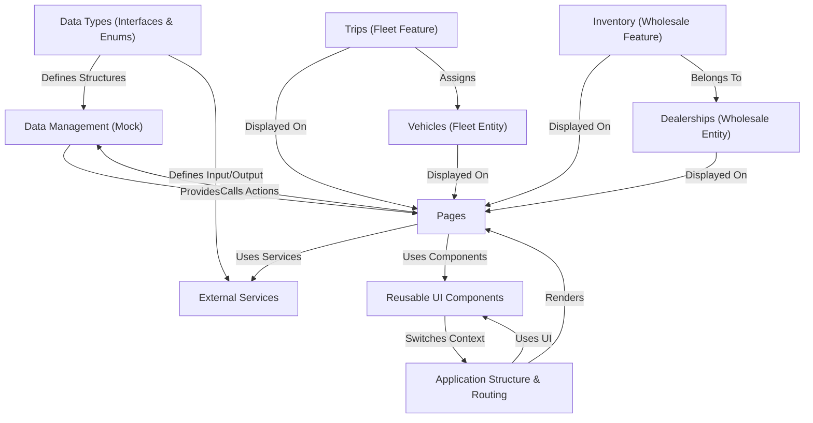

# Run and deploy your AI Studio app

This contains everything you need to run your app locally.

## Run Locally

**Prerequisites:**  Node.js

1. Install dependencies:
   `npm install`
2. Set the `GEMINI_API_KEY` in [.env.local](.env.local) to your Gemini API key
3. Run the app:
   `npm run dev`

   # Tutorial: fleetpro-fleetmanagement

This project is a web application for **managing vehicle fleets** (like trucks) and handling **wholesale financing** for dealerships.
It allows users to view vehicle details, track trips, manage maintenance, monitor alerts, log costs, and also handle dealership credit lines and financed inventory.
The app structure uses **React** for building *pages* and *components*, with data managed in the main application state, mimicking a real backend interaction.

## Visual Overview

## Chapters

1. [Vehicles (Fleet Entity)
](/tutorial/01_vehicles__fleet_entity__.md)
2. [Dealerships (Wholesale Entity)
](02_dealerships__wholesale_entity__.md)
3. [Trips (Fleet Feature)
](03_trips__fleet_feature__.md)
4. [Inventory (Wholesale Feature)
](04_inventory__wholesale_feature__.md)
5. [Pages
](05_pages_.md)
6. [Reusable UI Components
](06_reusable_ui_components_.md)
7. [Application Structure & Routing
](07_application_structure___routing_.md)
8. [Data Types (Interfaces & Enums)
](08_data_types__interfaces___enums__.md)
9. [Data Management (Mock)
](09_data_management__mock__.md)
10. [External Services
](10_external_services_.md)

---

Generated by [AI Codebase Knowledge Builder](https://github.com/The-Pocket/Tutorial-Codebase-Knowledge).
