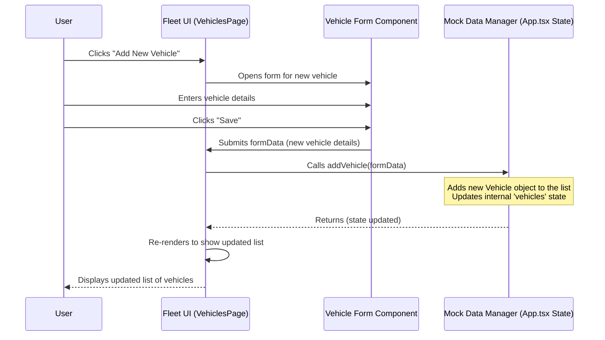

# Chapter 1: Vehicles (Fleet Entity)

Welcome to the first chapter of the FleetPro Fleet Management tutorial! In this chapter, we'll explore the very heart of the Fleet Management side of our application: **Vehicles**.

Imagine you run a pizza delivery service. To deliver pizzas, you need bikes or cars, right? In our FleetPro system, these bikes, cars, trucks, or vans are called **Vehicles**. They are the main things you manage in a fleet!

The "Vehicle Entity" in FleetPro is like a digital profile for each one of your real-world vehicles. It keeps track of everything important about them so you don't have to rely on spreadsheets or sticky notes.

## What is a Vehicle Entity?

A `Vehicle` in FleetPro is a fundamental building block. It represents any asset that moves goods or people and is part of your fleet. Think of it as the primary object you'll interact with when managing your fleet.

Just like your delivery bike has a number plate, a unique identification number, and needs regular check-ups, the `Vehicle` entity stores all this crucial information in the system.

Looking at the code, the basic blueprint for what information a `Vehicle` holds is defined in the `types.ts` file:

```typescript
export interface Vehicle {
  id: string; // A unique ID for this vehicle in the system
  vin: string; // The car's unique VIN (Vehicle Identification Number)
  make: string; // Like 'Tata' or 'Mahindra'
  model: string; // Like 'Ace' or 'Bolero'
  year: number; // When it was made, e.g., 2023
  licensePlate: string; // The vehicle's number plate, e.g., 'KA01AB1234'
  status: VehicleStatus; // Is it 'Active', 'Maintenance', etc.?
  mileage: number; // How many kilometers it has traveled
  // ... lots more fields like document info, location, maintenance dates ...
}

export enum VehicleStatus {
  ACTIVE = 'Active',
  MAINTENANCE = 'Maintenance',
  INACTIVE = 'Inactive',
  RETIRED = 'Retired',
}
```

This code snippet shows you the core details associated with a vehicle. The `VehicleStatus` tells us whether a vehicle is currently available for use (`Active`), is in the garage (`Maintenance`), is temporarily out of action (`Inactive`), or has been permanently removed from the fleet (`Retired`).

Here's a quick look at some of the key pieces of information the `Vehicle` entity stores:

| Information        | Description                                        | Why it's useful                          |
| :----------------- | :------------------------------------------------- | :--------------------------------------- |
| `id`               | Unique identifier in FleetPro                      | How the system finds this specific vehicle |
| `vin`              | Vehicle Identification Number (globally unique)    | Official identity of the physical vehicle  |
| `licensePlate`     | The number plate                                   | Easy way to identify in daily operations |
| `make`, `model`    | Manufacturer and type (e.g., "Tata Ace")         | Understanding the vehicle's capabilities |
| `year`             | Manufacturing year                                 | Age of the vehicle, helps with maintenance |
| `status`           | Current condition (Active, Maintenance, etc.)    | Availability for tasks or trips          |
| `mileage`          | Distance traveled                                  | Key for maintenance scheduling & value   |
| `rcNumber`, `...ExpiryDate` | Registration, Insurance, PUC, Fitness details | Essential for compliance and legality    |
| `lastKnownLocation`, `currentSpeedKmph` | Real-time tracking data (if available)     | Monitoring operations and safety         |
| `nextMaintenanceDueDate/Mileage` | When the next service is needed            | Planning maintenance effectively           |

## Use Case: Viewing and Managing Your Vehicles

Let's go back to our pizza delivery business. A core task is seeing which bikes (vehicles) you have, checking if they are available, and adding new ones as your business grows. This is the main use case we'll focus on: **Viewing, Adding, and Basic Management of Vehicles**.

FleetPro provides a dedicated page for this: the "Vehicles" page.

## How the `Vehicle` Entity Helps Solve the Use Case

The `Vehicle` entity is the foundation of the Vehicles page.

1.  **Viewing:** The page loads a list of all `Vehicle` objects stored in the system. It then displays key information from each `Vehicle` object, like its make, model, license plate, and current status.
2.  **Adding:** When you click "Add New Vehicle", a form appears. You fill in the details (VIN, make, model, etc.) which correspond directly to the fields in the `Vehicle` entity. When you save, a new `Vehicle` object is created with this information and added to the system's list.
3.  **Updating:** If you want to change a vehicle's details (e.g., update its mileage after a trip or change its status to 'Maintenance'), the system finds the correct `Vehicle` object by its `id`, you modify the fields on the form, and the system updates the corresponding `Vehicle` object.

## Code Snippet: Displaying Vehicles

Let's look at a tiny piece of code from the `VehiclesPage.tsx` file that shows how the application gets the list of vehicles and might display some of their information.

```typescript
// Inside VehiclesPage.tsx component
interface VehiclesPageProps {
  vehicles: Vehicle[]; // This prop holds the list of Vehicle objects
  // ... other props ...
}

const VehiclesPage: React.FC<VehiclesPageProps> = ({ vehicles, drivers, maintenanceTasks, addVehicle, updateVehicle, deleteVehicle }) => {
  // ... state and other hooks ...

  // This 'vehicles' array contains all the Vehicle entities
  // We can map over this array to display each vehicle's details
  return (
    <div>
      {/* ... other page elements ... */}
      
      {/* Example of displaying a list item for *one* vehicle */}
      {vehicles.map(vehicle => (
        <div key={vehicle.id} className="..."> {/* Unique key for each vehicle */}
          <h3>{vehicle.make} {vehicle.model} ({vehicle.year})</h3>
          <p>Plate: {vehicle.licensePlate}</p>
          <p>Status: {vehicle.status}</p>
          <p>Mileage: {vehicle.mileage.toLocaleString()} km</p>
          {/* ... more vehicle details ... */}
        </div>
      ))}
      
      {/* ... modals and other page elements ... */}
    </div>
  );
};
```

This is a simplified example, but it shows the core idea: the `vehicles` array contains the `Vehicle` objects, and we use programming techniques (like `.map()` in React) to loop through them and display the information (`vehicle.make`, `vehicle.licensePlate`, etc.) stored in each object.

## Code Snippet: Adding/Updating (Simplified Form Handling)

When you add or edit a vehicle, a form component like `VehicleForm` (also shown in the `VehiclesPage.tsx` file) is used. This form collects the data that will become or update a `Vehicle` object.

```typescript
// Inside VehicleForm.tsx component (part of VehiclesPage.tsx)
interface VehicleFormProps {
  onSubmit: (vehicleData: Omit<Vehicle, 'id' | 'imageUrl' | 'documents' | 'lastKnownLocation' | 'currentSpeedKmph' | 'isIgnitionOn'> & { isAIS140Compliant?: boolean, driverIdToAssign?: string | null }) => void;
  // ... other props ...
}

const VehicleForm: React.FC<VehicleFormProps> = ({ onSubmit, onCancel, initialData, drivers, vehicles }) => {
  // State to hold the data being entered in the form,
  // initialized with existing data if editing
  const [formData, setFormData] = useState<...>( initialData ? { ...initialData, ... } : { ...initialVehicleFormState } );

  // Handler for when form input values change
  const handleChange = (e: React.ChangeEvent<HTMLInputElement | HTMLSelectElement>) => {
    const { name, value, type } = e.target;
    // Update the state based on the input field's name and value
    setFormData(prev => ({ ...prev, [name]: value }));
  };

  // Handler for when the form is submitted
  const handleSubmit = (e: React.FormEvent) => {
    e.preventDefault();
    // Basic validation (check required fields)
    if (!formData.vin || !formData.licensePlate) {
        alert("VIN and License Plate are required.");
        return;
    }
    // Call the onSubmit function passed from the parent (VehiclesPage)
    onSubmit(formData);
  };

  return (
    <form onSubmit={handleSubmit} className="...">
      {/* Input fields linked to formData state via 'name' and 'value' */}
      <div>
        <label htmlFor="vin">VIN *</label>
        <input type="text" name="vin" id="vin" value={formData.vin} onChange={handleChange} className="..." />
      </div>
      {/* ... other form fields ... */}
      
      <div className="flex justify-end">
        <button type="submit">Save Vehicle</button>
      </div>
    </form>
  );
};
```

This snippet shows how a form component collects user input (`handleChange`) and, upon submission (`handleSubmit`), bundles this data into an object (`formData`) that matches the `Vehicle` structure (or a part of it) and passes it back to the main `VehiclesPage` component via the `onSubmit` function. The `VehiclesPage` then uses this data to call `addVehicle` or `updateVehicle`.

## Under the Hood: Managing Vehicle Data (Mock Data)

For now, in this beginner-friendly version of FleetPro, we are using "Mock Data". This means the vehicle information isn't stored in a real database, but simply kept in memory while the application is running.

When you add, update, or delete a vehicle on the Vehicles page, the application directly changes this in-memory list of `Vehicle` objects.

Here's a simplified look at the flow when you add a new vehicle:



This diagram shows that the user interacts with the form, which passes data to the main page component. The page component then tells the "Mock Data Manager" (which is handled within the `App.tsx` file's state in this project) to add the new vehicle object to its list. Finally, the UI updates to display the change.

The actual `addVehicle`, `updateVehicle`, and `deleteVehicle` functions in `App.tsx` would look something like this in their simplest form using React's `useState`:

```typescript
// Inside App.tsx (simplified)
const [vehicles, setVehicles] = useState<Vehicle[]>([]); // Holds the list of vehicles

const addVehicle = useCallback((vehicleData: Omit<Vehicle, 'id'>) => {
  const newVehicle: Vehicle = {
    id: generateMockId(), // Create a unique ID
    ...vehicleData,
    // Add default/empty values for fields not in the form initially
    imageUrl: '', 
    documents: [],
    lastKnownLocation: undefined,
    currentSpeedKmph: undefined,
    isIgnitionOn: undefined,
    // Set default maintenance fields if not provided
    nextMaintenanceDueDate: vehicleData.nextMaintenanceDueDate || '',
    nextMaintenanceMileage: vehicleData.nextMaintenanceMileage || 0,
  };
  setVehicles(prevVehicles => [...prevVehicles, newVehicle]); // Add to the list
}, []);

const updateVehicle = useCallback((updatedVehicle: Vehicle) => {
  setVehicles(prevVehicles =>
    prevVehicles.map(v => (v.id === updatedVehicle.id ? updatedVehicle : v)) // Replace the old object with the updated one
  );
}, []);

const deleteVehicle = useCallback((vehicleId: string) => {
  setVehicles(prevVehicles => prevVehicles.filter(v => v.id !== vehicleId)); // Remove the object by ID
}, []);
```

These small functions are what actually modify the list of `Vehicle` objects held in the application's memory (`vehicles` state).

## Vehicle Status and Beyond

The `VehicleStatus` is important because it affects where the vehicle appears and what actions can be taken on it. For example:

*   Only `Active` vehicles can typically be assigned to a driver or a trip ([Trips (Fleet Feature)](03_trips__fleet_feature__.md)).
*   Vehicles with `Maintenance` status might appear on a maintenance dashboard ([Maintenance Dashboard](09_data_management__mock__.md) - Note: Maintenance is covered more in later chapters, like Maintenance Tasks).

As you'll see in later chapters, the `Vehicle` entity is linked to many other parts of the system:

*   It's assigned to a [Driver (Fleet Entity)](). (Note: Drivers will be covered in a later chapter).
*   It is used for [Trips (Fleet Feature)](03_trips__fleet_feature__.md).
*   It generates [Telematics Alerts (Telematics Feature)](). (Note: Telematics will be covered in a later chapter).
*   It incurs [Costs (Cost Management Feature)](). (Note: Costs will be covered in a later chapter).
*   It requires [Maintenance (Maintenance Management Feature)](). (Note: Maintenance will be covered in a later chapter).
*   Its compliance documents are tracked ([Compliance Page](05_pages_.md) - Note: Compliance is touched upon in the pages chapter).

Understanding the `Vehicle` entity is crucial because it's the central "thing" that many other features revolve around in the Fleet Management side of the application.

## Conclusion

In this chapter, we learned that the `Vehicle` entity is the fundamental representation of your fleet assets in FleetPro. It holds all the essential information needed to identify, track, and manage each vehicle. We saw how this entity is used to power the basic viewing and management features on the Vehicles page, using simple in-memory mock data for now.

Understanding the `Vehicle` entity is the first step to understanding the Fleet Management part of FleetPro. Next, we'll shift gears slightly to look at the other major entity in the application, this time on the **Wholesale Finance** side.

[Next Chapter: Dealerships (Wholesale Entity)](02_dealerships__wholesale_entity__.md)

---

<sub><sup>**References**: [[1]](https://github.com/rakeshkrrajak/fleetpro-fleetmanagement/blob/7b84d99e0dc11a8c8350b388be15b56727655e66/App.tsx), [[2]](https://github.com/rakeshkrrajak/fleetpro-fleetmanagement/blob/7b84d99e0dc11a8c8350b388be15b56727655e66/pages/FleetOverviewDashboardPage.tsx), [[3]](https://github.com/rakeshkrrajak/fleetpro-fleetmanagement/blob/7b84d99e0dc11a8c8350b388be15b56727655e66/pages/MonitorPage.tsx), [[4]](https://github.com/rakeshkrrajak/fleetpro-fleetmanagement/blob/7b84d99e0dc11a8c8350b388be15b56727655e66/pages/VehiclesPage.tsx), [[5]](https://github.com/rakeshkrrajak/fleetpro-fleetmanagement/blob/7b84d99e0dc11a8c8350b388be15b56727655e66/types.ts)</sup></sub>
