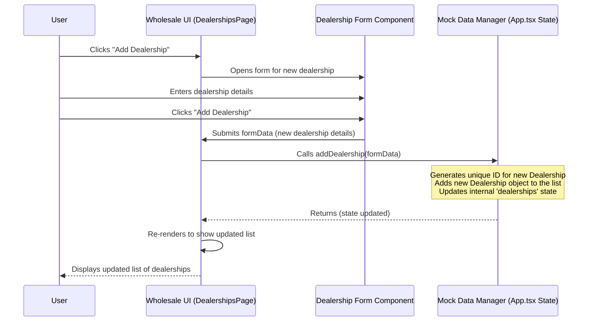

# Chapter 2: Dealerships (Wholesale Entity)

Welcome back to the FleetPro tutorial! In the [previous chapter](01_vehicles__fleet_entity__.md), we learned about the `Vehicle` entity, which is the core building block for managing a fleet of assets like cars or trucks.

Now, let's switch gears slightly and look at the other major side of the FleetPro application: **Wholesale Finance**.

Imagine you are not managing a fleet of vehicles that drive around, but rather a business that **finances** the purchase of vehicles for other businesses, like car or truck showrooms. These showrooms need money (funding) to buy vehicles from the manufacturers before they sell them to customers. The Wholesale Finance part of FleetPro helps manage this process.

The central "thing" you need to track in this financing business is **who** you are providing money to. These businesses are typically called **Dealerships**.

## What is a Dealership Entity?

In the Wholesale Finance application, a `Dealership` is a fundamental entity. It represents a business (like a car or truck showroom) that receives funding from your finance company to buy vehicles. Think of it as the primary object you interact with when managing your finance relationships.

Just like a `Vehicle` has details like its make, model, and VIN, a `Dealership` has important details about the business itself.

Looking at the code, the basic blueprint for what information a `Dealership` holds is defined in the `types.ts` file:

```typescript
export enum DealershipStatus {
  ACTIVE = "Active", // Ready to receive funding
  ONBOARDING = "Onboarding", // In the process of setting up
  SUSPENDED = "Suspended", // Temporarily unable to receive funding
  INACTIVE = "Inactive", // No longer working with the finance company
}

export interface Dealership {
  id: string; // A unique ID for this dealership in the system
  name: string; // The name of the dealership (e.g., "Prestige Motors")
  dealerPrincipal: string; // The main person in charge
  location: string; // Where the dealership is located
  status: DealershipStatus; // Their current status with the finance company
  agreementDate: string; // When the financing agreement started (ISO Date string)
  creditLineId: string | null; // Link to their credit line details (more on this later!)
  // ... potentially more fields ...
}
```

This code snippet shows the core details associated with a dealership. The `DealershipStatus` helps you track if a dealership is actively working with you (`Active`), if they are new and getting set up (`Onboarding`), or if there are issues (`Suspended`, `Inactive`).

Here's a quick look at some of the key pieces of information the `Dealership` entity stores:

| Information       | Description                                 | Why it's useful                                  |
| :---------------- | :------------------------------------------ | :----------------------------------------------- |
| `id`              | Unique identifier in FleetPro               | How the system finds this specific dealership    |
| `name`            | Business name (e.g., "Capital Auto")      | Easy way to identify the partner                 |
| `dealerPrincipal` | The main contact person                     | Who to talk to at the dealership                 |
| `location`        | Physical address or region                  | Where the business operates                      |
| `status`          | Current relationship state (`Active`, etc.) | Determines if they can get funding or need action|
| `agreementDate`   | Start date of financing agreement           | Tracks history and relationship duration         |
| `creditLineId`    | Link to their financing limit details       | Essential for managing their funding capacity    |

## Use Case: Managing Your Dealership Partners

A core task in Wholesale Finance is keeping track of all the dealerships you work with, seeing their key information, and adding new ones as your business grows. This is the main use case we'll focus on: **Viewing, Adding, and Basic Management of Dealerships**.

FleetPro provides a dedicated page for this: the "Dealerships" page.

## How the `Dealership` Entity Helps Solve the Use Case

The `Dealership` entity is the foundation of the Dealerships page.

1.  **Viewing:** The page loads a list of all `Dealership` objects stored in the system. It then displays key information from each `Dealership` object, like its name, location, and current status. Clicking on a dealership allows you to view more detailed information about *that specific* dealership.
2.  **Adding:** When you click "Add Dealership", a form appears. You fill in the details (Name, Principal, Location, etc.) which correspond directly to the fields in the `Dealership` entity. When you save, a new `Dealership` object is created with this information and added to the system's list.

## Code Snippet: Displaying Dealerships

Let's look at a tiny piece of code from the `DealershipsPage.tsx` file that shows how the application gets the list of dealerships and might display some of their information.

```typescript
// Inside DealershipsPage.tsx component
interface DealershipsPageProps {
  dealerships: Dealership[]; // This prop holds the list of Dealership objects
  // ... other props like creditLines, inventory ...
}

const DealershipsPage: React.FC<DealershipsPageProps> = ({ dealerships, creditLines, inventory, addDealership }) => {
  // ... state for modal, selected dealer etc. ...

  // This 'dealerships' array contains all the Dealership entities
  // We can map over this array to display each dealership's details
  return (
    <div>
      {/* ... page header and add button ... */}
      
      {/* Grid or list displaying each dealership */}
      <div className="grid grid-cols-1 md:grid-cols-2 lg:grid-cols-3 gap-6">
        {dealerships.map(dealer => (
          <div key={dealer.id} className="..." onClick={() => setSelectedDealer(dealer)}> {/* Clicking shows details */}
            <div className="flex justify-between items-start">
                {/* Displaying information from the 'dealer' object */}
                <h2 className="font-bold text-lg">{dealer.name}</h2> 
                <span className={`text-xs px-2 py-0.5 rounded-full ${getStatusColor(dealer.status)}`}>{dealer.status}</span>
            </div>
            <p className="text-sm text-gray-400">{dealer.location}</p>
            {/* ... display more details, potentially from linked entities ... */}
          </div>
        ))}
      </div>
      
      {/* ... modal for adding a dealership ... */}
      <Modal isOpen={isModalOpen} onClose={() => setIsModalOpen(false)} title="Add New Dealership">
          <DealershipForm onSubmit={(data) => { addDealership(data); setIsModalOpen(false); }} onCancel={() => setIsModalOpen(false)} />
      </Modal>
    </div>
  );
};
```

This is a simplified example, but it shows the core idea: the `dealerships` array contains the `Dealership` objects, and the code loops through them (`.map()`) to display the information (`dealer.name`, `dealer.location`, etc.) stored in each object. Clicking on a dealership allows the page to store which one is `selectedDealer` and show its specific view.

## Code Snippet: Adding (Simplified Form Handling)

When you add a new dealership, a form component like `DealershipForm` (also shown in the `DealershipsPage.tsx` file) is used. This form collects the data that will become a `Dealership` object.

```typescript
// Inside DealershipForm.tsx component (part of DealershipsPage.tsx)
interface DealershipFormProps {
  onSubmit: (dealershipData: Omit<Dealership, 'id'>) => void;
  onCancel: () => void;
}

const DealershipForm: React.FC<DealershipFormProps> = ({ onSubmit, onCancel }) => {
  // State to hold the data being entered in the form
  const [formData, setFormData] = useState<Omit<Dealership, 'id'>>({
      name: '',
      dealerPrincipal: '',
      location: '',
      status: DealershipStatus.ONBOARDING, // Default status for new dealers
      agreementDate: new Date().toISOString().split('T')[0], // Default date
      creditLineId: null, // No credit line initially
  });

  // Handler for when form input values change
  const handleChange = (e: React.ChangeEvent<HTMLInputElement | HTMLSelectElement>) => {
      const { name, value } = e.target;
      // Update the state based on the input field's name and value
      setFormData(prev => ({...prev, [name]: value}));
  }

  // Handler for when the form is submitted
  const handleSubmit = (e: React.FormEvent) => {
      e.preventDefault();
      // Basic validation
      if(!formData.name || !formData.dealerPrincipal || !formData.location) {
          alert("Please fill all required fields.");
          return;
      }
      // Call the onSubmit function passed from the parent (DealershipsPage)
      onSubmit(formData);
  }

  return (
      <form onSubmit={handleSubmit} className="space-y-4">
          {/* Input fields linked to formData state */}
          <div>
              <label htmlFor="name" className={labelStyle}>Dealership Name *</label>
              <input type="text" name="name" id="name" value={formData.name} onChange={handleChange} required className={inputFieldStyle} />
          </div>
          {/* ... other form fields like dealerPrincipal, location, status, agreementDate ... */}
          
          <div className="flex justify-end space-x-3 pt-4">
              <button type="button" onClick={onCancel} className={buttonSecondaryStyle}>Cancel</button>
              <button type="submit" className={buttonPrimaryStyle}>Add Dealership</button>
          </div>
      </form>
  );
}
```

This snippet shows how the form collects user input (`handleChange`) and, upon submission (`handleSubmit`), creates an object (`formData`) that matches the `Dealership` structure (minus the `id`) and sends it back to the main `DealershipsPage` component via the `onSubmit` function.

## Under the Hood: Managing Dealership Data (Mock Data)

Like the vehicle data, the dealership information in this beginner version of FleetPro is stored using "Mock Data" in memory while the application is running.

When you add a dealership on the Dealerships page, the application directly changes this in-memory list of `Dealership` objects.

Here's a simplified look at the flow when you add a new dealership:



This diagram shows that the user interacts with the form, which passes data to the main page component. The page component then tells the "Mock Data Manager" (handled in `App.tsx`) to add the new dealership object to its list. Finally, the UI updates to display the change.

The actual `addDealership` function in `App.tsx` is quite simple using React's `useState`:

```typescript
// Inside App.tsx (simplified)
const [dealerships, setDealerships] = useState<Dealership[]>([]); // Holds the list of dealerships

const addDealership = useCallback((dealershipData: Omit<Dealership, 'id'>) => {
  const newId = generateMockId(); // Create a unique ID
  const newDealership: Dealership = {
    id: newId,
    ...dealershipData,
    // creditLineId might be null initially or assigned later
    creditLineId: null, // Default to null
    // Add any other default fields
  };
  setDealerships(prev => [...prev, newDealership]); // Add to the list
}, []);
```

This small function is what actually adds a new `Dealership` object to the list held in the application's memory (`dealerships` state).

## Linking Dealerships to Finance Details

The `Dealership` entity is central to the Wholesale Finance system because it links to other crucial financial details:

*   **Credit Lines:** Each dealership has a specific `creditLineId`. This ID points to a [Credit Line (Wholesale Feature)]() object (covered in a later chapter) which defines the total amount of funding the dealership is allowed to receive, the interest rate, and how much credit is currently available.
*   **Inventory:** The vehicles that a finance company funds for a dealership are tracked as [Inventory (Wholesale Feature)](04_inventory__wholesale_feature__.md) units. Each `InventoryUnit` object is linked back to the specific `Dealership` that received the funding for that vehicle.
*   **Audits:** The finance company needs to periodically check the inventory physically present at a dealership. These checks are tracked as [Audits (Wholesale Feature)]() (covered in a later chapter), and each `Audit` object is linked to the `Dealership` being audited.

Understanding the `Dealership` entity is crucial because it's the central "who" that many other features revolve around in the Wholesale Finance side of the application.

## Conclusion

In this chapter, we explored the `Dealership` entity, which is the fundamental representation of a financed business partner in the Wholesale Finance part of FleetPro. We saw how it holds essential information about the dealership and how it's used to power the basic viewing and adding features on the Dealerships page, again using simple in-memory mock data. We also briefly touched upon how Dealerships are linked to Credit Lines and Inventory, which are core to the financing process and will be covered in more detail in upcoming chapters.

Understanding the `Dealership` entity is the first step to understanding the Wholesale Finance part of FleetPro. Next, we'll go back to the Fleet Management side and look at how we track the journeys vehicles take.

[Next Chapter: Trips (Fleet Feature)](03_trips__fleet_feature__.md)

---

<sub><sup>**References**: [[1]](https://github.com/rakeshkrrajak/fleetpro-fleetmanagement/blob/7b84d99e0dc11a8c8350b388be15b56727655e66/App.tsx), [[2]](https://github.com/rakeshkrrajak/fleetpro-fleetmanagement/blob/7b84d99e0dc11a8c8350b388be15b56727655e66/pages/wholesale/CreditLinesPage.tsx), [[3]](https://github.com/rakeshkrrajak/fleetpro-fleetmanagement/blob/7b84d99e0dc11a8c8350b388be15b56727655e66/pages/wholesale/DealershipsPage.tsx), [[4]](https://github.com/rakeshkrrajak/fleetpro-fleetmanagement/blob/7b84d99e0dc11a8c8350b388be15b56727655e66/pages/wholesale/WholesaleDashboardPage.tsx), [[5]](https://github.com/rakeshkrrajak/fleetpro-fleetmanagement/blob/7b84d99e0dc11a8c8350b388be15b56727655e66/types.ts)</sup></sub>