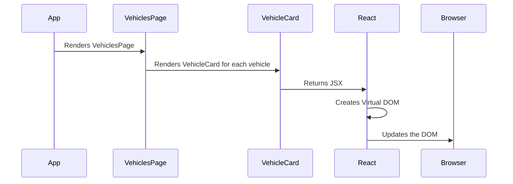

# Chapter 3: React Components

In the previous chapter, [Routing (React Router)](02_routing__react_router_.md), we learned how to navigate between different pages in our application. Now, let's dive into the building blocks that make up those pages: **React Components**.

Imagine you're building with LEGOs. You have different bricks: some are 2x4, some are 1x1, and some are special shapes. React Components are like those LEGO bricks. They are reusable pieces of UI that we can combine to create complex layouts.

**Why Components?**

Think about a fleet manager who wants to see a list of all their vehicles on the `VehiclesPage`. Instead of writing all the code for the list, the heading, and the styling from scratch every time, we can create reusable components. For example, a `VehicleCard` component can display information about a single vehicle, and we can reuse it for every vehicle in the list. This makes our code much easier to manage and update.

**Central Use Case:** Displaying a list of vehicles on the `VehiclesPage`.

**What is a React Component?**

A React Component is a self-contained piece of UI. It can be as small as a button or as large as an entire page. Key characteristics of a component are:

*   **Reusability:** We can use the same component in multiple places in our application.
*   **Composability:** We can combine smaller components to create larger ones.
*   **Manageability:** Components encapsulate their own logic and rendering, making our code easier to understand and maintain.

Let's break this down further into the key concepts of React Components:

1.  **Functional Components:**

    A functional component is a simple JavaScript function that returns JSX (JavaScript XML). JSX is a syntax extension to JavaScript that allows us to write HTML-like code in our JavaScript files.

    Here's a very simple example:

    ```tsx
    function MyComponent() {
      return <h1>Hello, world!</h1>;
    }
    ```

    This component, `MyComponent`, simply renders the text "Hello, world!" as a heading.

    To use this component, you can render it in another component, like this:

    ```tsx
    function App() {
      return (
        <div>
          <MyComponent />
        </div>
      );
    }
    ```

    The browser will then display: `Hello, world!`.

2.  **Props (Properties):**

    Props are like arguments that we pass to a function. They allow us to customize the behavior and appearance of a component.

    Let's modify our `MyComponent` to accept a `name` prop:

    ```tsx
    function MyComponent(props) {
      return <h1>Hello, {props.name}!</h1>;
    }
    ```

    Now, we can pass a name to the component when we render it:

    ```tsx
    function App() {
      return (
        <div>
          <MyComponent name="Alice" />
        </div>
      );
    }
    ```

    The browser will now display: `Hello, Alice!`

    We can simplify this further using destructuring:

     ```tsx
    function MyComponent({ name }) {
      return <h1>Hello, {name}!</h1>;
    }
    ```

    It does the same thing, but it's more concise.

3.  **State:**

    State is data that a component manages internally. It allows a component to change its appearance or behavior over time.  We will discuss state management in more detail in [Application State (App.tsx)](04_application_state__app_tsx_.md). For now, let's just see a minimal example.

    To use state, we use the `useState` hook:

    ```tsx
    import { useState } from 'react';

    function MyComponent() {
      const [count, setCount] = useState(0);

      return (
        <div>
          <p>Count: {count}</p>
          <button onClick={() => setCount(count + 1)}>Increment</button>
        </div>
      );
    }
    ```

    This component displays a count and a button. When the button is clicked, the `setCount` function updates the `count` state, causing the component to re-render and display the updated count.

**Solving the Central Use Case: Displaying a list of vehicles on the `VehiclesPage`**

Let's see how we can use components to display a list of vehicles on the `VehiclesPage`.

First, let's assume we have an array of vehicle data:

```tsx
const vehicles = [
  { id: 1, make: 'Toyota', model: 'Camry', year: 2020 },
  { id: 2, make: 'Honda', model: 'Civic', year: 2022 },
];
```

Now, let's create a `VehicleCard` component to display information about a single vehicle:

```tsx
function VehicleCard({ vehicle }) {
  return (
    <div>
      <h3>{vehicle.make} {vehicle.model}</h3>
      <p>Year: {vehicle.year}</p>
    </div>
  );
}
```

This component takes a `vehicle` prop and displays the make, model, and year of the vehicle.

Finally, let's use the `VehicleCard` component in the `VehiclesPage` to display the list of vehicles:

```tsx
function VehiclesPage() {
  const vehicles = [
    { id: 1, make: 'Toyota', model: 'Camry', year: 2020 },
    { id: 2, make: 'Honda', model: 'Civic', year: 2022 },
  ];

  return (
    <div>
      <h1>Vehicles</h1>
      {vehicles.map(vehicle => (
        <VehicleCard key={vehicle.id} vehicle={vehicle} />
      ))}
    </div>
  );
}
```

Here, we are using the `map` function to iterate over the `vehicles` array. For each vehicle, we render a `VehicleCard` component, passing the vehicle data as a prop.  The `key` prop is important for React to efficiently update the list when the data changes.

**Internal Implementation**

When a component is rendered, React performs the following steps:

1.  **JSX Transformation:** React transforms the JSX code into JavaScript function calls.
2.  **Virtual DOM:** React creates a virtual DOM (Document Object Model), which is a lightweight representation of the actual DOM.
3.  **Reconciliation:** React compares the virtual DOM with the previous virtual DOM to identify the changes that need to be made to the actual DOM.
4.  **DOM Updates:** React updates the actual DOM with the changes identified in the reconciliation step.

Here's a simplified sequence diagram:



Here's a more complex example of a Modal Component from `components/Modal.tsx`:

```tsx
import React from 'react';

interface ModalProps {
  isOpen: boolean;
  onClose: () => void;
  title: string;
  children: React.ReactNode;
}

const Modal: React.FC<ModalProps> = ({ isOpen, onClose, title, children }) => {
  if (!isOpen) return null;

  return (
    <div className="fixed inset-0 bg-gray-900 bg-opacity-75 backdrop-blur-sm flex justify-center items-center z-50">
      <div className="bg-gray-800 rounded-xl shadow-2xl w-full max-w-md">
        <div className="flex justify-between items-center p-6 border-b border-gray-700">
          <h3 className="text-xl font-semibold text-gray-100">{title}</h3>
          <button onClick={onClose} className="text-gray-400 hover:text-gray-200">Close</button>
        </div>
        <div className="p-6">
          {children}
        </div>
      </div>
    </div>
  );
};

export default Modal;
```

This code defines a `Modal` component that renders a modal dialog.

*   **`ModalProps`**:  Defines the expected properties for the component.
*   **`isOpen`**: A boolean indicating whether the modal is open or not. If `isOpen` is `false`, the component returns `null`, meaning it doesn't render anything.
*   **`onClose`**: A function to be called when the user wants to close the modal.
*   **`title`**: The title of the modal.
*   **`children`**: Special property in React. Whatever is rendered in between the opening and closing tag will be rendered inside the component.

Another important component is the `Sidebar.tsx`, responsible for rendering the sidebar navigation. It uses `NavLink` from `react-router-dom` which we discussed in [Routing (React Router)](02_routing__react_router_.md) to create links to different pages:

```tsx
import { NavLink } from 'react-router-dom';

function Sidebar() {
  return (
    <NavLink to="/vehicles">Vehicles</NavLink>
  );
}
```

The `NavLink` component creates a link to the vehicles page and updates the UI accordingly when being clicked.

**In Summary:**

React Components are reusable building blocks for our user interface. They allow us to break down complex UIs into smaller, manageable pieces. By using components, we can write cleaner, more maintainable, and more reusable code. We learned about functional components, props, and state, and we saw how to use components to display a list of vehicles on the `VehiclesPage`.

Now that we understand how to create and use components, let's move on to the next chapter: [Application State (App.tsx)](04_application_state__app_tsx_.md), where we'll learn how to manage the state of our application.


---

Generated by [AI Codebase Knowledge Builder](https://github.com/The-Pocket/Tutorial-Codebase-Knowledge)