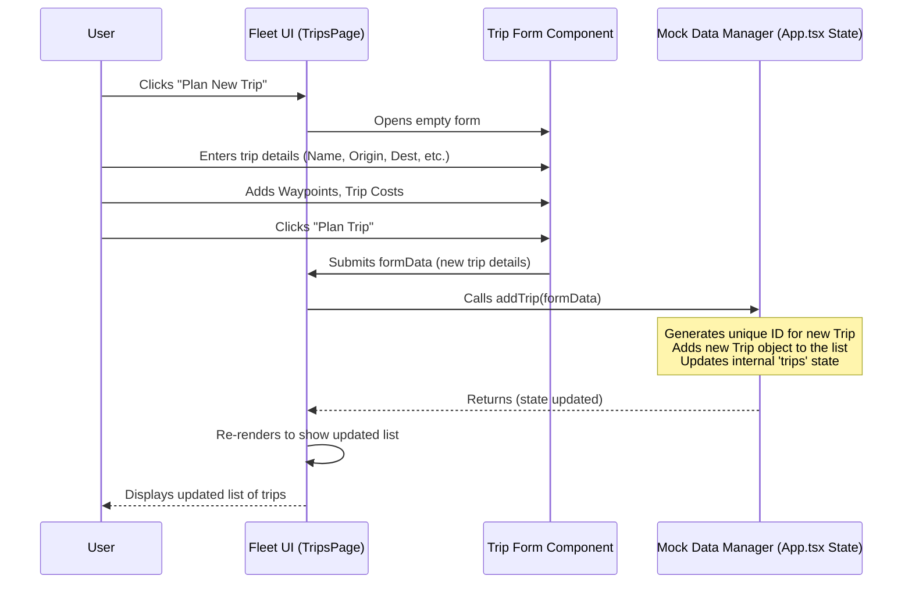

# Chapter 3: Trips (Fleet Feature)

Welcome back to the FleetPro tutorial! In the [previous chapter](02_dealerships__wholesale_entity__.md), we took a look at the `Dealership` entity, which is key to the Wholesale Finance side of the application. Now, let's return to the Fleet Management side and explore how we plan and track the actual journeys your vehicles take.

Imagine you need to send a specific vehicle with a driver from your main depot in Mumbai to a customer's warehouse in Jaipur. You need to know: which vehicle is going, who is driving it, where exactly it's going, maybe if it needs to make any stops along the way, and roughly how long it should take. Tracking this information helps you manage your operations efficiently.

In FleetPro, this planned or ongoing journey is represented by a **Trip**.

## What is a Trip Entity?

A `Trip` in FleetPro is a central concept for managing vehicle movements. It's like a digital travel plan or manifest for one specific journey. It brings together a vehicle, a driver, and the details of the route they will follow.

A `Trip` object holds all the important information about a specific journey. Looking at the `types.ts` file, you can see the structure for a `Trip`:

```typescript
export enum TripStatus {
  PLANNED = "Planned",   // The trip has been created but hasn't started yet
  ONGOING = "Ongoing",   // The vehicle is currently on the trip
  COMPLETED = "Completed", // The vehicle has reached the destination
  CANCELLED = "Cancelled", // The trip was planned but didn't happen
  DELAYED = "Delayed",   // The ongoing trip is experiencing delays
}

export interface Trip {
  id: string;         // Unique ID for this trip
  tripName: string;   // A descriptive name (e.g., "Mumbai to Jaipur Delivery")
  vehicleId: string | null; // Which vehicle is assigned? (Links to Vehicle entity)
  driverId: string | null;  // Which driver is assigned? (Links to Driver entity)
  origin: string;     // Starting point address
  destination: string;// Ending point address
  waypoints: Waypoint[]; // Optional intermediate stops
  scheduledStartDate: string; // When the trip is planned to start (with time)
  scheduledEndDate?: string; // When it's planned to end (optional)
  actualStartDate?: string;  // When it actually started
  actualEndDate?: string;    // When it actually ended
  status: TripStatus;       // Current state of the trip (Planned, Ongoing, etc.)
  estimatedDistanceKm?: number; // Estimated total distance
  estimatedDuration?: string;   // Estimated time it will take
  routeSuggestion?: string;   // Text description of the suggested route
  suggestedStops?: MockStop[]; // AI-suggested stops (like tolls, fuel)
  tripCosts?: CostEntry[];    // Costs specifically logged against this trip
}

export interface Waypoint {
  id: string;
  address: string; // Address of the stop
  purpose?: string; // Why stop here? (e.g., "Pickup", "Delivery")
  sequence: number; // The order of this stop
  // ... optional time estimates ...
}

export interface MockStop {
  id: string;
  name: string; // Name of the stop (e.g., "Imaginary Toll Plaza")
  type: 'Toll' | 'Fuel' | 'Rest Area' | 'Other'; // What kind of stop is it?
  estimatedCost?: number; // Estimated cost (e.g., for tolls)
  notes?: string;
  locationHint?: string;
}

// CostEntry is defined in types.ts but shown partially here
// export interface CostEntry { ... relevant fields like amount, category, description ... }
```

This snippet shows the key pieces of information stored for each trip. Notice it references `vehicleId` and `driverId`, connecting the trip to the specific [Vehicles (Fleet Entity)](01_vehicles__fleet_entity__.md) and drivers (we'll cover drivers in a later chapter) involved. The `TripStatus` helps track the journey's progress. Waypoints define specific addresses the vehicle *must* visit, while Suggested Stops are potential places for fuel, rest, or tolls, possibly suggested by the system.

Here's a quick look at some of the key pieces of information the `Trip` entity stores:

| Information          | Description                                            | Why it's useful                                 |
| :------------------- | :----------------------------------------------------- | :---------------------------------------------- |
| `id`                 | Unique identifier for the trip                         | How the system finds this specific journey      |
| `tripName`           | Human-readable name (e.g., "Daily Route 1", "Urgent Delivery") | Quick identification                          |
| `vehicleId`          | Link to the assigned vehicle                           | Knowing which vehicle is on the trip          |
| `driverId`           | Link to the assigned driver                            | Knowing who is driving                        |
| `origin`             | Starting address                                       | Where the trip begins                         |
| `destination`        | Ending address                                         | Where the trip ends                           |
| `waypoints`          | Sequence of addresses to visit between origin/destination | Planning multi-stop routes                    |
| `scheduledStartDate` | When the trip is planned to begin                      | Scheduling and planning                       |
| `status`             | Current state (Planned, Ongoing, etc.)                 | Real-time tracking and operational view       |
| `estimatedDistanceKm`, `estimatedDuration` | Predicted length and time                  | Forecasting and planning                      |
| `routeSuggestion`    | Description of the route (can be AI generated)         | Provides a reference for the driver/manager   |
| `suggestedStops`     | Potential places to stop (e.g., fuel, tolls)         | Helps drivers prepare for the journey         |
| `tripCosts`          | List of costs specifically for this trip               | Tracking profitability and expenses per trip  |

## Use Case: Planning and Viewing Trips

A fundamental task in fleet management is creating new trips for vehicles and monitoring the progress of ongoing ones. This is the core use case: **Planning New Trips and Viewing Existing Trip Details**.

FleetPro provides a dedicated page for this: the "Trips" page.

## How the `Trip` Entity Helps Solve the Use Case

The `Trip` entity is the backbone of the Trips page.

1.  **Viewing:** The page loads a list of all `Trip` objects. It displays key details from each `Trip`, such as the name, origin, destination, assigned vehicle/driver, and status. Clicking on a trip shows more detailed information from that specific `Trip` object, including waypoints, suggested stops, and logged costs.
2.  **Planning (Adding):** When you click "Plan New Trip", a form appears. You fill in the details (Name, Origin, Destination, Vehicle, Driver, etc.) which directly populate a new `Trip` object. You can also add waypoints, and the form includes a feature to fetch route and stop suggestions, potentially using an AI service, which update fields like `routeSuggestion`, `estimatedDistanceKm`, `estimatedDuration`, and `suggestedStops`. When you save, a new `Trip` object is created with this information.
3.  **Tracking & Updating:** The `TripStatus` can be updated (e.g., from `PLANNED` to `ONGOING`, `ONGOING` to `COMPLETED` or `DELAYED`). The form also allows editing other details or adding `tripCosts` after the trip has started or completed.

## Code Snippet: Displaying Trips

Let's look at a simplified snippet from the `TripsPage.tsx` file showing how the page gets the list of trips and displays them.

```typescript
// Inside TripsPage.tsx component
interface TripsPageProps {
  trips: Trip[]; // This prop holds the list of Trip objects
  // ... other props like vehicles, drivers, costCategories ...
}

const TripsPage: React.FC<TripsPageProps> = ({ trips, vehicles, drivers, costCategories, addTrip, updateTrip, cancelTrip }) => {
  // ... state for modals, filtering, etc. ...

  // 'filteredTrips' is a list of Trip objects based on selected status
  return (
    <div>
      {/* ... page header and add button ... */}

      {/* Filter controls */}
      <div className="...">
        {/* ... filter dropdown linked to 'filterStatus' state ... */}
      </div>
      
      {/* Grid or list displaying each trip */}
      <div className="grid ...">
        {/* Mapping over the filtered list of Trip entities */}
        {filteredTrips.map(trip => {
          // Find the linked vehicle and driver for display
          const vehicle = vehicles.find(v => v.id === trip.vehicleId);
          const driver = drivers.find(d => d.id === trip.driverId);

          return (
            <div key={trip.id} className="..."> {/* Unique key for each trip */}
              <div className="...">
                {/* Displaying information from the 'trip' object */}
                <h3 className="..."> {/* trip.tripName */}</h3>
                <span className={`... ${getStatusColor(trip.status)}`}>{trip.status}</span>
              </div>
              <p className="text-xs text-gray-400"><strong>Origin:</strong> {trip.origin}</p>
              <p className="text-xs text-gray-400"><strong>Destination:</strong> {trip.destination}</p>
              <p className="text-xs text-gray-400"><strong>Start:</strong> {/* Formatted trip.scheduledStartDate */}</p>
              {/* Displaying linked vehicle/driver info */}
              {vehicle && <p className="text-xs text-gray-400"><strong>Vehicle:</strong> {vehicle.make} ({vehicle.licensePlate})</p>}
              {driver && <p className="text-xs text-gray-400"><strong>Driver:</strong> {driver.name}</p>}
              {/* ... more details ... */}
              {(trip.tripCosts?.length || 0) > 0 && <p className="text-xs text-gray-400"><strong>Costs Logged:</strong> {trip.tripCosts?.length}</p>}
            </div>
          );
        })}
        {/* ... Empty state message if no trips ... */}
      </div>

      {/* Modal for adding/editing/viewing trip */}
      <Modal isOpen={/* state */} onClose={/* handler */}>
          {/* Conditionally render TripForm or TripDetailModal */}
      </Modal>
    </div>
  );
};
```

This simplified code shows how the `TripsPage` component receives a list of `Trip` objects (`filteredTrips`), loops through them, and displays relevant properties (`trip.tripName`, `trip.origin`, `trip.status`). It also uses the `vehicleId` and `driverId` fields to look up and display information from the linked [Vehicles (Fleet Entity)](01_vehicles__fleet_entity__.md) and Driver objects.

## Code Snippet: Planning (Simplified Form Handling)

The `TripForm` component handles collecting data for a new or existing trip.

```typescript
// Inside TripForm.tsx component (part of TripsPage.tsx)
interface TripFormProps {
  onSubmit: (tripData: Omit<Trip, 'id'>) => void;
  onCancel: () => void;
  initialData?: Trip | null; // If editing an existing trip
  vehicles: Vehicle[];
  drivers: Driver[];
  costCategories: CostCategory[]; // For trip costs
}

const TripForm: React.FC<TripFormProps> = ({ onSubmit, onCancel, initialData, vehicles, drivers, costCategories }) => {
  // State to hold the data being entered in the form,
  // initialized with existing data if editing
  const [formData, setFormData] = useState<Omit<Trip, 'id'>>(
    initialData ? { ...initialData, ... } : { ...initialTripFormState }
  );
  
  // ... state for AI suggestions loading/errors ...

  // Handler for when form input values change
  const handleChange = (e: React.ChangeEvent<HTMLInputElement | HTMLSelectElement | HTMLTextAreaElement>) => {
    const { name, value } = e.target;
    setFormData(prev => ({
      ...prev,
      [name]: (name === 'vehicleId' || name === 'driverId') && value === "" ? null : value // Handle null assignment
    }));
  };

  // Handlers for adding/removing/changing waypoints
  const addWaypoint = () => {
      const newWaypoint: Waypoint = { id: generateMockId(), address: '', sequence: (formData.waypoints?.length || 0) + 1 };
      setFormData(prev => ({ ...prev, waypoints: [...(prev.waypoints || []), newWaypoint] }));
  };
  // ... removeWaypoint, handleWaypointChange ...

  // Handlers for adding/removing/changing suggested stops (similar pattern to waypoints)
  const addSuggestedStop = () => {
      const newStop: MockStop = { id: generateMockId(), name: '', type: 'Other' };
      setFormData(prev => ({ ...prev, suggestedStops: [...(prev.suggestedStops || []), newStop] }));
  };
  // ... removeSuggestedStop, handleSuggestedStopChange ...

  // Handlers for adding/removing/changing trip costs (similar pattern)
   const addTripCost = () => {
     const newCostEntry: CostEntry = { id: generateMockId(), date: new Date().toISOString().split('T')[0], costCategoryId: costCategories[0].id || '', amount: 0 };
     setFormData(prev => ({ ...prev, tripCosts: [...(prev.tripCosts || []), newCostEntry] }));
   };
  // ... removeTripCost, handleTripCostChange ...

  // Handler for fetching AI suggestions (simplified)
  const fetchAISuggestions = async () => {
    // ... logic to call getTripSuggestionsFromGemini service ...
    // ... update formData with routeSuggestion, estimatedDistanceKm, suggestedStops ...
  };


  // Handler for when the form is submitted
  const handleSubmit = (e: React.FormEvent) => {
    e.preventDefault();
    // ... basic validation ...
    // Ensure waypoints/stops/costs have IDs if newly added in the form
    const waypointsWithIds = (formData.waypoints || []).map(wp => ({...wp, id: wp.id || generateMockId() }));
    const stopsWithIds = (formData.suggestedStops || []).map(st => ({...st, id: st.id || generateMockId() }));
    const costsWithIds = (formData.tripCosts || []).map(tc => ({...tc, id: tc.id || generateMockId()}));


    // Call the onSubmit function passed from the parent (TripsPage)
    onSubmit({...formData, waypoints: waypointsWithIds, suggestedStops: stopsWithIds, tripCosts: costsWithIds});
  };

  return (
    <form onSubmit={handleSubmit} className="space-y-4 text-sm">
      {/* Input fields linked to formData state */}
      <div>
        <label htmlFor="tripName" className="...">Trip Name *</label>
        <input type="text" name="tripName" id="tripName" value={formData.tripName} onChange={handleChange} required className="..." />
      </div>
      {/* ... dropdowns for vehicleId and driverId ... */}
      {/* ... inputs for origin, destination, scheduledStartDate ... */}

      {/* Waypoints Section */}
      <fieldset className="...">
        <legend className="...">Waypoints (Multi-Stops)</legend>
        {(formData.waypoints || []).map((waypoint, index) => (
          <div key={waypoint.id || index} className="...">
            {/* Input fields for waypoint.address, waypoint.purpose */}
            {/* Remove button */}
          </div>
        ))}
        <button type="button" onClick={addWaypoint} className="...">Add Waypoint</button>
      </fieldset>

      {/* AI Suggestion Button */}
      <div className="...">
        <button type="button" onClick={fetchAISuggestions} disabled={/* loading state */} className="...">
           {/* Button text / loading spinner */}
        </button>
        {/* AI error message */}
      </div>

      {/* Display AI Suggestions (Editable) */}
      <div>
        <label htmlFor="routeSuggestion" className="...">AI Route Suggestion</label>
        <textarea name="routeSuggestion" id="routeSuggestion" value={formData.routeSuggestion || ''} onChange={handleChange} rows={3} className="..." placeholder="AI suggestions will appear here..."/>
      </div>
      {/* ... inputs for estimatedDistanceKm, estimatedDuration ... */}

       {/* Suggested Stops Section */}
       <fieldset className="...">
        <legend className="...">Suggested Stops (Editable)</legend>
        {(formData.suggestedStops || []).map((stop, index) => (
          <div key={stop.id || index} className="...">
            {/* Input fields for stop.name, stop.type, stop.estimatedCost, stop.notes */}
             {/* Remove button */}
          </div>
        ))}
        <button type="button" onClick={addSuggestedStop} className="...">Add Custom Stop</button>
      </fieldset>

       {/* Trip Costs Section */}
        <fieldset className="...">
            <legend className="...">Trip Specific Costs</legend>
            {(formData.tripCosts || []).map((cost, index) => (
                <div key={cost.id || index} className="...">
                    {/* Input fields for cost.date, cost.costCategoryId (select), cost.amount, cost.description */}
                    {/* Remove button */}
                </div>
            ))}
            <button type="button" onClick={addTripCost} className="...">Add Trip Cost</button>
        </fieldset>

      <div className="..."> {/* Buttons */}
        <button type="button" onClick={onCancel} className="...">Cancel</button>
        <button type="submit" className="...">
          {initialData ? 'Update Trip' : 'Plan Trip'}
        </button>
      </div>
    </form>
  );
};
```

This snippet shows how the `TripForm` manages the input data using React's `useState`. When you type in a field or select an option, the `handleChange` function updates the `formData` state. Adding waypoints, suggested stops, or costs adds new items to the respective arrays within `formData`. When you submit, `handleSubmit` gathers the final `formData` (ensuring new list items get temporary IDs if needed) and passes it back to the `TripsPage` to be saved. The form also includes fields populated by the AI suggestion feature.

## Under the Hood: Managing Trip Data (Mock Data)

Just like with [Vehicles (Fleet Entity)](01_vehicles__fleet_entity__.md) and [Dealerships (Wholesale Entity)](02_dealerships__wholesale_entity__.md), the trip information in this beginner version of FleetPro is stored using "Mock Data" in memory within the `App.tsx` file.

When you plan a new trip or update an existing one on the Trips page, the application directly modifies this in-memory list of `Trip` objects.

Here's a simplified look at the flow when you plan a new trip:



This diagram shows the user interacting with the form, which collects the trip data. This data is then passed to the `TripsPage`, which calls a function in the "Mock Data Manager" (`App.tsx`) to add the new `Trip` object to the main list. The UI then updates automatically.

The actual `addTrip`, `updateTrip`, and `cancelTrip` functions in `App.tsx` manage the list of `Trip` objects stored in the `trips` state using React's `useState`.

```typescript
// Inside App.tsx (simplified)
const [trips, setTrips] = useState<Trip[]>([]); // Holds the list of trips

const addTrip = useCallback((tripData: Omit<Trip, 'id'>) => {
  const newTrip: Trip = {
    id: generateMockId(), // Create a unique ID
    ...tripData,
    // Ensure arrays are initialized if somehow undefined
    waypoints: tripData.waypoints || [],
    suggestedStops: tripData.suggestedStops || [],
    tripCosts: tripData.tripCosts || [],
    // Set default status if not explicitly set (form defaults to PLANNED)
    status: tripData.status || TripStatus.PLANNED,
  };
  setTrips(prevTrips => [...prevTrips, newTrip]); // Add to the list
}, []);

const updateTrip = useCallback((updatedTrip: Trip) => {
  setTrips(prevTrips =>
    prevTrips.map(t => (t.id === updatedTrip.id ? updatedTrip : t)) // Replace the old object
  );
}, []);

const cancelTrip = useCallback((tripId: string) => {
  setTrips(prevTrips =>
    prevTrips.map(t => (t.id === tripId ? { ...t, status: TripStatus.CANCELLED } : t)) // Update status to Cancelled
  );
}, []);

// Example of starting/completing a trip update
const handleUpdateTripStatus = useCallback((tripId: string, status: TripStatus) => {
    setTrips(prevTrips =>
        prevTrips.map(t => {
            if (t.id === tripId) {
                const updatedTrip = { ...t, status };
                 // Auto-fill start/end dates when status changes
                if (status === TripStatus.ONGOING && !updatedTrip.actualStartDate) {
                    updatedTrip.actualStartDate = new Date().toISOString();
                } else if (status === TripStatus.COMPLETED && !updatedTrip.actualEndDate) {
                     updatedTrip.actualEndDate = new Date().toISOString();
                     // If completing but never started (error?), set start to end
                     if(!updatedTrip.actualStartDate) updatedTrip.actualStartDate = updatedTrip.actualEndDate;
                }
                return updatedTrip;
            }
            return t;
        })
    );
}, []);
```

These functions show how the `App.tsx` file uses React state updates (`setTrips`) to modify the in-memory list of `Trip` objects. `addTrip` adds a new object, `updateTrip` replaces an existing one (useful for saving edits from the form), and `cancelTrip` specifically updates the status for cancelling. The `handleUpdateTripStatus` demonstrates updating the status and automatically setting actual start/end dates based on the transition.

## Trip Status and Beyond

The `TripStatus` is crucial for operations. It allows managers to quickly see which trips are planned, which are currently active, and which are finished.

*   `PLANNED` trips are waiting to start.
*   `ONGOING` trips are currently happening. Potentially, this status could integrate with [Telematics Alerts (Telematics Feature)]() and location data from the assigned [Vehicles (Fleet Entity)](01_vehicles__fleet_entity__.md) for real-time tracking on the Map.
*   `COMPLETED` trips are finished journeys, ready for review and cost logging.
*   `CANCELLED` trips were stopped before completion or never started.
*   `DELAYED` allows marking an ongoing trip that is running behind schedule.

Trips are linked to other parts of FleetPro:

*   They are assigned a [Vehicle (Fleet Entity)](01_vehicles__fleet_entity__.md).
*   They are assigned a Driver (covered in a later chapter).
*   They can have associated [Costs (Cost Management Feature)](05_pages_.md) logged against them (e.g., tolls, fuel, driver expenses incurred specifically for that trip), using `CostEntry` objects linked via `tripId`.
*   If connected to telematics, their progress might be tracked and linked to [Telematics Alerts (Telematics Feature)]().

Understanding the `Trip` entity helps you see how FleetPro organizes and manages the core movement of your fleet vehicles.

## Conclusion

In this chapter, we explored the `Trip` entity, the way FleetPro defines and manages planned or ongoing journeys. We learned about the key information stored in a `Trip` object, including origin, destination, assigned vehicle and driver, waypoints, estimated route details, and trip-specific costs. We saw how this entity is used on the Trips page for planning new journeys, viewing details, and basic status tracking, using the familiar pattern of in-memory mock data management.

Understanding the `Trip` entity is essential for managing the operations side of your fleet. Next, we'll shift gears back to the Wholesale Finance side to look at how the financed vehicles are tracked.

[Next Chapter: Inventory (Wholesale Feature)](04_inventory__wholesale_feature__.md)

---

<sub><sup>Generated by [AI Codebase Knowledge Builder](https://github.com/The-Pocket/Tutorial-Codebase-Knowledge).</sup></sub> <sub><sup>**References**: [[1]](https://github.com/rakeshkrrajak/fleetpro-fleetmanagement/blob/7b84d99e0dc11a8c8350b388be15b56727655e66/App.tsx), [[2]](https://github.com/rakeshkrrajak/fleetpro-fleetmanagement/blob/7b84d99e0dc11a8c8350b388be15b56727655e66/pages/TripsPage.tsx), [[3]](https://github.com/rakeshkrrajak/fleetpro-fleetmanagement/blob/7b84d99e0dc11a8c8350b388be15b56727655e66/services/geminiService.ts), [[4]](https://github.com/rakeshkrrajak/fleetpro-fleetmanagement/blob/7b84d99e0dc11a8c8350b388be15b56727655e66/types.ts)</sup></sub>