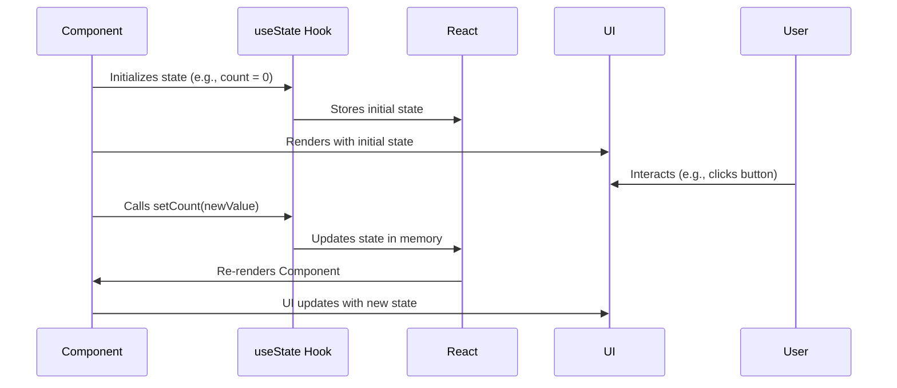

# Chapter 4: Application State (App.tsx)

In the previous chapter, [React Components](03_react_components.md), we learned how to build reusable UI elements. Now, let's talk about how to manage the data that drives those components. This chapter is about **Application State**, and we'll focus on how it's handled in `App.tsx`.

Imagine your application is a car. React components are like the steering wheel, seats, and engine. But what controls how the car runs? What's the fuel level, the speed, the location? That's the **application state**. It's the data that *everything* in your application relies on.

**Central Use Case:** Keeping track of all the vehicles in our fleet management system.

Without a central place to store and manage vehicle data, each page and component would have to fetch and maintain its own copy of the data. This would lead to inconsistencies and make it difficult to update information across the application. For example, if a vehicle's status changes (e.g., from "active" to "under maintenance"), we'd want that change to be reflected everywhere immediately.  Application state helps us solve this.

**What is Application State?**

Application state is essentially all the data that our application needs to function. In `fleetpro-fleetmanagement`, this includes:

*   Vehicles
*   Drivers
*   Users
*   Trips
*   ...and more!

**Why is it in `App.tsx`?**

The `App.tsx` file is the root component of our application. By managing the application state here, we create a single source of truth for our data. This makes it easier to:

*   Share data between different parts of the application.
*   Update data consistently.
*   Avoid "prop drilling" (passing data down through many layers of components).

**Key Concept: `useState` Hook**

In React, we use the `useState` hook to manage state within a component. Think of `useState` as a special box where you can store data and be notified whenever that data changes.

Here's how it works:

```tsx
import React, { useState } from 'react';

function MyComponent() {
  const [count, setCount] = useState(0);

  return (
    <div>
      <p>Count: {count}</p>
      <button onClick={() => setCount(count + 1)}>Increment</button>
    </div>
  );
}
```

Let's break this down:

1.  `useState(0)`: This initializes a piece of state called `count` with a starting value of `0`.
2.  `const [count, setCount]`: This returns an array with two elements:
    *   `count`: The current value of the state.
    *   `setCount`: A function to update the state.
3.  `onClick={() => setCount(count + 1)}`: When the button is clicked, the `setCount` function is called to update the `count` state. This will trigger a re-render of the component, and the displayed count will be updated.

**Managing Vehicle Data in `App.tsx`**

Now, let's see how `useState` is used in `App.tsx` to manage our vehicle data.

```tsx
import React, { useState } from 'react';
import { Vehicle } from './types'; // Assuming you have a Vehicle type defined

const App: React.FC = () => {
  const [vehicles, setVehicles] = useState<Vehicle[]>([]);

  // ...rest of your component
};
```

Explanation:

1.  `useState<Vehicle[]>([])`: This initializes a piece of state called `vehicles` as an *array* of `Vehicle` objects. The initial value is an empty array `[]`.
2.  `const [vehicles, setVehicles]`: This gives us:
    *   `vehicles`: The current array of `Vehicle` objects.
    *   `setVehicles`: A function to update the `vehicles` array.

Now, *any* component in our application can access and update the `vehicles` state through these variables.

**Sharing State with Child Components**

Once we have the state defined in `App.tsx`, we can pass it down to child components as props (remember [React Components](03_react_components.md)?).

```tsx
import React, { useState } from 'react';
import { Vehicle } from './types';
import VehiclesPage from './pages/VehiclesPage';

const App: React.FC = () => {
  const [vehicles, setVehicles] = useState<Vehicle[]>([]);

  return (
    <div>
      <VehiclesPage vehicles={vehicles} />
    </div>
  );
};
```

Here, we're passing the `vehicles` state to the `VehiclesPage` component as a prop.  `VehiclesPage` can then use this data to display the list of vehicles.

**Updating State from Child Components**

If a child component needs to *update* the application state (e.g., when adding a new vehicle), we can pass the `setVehicles` function down as a prop as well.

```tsx
import React, { useState, useCallback } from 'react';
import { Vehicle } from './types';
import VehiclesPage from './pages/VehiclesPage';

const App: React.FC = () => {
  const [vehicles, setVehicles] = useState<Vehicle[]>([]);

  const addVehicle = useCallback((newVehicle: Vehicle) => {
    setVehicles(prevVehicles => [...prevVehicles, newVehicle]);
  }, []);

  return (
    <div>
      <VehiclesPage vehicles={vehicles} addVehicle={addVehicle} />
    </div>
  );
};
```

Key points:

1.  `const addVehicle = useCallback(...)`:  We use `useCallback` to create a memoized function. This helps prevent unnecessary re-renders of child components. `useCallback` will be explained in advanced React tutorials.
2.  `setVehicles(prevVehicles => [...prevVehicles, newVehicle])`:  This is how we update the `vehicles` state.  We use the functional update form `(prevVehicles => ...)` to ensure we're working with the *latest* state. We create a *new* array that includes the previous vehicles *and* the new vehicle.
3.  We pass `addVehicle` to the `VehiclesPage` component.

Now, the `VehiclesPage` component can call the `addVehicle` function to add a new vehicle to the application state.

**Internal Implementation: How `useState` Works**

Let's break down what happens behind the scenes when we use `useState`.



1.  **Initialization:** When the component first renders, `useState` initializes the state with the provided initial value (e.g., `0` for `count`, `[]` for `vehicles`).

2.  **Storage:** React stores this state internally.

3.  **First Render:** The component renders using the initial state.

4.  **Update:** When the user interacts with the component and calls the `setCount` or `setVehicles` function, React updates the state in its internal memory.

5.  **Re-render:** React then re-renders the component, causing the UI to update with the new state value.

**Example in `App.tsx`**

Here's how the `App.tsx` file manages vehicles:

```tsx
import React, { useState, useCallback, useEffect } from 'react';
import { Vehicle } from './types';
import VehiclesPage from './pages/VehiclesPage';

const App: React.FC = () => {
    const [vehicles, setVehicles] = useState<Vehicle[]>([]);

    useEffect(() => {
        // Simulate fetching vehicles from an API
        const initialVehicles: Vehicle[] = [
            { id: '1', make: 'Toyota', model: 'Camry', year: 2020, licensePlate: 'ABC-123' },
            { id: '2', make: 'Honda', model: 'Civic', year: 2022, licensePlate: 'XYZ-456' },
        ];
        setVehicles(initialVehicles);
    }, []);

    const addVehicle = useCallback((newVehicle: Vehicle) => {
        setVehicles(prevVehicles => [...prevVehicles, { ...newVehicle, id: Math.random().toString() }]);
    }, []);

    return (
        <div>
            <VehiclesPage vehicles={vehicles} addVehicle={addVehicle} />
        </div>
    );
};

export default App;
```

Here's a breakdown:

*   `const [vehicles, setVehicles] = useState<Vehicle[]>([]);`: Initializes the vehicle state as an empty array.
*   `useEffect(...)`:  This hook runs once when the component mounts.  It simulates fetching initial vehicle data. `useEffect` will be explained in advanced React tutorials.
*   `setVehicles(initialVehicles)`: Sets the initial vehicle data.
*   `addVehicle`: a function to add a new vehicle to the state.

**In Summary:**

Application state is the data that drives our application. By managing it in `App.tsx` using the `useState` hook, we create a single source of truth and simplify data sharing between components. We learned how to initialize state, update state, and pass state down to child components.

Now that we understand how to manage application state, let's move on to the next chapter: [Wholesale Finance Abstractions (Entities and Statuses)](05_wholesale_finance_abstractions__entities_and_statuses_.md), where we'll explore data structures and statuses in the wholesale finance part of the application.


---

Generated by [AI Codebase Knowledge Builder](https://github.com/The-Pocket/Tutorial-Codebase-Knowledge)