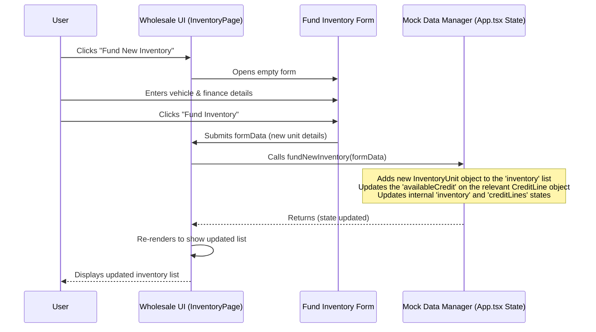
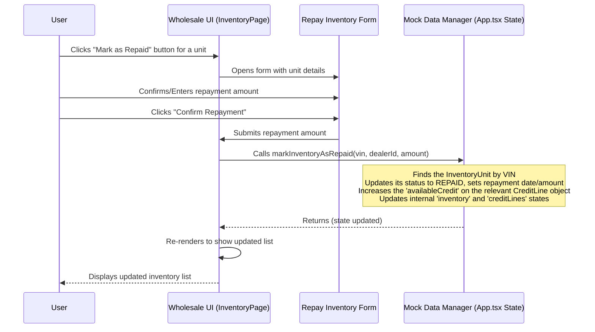

# Chapter 4: Inventory (Wholesale Feature)

Welcome back to the FleetPro tutorial! In the [previous chapter](03_trips__fleet_feature__.md), we returned to the Fleet Management side and learned how the `Trip` entity helps us plan and track vehicle journeys.

Now, let's pivot back to the **Wholesale Finance** side of the application. As we saw in [Chapter 2: Dealerships (Wholesale Entity)](02_dealerships__wholesale_entity__.md), the core of Wholesale Finance is providing funding to dealerships to help them buy vehicles to put on their showroom floors.

Think about a large car dealership. They don't pay for all the cars they have in stock upfront. A finance company (like the one FleetPro's wholesale side is built for) provides them with a credit line (like a business loan) and funds the purchase of specific vehicles from the manufacturer. The dealership then repays the finance company when they sell the vehicle to a final customer.

To manage this, the finance company needs to keep a detailed list of **exactly which vehicles** they have financed for each dealership. This list is the "Inventory" for the wholesale floor plan.

## What is an Inventory Unit Entity?

In FleetPro's Wholesale Finance module, an `InventoryUnit` represents a single, specific vehicle that has been financed under a dealership's floor plan. It's essentially a digital record of an asset that the finance company has a financial interest in while it sits at the dealership.

Each `InventoryUnit` object tracks crucial details about the vehicle itself and its financing status. Looking at the `types.ts` file, you'll find the definition:

```typescript
export enum InventoryUnitStatus {
  PENDING_FUNDING = "Pending Funding",      // Waiting for funds to be released
  IN_STOCK = "In Stock",                  // Funded and at the dealership
  SOLD_PENDING_PAYMENT = "Sold - Pending Payment", // Sold by dealer, awaiting finance repayment
  REPAID = "Repaid",                      // Finance repaid by the dealership
  AUDIT_MISSING = "Audit - Missing",         // Vehicle not found during an audit
}

export enum HypothecationStatus {
  PENDING = "Pending",    // Paperwork for hypothecation (loan attachment) is pending
  COMPLETED = "Completed",// Hypothecation is legally registered
  NOC_ISSUED = "NOC Issued",// No Objection Certificate issued after repayment
}

export interface InventoryUnit {
  vin: string;                  // VIN (Vehicle Identification Number) - Unique ID for the vehicle
  dealershipId: string;         // Links to the Dealership entity that holds this vehicle
  oemInvoiceNumber: string;     // Invoice number from the manufacturer (OEM)
  make: string;
  model: string;
  year: number;
  financedAmount: number;       // The amount funded by the finance company
  fundingDate: string;          // When the funding was disbursed (ISO Date string)
  repaymentDate?: string;       // When the finance was repaid (ISO Date string)
  repaymentAmount?: number;     // The amount repaid
  status: InventoryUnitStatus;  // Current state of the inventory unit
  daysInStock: number;          // How many days it has been financed (auto-calculated)
  hypothecationStatus: HypothecationStatus; // Status of the hypothecation process
  documents?: {                 // Relevant vehicle-specific documents
    invoiceUrl?: string;
    form20Url?: string;         // Form 20 for vehicle registration
  };
}
```

This snippet shows the key properties of an `InventoryUnit`. The `vin` is the primary identifier for the vehicle itself. `dealershipId` connects this financed vehicle back to the specific [Dealerships (Wholesale Entity)](02_dealerships__wholesale_entity__.md) it belongs to. The `financedAmount` and `fundingDate` track the financial transaction. `status` and `hypothecationStatus` are crucial for monitoring the lifecycle of the financed asset. `daysInStock` helps track how long the vehicle has been on the dealer's floor plan, which is important for calculating interest and managing risk.

Here's a quick summary of the key pieces of information and why they matter:

| Information          | Description                                          | Why it's useful                                    |
| :------------------- | :--------------------------------------------------- | :------------------------------------------------- |
| `vin`                | Vehicle Identification Number                        | Unique identifier for the physical car/truck       |
| `dealershipId`       | Link to the dealership holding the vehicle         | Knowing *which* partner has the funded vehicle     |
| `financedAmount`     | How much was funded for this vehicle               | Core financial value for tracking                  |
| `fundingDate`        | When the money was given to buy this vehicle       | Start date for interest calculations & tracking    |
| `status`             | `IN_STOCK`, `REPAID`, `AUDIT_MISSING`, etc.        | Current state in the financing lifecycle           |
| `daysInStock`        | How long it's been financed                      | Indicator for potential issues or floor plan costs |
| `hypothecationStatus`| Legal status of the finance company's claim        | Important for legal compliance                     |

## Use Case: Managing Financed Inventory Items

The main tasks related to `InventoryUnit` entities are:

1.  **Funding New Inventory:** Recording a new vehicle purchase that has been financed for a dealership. This adds a new `InventoryUnit` to the system.
2.  **Tracking & Updating:** Monitoring the status of vehicles (`IN_STOCK`, `SOLD_PENDING_PAYMENT`) and, crucially, marking them as `REPAID` when the dealership has paid back the financed amount.

FleetPro provides a dedicated page for this: the "Floor Plan Inventory" page ([InventoryPage.tsx]).

## How the `InventoryUnit` Entity Helps Solve the Use Case

The `InventoryUnit` entity is the core data structure used by the Inventory page:

1.  **Viewing:** The page loads a list of all `InventoryUnit` objects. It displays key information from each unit, like VIN, vehicle details, funded amount, status, and dealership name (by looking up the `dealershipId`).
2.  **Funding (Adding):** When you use the "Fund New Inventory" feature, a form collects data about the vehicle and the financing. This data is used to create a new `InventoryUnit` object, which is then added to the system's list.
3.  **Tracking & Repaying (Updating):** The page allows you to mark a vehicle as repaid. This action updates the `status` of the corresponding `InventoryUnit` object to `REPAID` and records the `repaymentDate` and `repaymentAmount`.

## Code Snippet: Displaying Inventory

Let's look at a simplified example from the `InventoryPage.tsx` file showing how the application might display a list of inventory units.

```typescript
// Inside InventoryPage.tsx component
interface InventoryPageProps {
  inventory: InventoryUnit[]; // This prop holds the list of InventoryUnit objects
  dealerships: Dealership[]; // Need dealerships to show dealer names
  // ... other props ...
}

const InventoryPage: React.FC<InventoryPageProps> = ({ inventory, dealerships, fundNewInventory, markInventoryAsRepaid }) => {
  // ... state for modals, filtering, etc. ...

  // Helper to find dealership name by ID
  const getDealershipName = (id: string) => dealerships.find(d => d.id === id)?.name || "N/A";

  // 'filteredInventory' is a list of InventoryUnit objects based on filters
  return (
    <div className="space-y-6">
        {/* ... Header and filter controls ... */}

        {/* Table displaying each inventory unit */}
        <div className="bg-gray-800 shadow-xl rounded-lg overflow-x-auto">
            <table className="min-w-full divide-y divide-gray-700">
                <thead className="bg-gray-750">
                    <tr>
                       {/* ... Table Headers (VIN, Dealership, Vehicle, Amount, Status, Days) ... */}
                    </tr>
                </thead>
                <tbody className="divide-y divide-gray-700">
                    {/* Mapping over the filtered list of InventoryUnit entities */}
                    {filteredInventory.map(unit => (
                        <tr key={unit.vin} className="hover:bg-gray-750">
                            {/* Displaying information from the 'unit' object */}
                            <td className="px-4 py-3 whitespace-nowrap text-xs font-mono text-gray-300">
                                {unit.vin}
                                <span className="block text-gray-500">{unit.oemInvoiceNumber}</span>
                            </td>
                            {/* Use getDealershipName to show the dealer's name */}
                            <td className="px-4 py-3 whitespace-nowrap text-sm text-gray-300">{getDealershipName(unit.dealershipId)}</td>
                            <td className="px-4 py-3 whitespace-nowrap text-sm text-gray-300">{unit.make} {unit.model} ({unit.year})</td>
                            <td className="px-4 py-3 whitespace-nowrap text-sm text-right font-semibold text-gray-200">₹{unit.financedAmount.toLocaleString()}</td>
                             {/* ... Status pill using getStatusPill helper ... */}
                            <td className="px-4 py-3 whitespace-nowrap text-sm text-right text-gray-300">{unit.daysInStock}</td>
                            <td className="px-4 py-3 whitespace-nowrap text-center text-sm">
                                {/* Action button - e.g., Mark as Repaid if status is IN_STOCK */}
                                {unit.status === InventoryUnitStatus.IN_STOCK && (
                                    <button onClick={() => setRepayingUnit(unit)} className="text-green-400 hover:underline">Mark as Repaid</button>
                                )}
                            </td>
                        </tr>
                    ))}
                     {/* ... Empty state row ... */}
                </tbody>
            </table>
        </div>

        {/* ... Modals for funding and repaying ... */}
    </div>
  );
};
```

This code shows how the `InventoryPage` receives the list of `InventoryUnit` objects (`filteredInventory`), iterates through them, and displays various properties (`unit.vin`, `unit.make`, etc.) in a table row. It also demonstrates using the `dealershipId` to find the corresponding [Dealerships (Wholesale Entity)](02_dealerships__wholesale_entity__.md) object and display its name.

## Code Snippet: Funding New Inventory (Simplified Form Handling)

When you click "Fund New Inventory", a form pops up, handled by the `FundInventoryForm` component.

```typescript
// Inside FundInventoryForm.tsx component (part of InventoryPage.tsx)
const FundInventoryForm: React.FC<{ dealerships: Dealership[]; onSubmit: (data: any) => void; onCancel: () => void; }> = ({ dealerships, onSubmit, onCancel }) => {
    // State to hold the data being entered in the form
    const [formData, setFormData] = useState({
        dealershipId: dealerships[0]?.id || '', // Default to first dealer
        vin: '',
        make: '',
        model: '',
        year: new Date().getFullYear(),
        financedAmount: 0,
        oemInvoiceNumber: ''
    });

    // Handler for when form input values change
    const handleChange = (e: React.ChangeEvent<HTMLInputElement | HTMLSelectElement>) => {
        const { name, value, type } = e.target;
        // Update state, handling numbers specifically
        setFormData(prev => ({ ...prev, [name]: type === 'number' ? parseFloat(value) || 0 : value }));
    }

    // Handler for when the form is submitted
    const handleSubmit = (e: React.FormEvent) => {
        e.preventDefault();
        // Basic validation
        if(!formData.dealershipId || !formData.vin || !formData.make || !formData.model || formData.financedAmount <= 0) {
            alert("Please fill all required fields.");
            return;
        }
        // Bundle form data with default status/date/hypothecation status
        onSubmit({
            ...formData,
            status: InventoryUnitStatus.IN_STOCK,
            fundingDate: new Date().toISOString(),
            hypothecationStatus: HypothecationStatus.PENDING,
            // daysInStock is calculated internally
        });
    }

    return (
        <form onSubmit={handleSubmit} className="space-y-4">
            {/* Dropdown to select Dealership */}
             <div>
                <label htmlFor="dealershipId" className="...">Dealership *</label>
                <select name="dealershipId" id="dealershipId" value={formData.dealershipId} onChange={handleChange} required className="...">
                    {dealerships.map(d => <option key={d.id} value={d.id}>{d.name}</option>)}
                </select>
            </div>
            {/* Input for VIN */}
            <div>
                <label htmlFor="vin" className="...">Vehicle VIN *</label>
                <input type="text" name="vin" value={formData.vin} onChange={handleChange} required className="..." />
            </div>
            {/* ... Inputs for make, model, year, financedAmount, oemInvoiceNumber ... */}

             <div className="flex justify-end space-x-3 pt-4">
                <button type="button" onClick={onCancel} className="...">Cancel</button>
                <button type="submit" className="...">Fund Inventory</button>
            </div>
        </form>
    )
}
```

This snippet shows the `FundInventoryForm` component collecting user input using `useState` and `handleChange`. When the user submits, `handleSubmit` gathers the data, adds default values for `status`, `fundingDate`, and `hypothecationStatus`, and passes this new inventory data back up to the `InventoryPage` via the `onSubmit` prop.

## Code Snippet: Repaying Inventory (Simplified Form Handling)

When you click "Mark as Repaid" for an `IN_STOCK` unit, a `RepayInventoryForm` component is shown.

```typescript
// Inside RepayInventoryForm.tsx component (part of InventoryPage.tsx)
const RepayInventoryForm: React.FC<{ unit: InventoryUnit; onSubmit: (amount: number) => void; onCancel: () => void; }> = ({ unit, onSubmit, onCancel }) => {
    // State to hold the repayment amount, defaulting to the financed amount
    const [repaymentAmount, setRepaymentAmount] = useState(unit.financedAmount);

    return (
        <form onSubmit={(e) => { e.preventDefault(); onSubmit(repaymentAmount); }} className="space-y-4">
            {/* Display info about the unit being repaid */}
            <p><strong className="...">VIN:</strong> {unit.vin}</p>
            <p><strong className="...">Vehicle:</strong> {unit.make} {unit.model}</p>
            <p><strong className="...">Principal Amount:</strong> ₹{unit.financedAmount.toLocaleString()}</p>
            
            {/* Input for the actual repayment amount */}
            <div>
                <label htmlFor="repaymentAmount" className="...">Repayment Amount (INR) *</label>
                <input type="number" name="repaymentAmount" value={repaymentAmount} onChange={(e) => setRepaymentAmount(Number(e.target.value))} required className="..." />
            </div>
            
            <div className="flex justify-end space-x-3 pt-4">
                <button type="button" onClick={onCancel} className="...">Cancel</button>
                <button type="submit" className="...">Confirm Repayment</button>
            </div>
        </form>
    )
}
```

This form is simpler, focusing on collecting the `repaymentAmount`. It calls the `onSubmit` prop, passing the entered amount, which the `InventoryPage` uses to trigger the repayment logic.

## Under the Hood: Managing Inventory Data (Mock Data)

Similar to other entities in this beginner version, the `InventoryUnit` data is managed using in-memory "Mock Data" within the `App.tsx` file.

Let's look at the simplified flows for funding and repaying inventory:

**Flow 1: Funding New Inventory**

When you use the form to fund a new vehicle:



The user fills the form, the form sends data to the page, and the page calls a function in `App.tsx` (`fundNewInventory`) to add the new `InventoryUnit` to the list. Crucially, funding also reduces the `availableCredit` for the associated [Dealerships (Wholesale Entity)](02_dealerships__wholesale_entity__.md)'s [Credit Lines (Wholesale Feature)]() (which we'll cover later).

**Flow 2: Marking Inventory as Repaid**

When you mark an `IN_STOCK` unit as repaid:



The user confirms repayment, the form sends the amount to the page, and the page calls `markInventoryAsRepaid` in `App.tsx`. This function updates the `InventoryUnit` status and adds repayment details. Importantly, it also *increases* the `availableCredit` on the dealership's [Credit Lines (Wholesale Feature)](), freeing up funds for them to finance more vehicles.

Let's look at the simplified functions in `App.tsx` that handle these updates using React's `useState`:

```typescript
// Inside App.tsx (simplified)
const [inventory, setInventory] = useState<InventoryUnit[]>([]); // Holds the list of inventory units
const [creditLines, setCreditLines] = useState<CreditLine[]>([]); // Holds credit lines

// Handles adding a new inventory unit and updating credit
const fundNewInventory = useCallback((inventoryData: Omit<InventoryUnit, 'daysInStock' | 'status' | 'fundingDate' | 'hypothecationStatus' | 'repaymentDate' | 'repaymentAmount'> & { status: InventoryUnitStatus, fundingDate: string, hypothecationStatus: HypothecationStatus }) => {
  // Note: daysInStock is calculated based on fundingDate vs today
  const newInventoryUnit: InventoryUnit = {
      ...inventoryData,
      daysInStock: 0, // Will be calculated on the fly for display
  };
  setInventory(prev => [...prev, newInventoryUnit]); // Add the new unit

  // Find and update the associated credit line
  setCreditLines(prevLines => prevLines.map(line => {
      if (line.dealershipId === inventoryData.dealershipId) {
          return {
              ...line,
              availableCredit: line.availableCredit - inventoryData.financedAmount,
          };
      }
      return line;
  }));
}, []); // Dependencies for useCallback


// Handles marking inventory as repaid and updating credit
const markInventoryAsRepaid = useCallback((vin: string, dealershipId: string, repaymentAmount: number) => {
    let financedAmountRecovered = 0;
    setInventory(prevInventory => prevInventory.map(unit => {
        if (unit.vin === vin && unit.dealershipId === dealershipId) {
            // This is the unit to update
            financedAmountRecovered = unit.financedAmount; // Capture original amount
            return {
                ...unit,
                status: InventoryUnitStatus.REPAID,
                repaymentDate: new Date().toISOString(),
                repaymentAmount,
            };
        }
        return unit;
    }));

    // Find and update the associated credit line by restoring the *principal* amount
    setCreditLines(prevLines => prevLines.map(line => {
        if (line.dealershipId === dealershipId) {
             // Note: In a real system, interest would also be calculated/paid.
             // Here, we just restore the principal to simplify the mock.
            return {
                ...line,
                availableCredit: line.availableCredit + financedAmountRecovered,
            };
        }
        return line;
    }));
}, []); // Dependencies for useCallback
```

These functions demonstrate how the `setInventory` and `setCreditLines` state update functions are used to modify the in-memory lists. `fundNewInventory` adds a new item to the `inventory` array and decreases `availableCredit`. `markInventoryAsRepaid` finds the item to update, changes its status, and increases `availableCredit` (using the original financed amount for simplicity in the mock).

## Inventory Status and Beyond

The `InventoryUnitStatus` is critical for monitoring the health of the wholesale portfolio.

*   `IN_STOCK` vehicles are the core financed assets actively on the dealer's lot.
*   `SOLD_PENDING_PAYMENT` indicates the dealer sold it, but the finance company hasn't been paid back yet. This is a key status to watch.
*   `REPAID` means the financing for this specific vehicle is closed.
*   `AUDIT_MISSING` is a high-alert status, indicating a financed vehicle could not be located during a physical audit ([Audits (Wholesale Feature)]()).

The `InventoryUnit` entity connects several parts of the Wholesale Finance system:

*   It is linked directly to the [Dealerships (Wholesale Entity)](02_dealerships__wholesale_entity__.md) (`dealershipId`) that holds the vehicle.
*   Its financing affects the `availableCredit` of the dealership's [Credit Lines (Wholesale Feature)]() (covered in a later chapter).
*   These units are the items checked during physical [Audits (Wholesale Feature)]() (covered in a later chapter).

Understanding the `InventoryUnit` entity is fundamental to seeing how FleetPro tracks the specific assets financed for dealership partners.

## Conclusion

In this chapter, we learned about the `InventoryUnit` entity, which represents a specific vehicle financed for a dealership under a floor plan. We saw how this entity holds crucial details like VIN, financed amount, funding date, and status. We explored how it's used on the Inventory page to track and manage these assets, from funding new vehicles to marking them as repaid, and how these actions affect the dealership's credit line, all managed using the in-memory mock data approach.

Understanding the `InventoryUnit` entity is key to managing the assets side of the Wholesale Finance application. Next, we'll take a step back and look at how these entities and features come together to form the actual screens or "Pages" you see in the application.

[Next Chapter: Pages](05_pages_.md)

---

<sub><sup>**References**: [[1]](https://github.com/rakeshkrrajak/fleetpro-fleetmanagement/blob/7b84d99e0dc11a8c8350b388be15b56727655e66/App.tsx), [[2]](https://github.com/rakeshkrrajak/fleetpro-fleetmanagement/blob/7b84d99e0dc11a8c8350b388be15b56727655e66/pages/wholesale/InventoryPage.tsx), [[3]](https://github.com/rakeshkrrajak/fleetpro-fleetmanagement/blob/7b84d99e0dc11a8c8350b388be15b56727655e66/pages/wholesale/WholesaleDashboardPage.tsx), [[4]](https://github.com/rakeshkrrajak/fleetpro-fleetmanagement/blob/7b84d99e0dc11a8c8350b388be15b56727655e66/types.ts)</sup></sub>