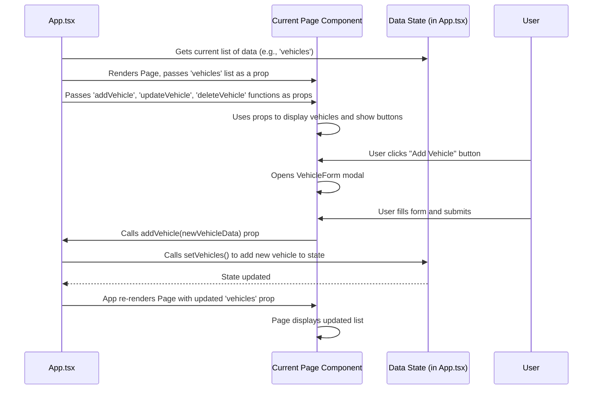

# Chapter 5: Pages

Welcome back to the FleetPro tutorial! In the previous chapters, we explored the fundamental building blocks of our application: the core data structures like [Vehicles (Fleet Entity)](01_vehicles__fleet_entity__.md), [Dealerships (Wholesale Entity)](02_dealerships__wholesale_entity__.md), [Trips (Fleet Feature)](03_trips__fleet_feature__.md), and [Inventory (Wholesale Feature)](04_inventory__wholesale_feature__.md). We learned what information they hold and the basic actions you can perform on them (like adding a vehicle or funding inventory).

But how do you actually *see* all this information? How do you click a button to add a new vehicle or view the details of a trip? This is where **Pages** come in.

## What are Pages?

Imagine FleetPro is like a building with different rooms. Each room is designed for a specific purpose. The "Vehicles Room" is where you see and manage your vehicles, the "Trips Room" is where you plan journeys, and the "Inventory Room" is for managing financed vehicles.

In a software application like FleetPro, these "rooms" are called **Pages**.

A **Page** is essentially a full-screen component that represents a distinct section or view of the application. When you click something in the navigation menu, you are typically moving from one page to another.

Think of the screens you see on your smartphone when you open an app. One screen shows your contacts, another shows your messages, another your photos. Each of those is a distinct "page" within the app.

In FleetPro, we have pages like:

*   **Dashboard:** The first page you see, giving a summary.
*   **Vehicles:** A page dedicated to viewing, adding, and managing vehicles.
*   **Trips:** Where you plan and track vehicle journeys.
*   **Inventory:** For managing financed vehicles for dealerships.
*   **Maintenance Tasks:** To schedule and log vehicle maintenance.
*   **Telematics Alerts:** To see notifications from vehicle tracking devices.
*   ... and others!

Each page component is responsible for showing you the right information and letting you perform actions relevant to that specific view.

## Core Use Case: Navigating and Interacting with Application Sections

The main use case for Pages is simply allowing users to access different functional areas of the application. You want to go to the Vehicles page to work with vehicles, the Trips page to work with trips, and so on. Once you are on a page, you expect to see the relevant data displayed and have controls (buttons, forms, filters) to interact with that data.

For example, on the **Vehicles Page**, you expect to:
1.  See a list or grid of all your vehicles.
2.  Click a button to add a new vehicle.
3.  Click on an existing vehicle to see its details or edit it.
4.  Search or filter the list.

The `VehiclesPage` component (the code that *is* the Vehicles Page) brings together the display, the data, and the user interactions for that specific view.

## How Pages Bring Things Together

A Page component acts like a conductor in an orchestra. It doesn't play all the instruments itself, but it tells them when and how to play together.

1.  **Gets Data:** A page needs the data it's supposed to show. For the Vehicles page, it needs the list of `Vehicle` objects. For the Trips page, it needs the list of `Trip` objects. (We'll see *how* it gets this data shortly).
2.  **Displays Data:** It takes the data it received and arranges it visually on the screen, often using smaller, reusable building blocks called UI Components (which we'll cover in the next chapter!). This might be a list, a table, cards, charts, etc.
3.  **Handles Interactions:** It responds to user actions like button clicks or form submissions. When a user clicks "Add New Vehicle", the page component opens the "Add Vehicle Form" (another component). When the user saves the form, the page component takes the data from the form and passes it along to the part of the application that actually saves the new vehicle.

Let's look at snippets from the code for a few pages we've discussed to see these concepts in action.

### Example: The Vehicles Page (`pages/VehiclesPage.tsx`)

This component is responsible for the `/vehicles` view.

```typescript
// Inside VehiclesPage.tsx
interface VehiclesPageProps {
  vehicles: Vehicle[]; // 1. Receives the list of vehicles as a 'prop'
  drivers: Driver[]; // Also receives drivers to show assignments
  maintenanceTasks: MaintenanceTask[]; // Receives maintenance tasks to show recent ones
  addVehicle: (vehicleData: any) => void; // 3. Receives functions to perform actions
  updateVehicle: (vehicle: any) => void;
  deleteVehicle: (vehicleId: string) => void;
}

const VehiclesPage: React.FC<VehiclesPageProps> = ({ vehicles, drivers, maintenanceTasks, addVehicle, updateVehicle, deleteVehicle }) => {
  // ... state for modals (like the add/edit form), filters, selected vehicle ...

  // Helper function to find the assigned driver's name
  const getAssignedDriverName = useCallback((vehicleId: string): string => {
    const driver = drivers.find(d => d.assignedVehicleId === vehicleId);
    return driver ? driver.name : "None";
  }, [drivers]);

  // Filtering logic (simplied)
  const filteredVehicles = useMemo(() => {
    // Filters vehicles based on search term
    return vehicles.filter(vehicle => /* ... search logic ... */ true );
  }, [vehicles, searchTerm]);

  // 2. Displays Data - Mapping over the filtered list to render vehicle cards
  return (
    <div className="space-y-8">
      {/* ... Page Header & Add Button ... */}
      
      {/* Search Input */}
      <input type="text" placeholder="Search vehicles..." className="..." value={searchTerm} onChange={(e) => setSearchTerm(e.target.value)} />

      {/* Conditional rendering: show details for selected vehicle OR list */}
      {selectedVehicle ? (
        <div className="..."> {/* Details section */}
            {/* Displays details from selectedVehicle */}
            <h2 className="..."> {/* selectedVehicle.make, model, etc. */}</h2>
            {/* ... other details including selectedVehicle._assignedDriverName ... */}
            {/* 3. Action Buttons (e.g., Edit, Delete, Schedule Maint) */}
            <button onClick={() => openEditModal(selectedVehicle)} className="...">Edit Vehicle</button>
            {/* ... other buttons ... */}
        </div>
      ) : (
        <div className="grid grid-cols-1 ... gap-6">
            {/* Mapping over the filtered list to show cards */}
            {filteredVehicles.map(vehicle => (
                <div key={vehicle.id} className="..."> {/* Vehicle Card */}
                    {/* Displays vehicle info from the 'vehicle' object */}
                     
                    <div className="p-5">
                        <h3 className="..."> {/* vehicle.make, model, year */}</h3>
                        <p className="...">Plate: {vehicle.licensePlate}</p>
                        {/* Uses the helper to show linked driver info */}
                        <p className="...">Driver: {getAssignedDriverName(vehicle.id)}</p>
                        {/* ... Status pill etc. ... */}
                    </div>
                    <div className="p-3 ...">
                         {/* 3. Action Buttons (e.g., View Details, Edit) */}
                        <button onClick={() => viewVehicleDetails(vehicle)} className="...">View Details</button>
                        <button onClick={() => openEditModal(vehicle)} className="...">Edit</button>
                    </div>
                </div>
            ))}
        </div>
      )}

      {/* 3. Modal for Add/Edit Form */}
      <Modal isOpen={isModalOpen} onClose={closeModal} title={editingVehicle ? 'Edit Vehicle' : 'Add New Vehicle'} size="3xl'>
        {/* VehicleForm component is rendered inside the modal */}
        <VehicleForm 
            onSubmit={handleFormSubmit} // Passes the function to handle form data
            onCancel={closeModal} 
            initialData={editingVehicle}
            drivers={drivers}
            vehicles={vehicles}
        />
      </Modal>
    </div>
  );
};
```
**Explanation:**
*   The `VehiclesPage` component is defined, and it accepts `vehicles`, `drivers`, `maintenanceTasks`, and functions like `addVehicle` as `props`. This is how it receives the data and the ability to trigger actions from the layer above it (as we'll see).
*   It uses React's `useState` to manage things like whether the "Add/Edit Vehicle" modal is open (`isModalOpen`) or which vehicle is currently being edited (`editingVehicle`).
*   `filteredVehicles` demonstrates how the page might process the data (in this case, filtering based on a search term).
*   The `return` statement contains the JSX, which describes what the page looks like. It includes a search input, and then conditionally renders either a detailed view of one vehicle (`selectedVehicle`) or a grid of vehicle cards.
*   Crucially, it iterates over the `filteredVehicles` array using `.map()` to create a visual representation (a `div` or card) for *each* `Vehicle` object. It displays properties like `vehicle.make`, `vehicle.licensePlate`, etc.
*   It also shows how a page can use data from *other* entities (like `drivers`) by looking up the driver associated with a vehicle's `driverId` to display the driver's name.
*   Buttons like "Add New Vehicle", "View Details", and "Edit" trigger functions defined within the `VehiclesPage` component (like `openAddModal`, `viewVehicleDetails`, `openEditModal`).
*   When an action requires input (like adding a vehicle), the page opens a `Modal` and renders a `VehicleForm` component inside it, passing the `handleFormSubmit` function as a prop so the form knows what to do when the user clicks save.

This illustrates that the page component pulls in necessary data, uses JavaScript logic to process it (like filtering), uses JSX to structure the visual layout, and contains the handlers for user interactions on that specific screen.

### Example: The Trips Page (`pages/TripsPage.tsx`)

Similarly, the `TripsPage` component manages the `/trips` view.

```typescript
// Inside TripsPage.tsx
interface TripsPageProps {
  trips: Trip[]; // Receives the list of trips
  vehicles: Vehicle[]; // Needed to show vehicle info on the trip list
  drivers: Driver[]; // Needed to show driver info on the trip list
  costCategories: CostCategory[]; // Needed for the TripForm (costs)
  addTrip: (tripData: any) => void; // Actions
  updateTrip: (trip: Trip) => void;
  cancelTrip: (tripId: string) => void;
}

const TripsPage: React.FC<TripsPageProps> = ({ trips, vehicles, drivers, costCategories, addTrip, updateTrip, cancelTrip }) => {
  // ... state for modals, selected trip, filtering ...

  // Helper functions to get linked vehicle/driver info for display
  const getVehicleInfo = useCallback((vehicleId: string | null) => vehicles.find(v => v.id === vehicleId), [vehicles]);
  const getDriverInfo = useCallback((driverId: string | null) => drivers.find(d => d.id === driverId), [drivers]);

  // Filtering trips by status
  const filteredTrips = useMemo(() => {
    if (filterStatus === 'ALL') return trips;
    return trips.filter(trip => trip.status === filterStatus);
  }, [trips, filterStatus]);

  return (
    <div className="space-y-6">
      {/* ... Page Header & Plan New Trip Button ... */}

      {/* Filter control for status */}
      <div className="...">
        <label htmlFor="filterStatus" className="...">Filter by Status:</label>
        <select id="filterStatus" value={filterStatus} onChange={(e) => setFilterStatus(e.target.value as TripStatus | 'ALL')} className="...">
            {/* ... options for ALL, PLANNED, ONGOING, etc. ... */}
        </select>
      </div>

      {/* Grid displaying trips */}
      <div className="grid grid-cols-1 ... gap-6">
        {/* Mapping over the filtered list of Trip entities */}
        {filteredTrips.map(trip => {
          const vehicle = getVehicleInfo(trip.vehicleId); // Look up linked vehicle
          const driver = getDriverInfo(trip.driverId);   // Look up linked driver
          return (
            <div key={trip.id} className="..."> {/* Trip Card */}
              <div className="p-5">
                {/* Displays trip info */}
                <h3 className="..."> {trip.tripName}</h3>
                <span className={`... ${getStatusColor(trip.status)}`}>{trip.status}</span>
                <p className="...">Origin: {trip.origin}</p>
                <p className="...">Destination: {trip.destination}</p>
                {/* Displays info from linked entities */}
                {vehicle && <p className="...">Vehicle: {vehicle.make} ({vehicle.licensePlate})</p>}
                {driver && <p className="...">Driver: {driver.name}</p>}
                {/* ... more details ... */}
              </div>
              <div className="p-3 ...">
                {/* Action Buttons (e.g., Details, Edit, Cancel) */}
                <button onClick={() => viewTripDetails(trip)} className="...">Details</button>
                {/* Conditional buttons based on status */}
                 {trip.status === TripStatus.PLANNED && <button onClick={() => openEditModal(trip)} className="...">Edit</button>}
              </div>
            </div>
          );
        })}
        {/* ... Empty state message ... */}
      </div>

      {/* Modal for Add/Edit/Details */}
      {(isModalOpen && !selectedTripDetails) && (
        <Modal isOpen={true} onClose={closeModal} title={editingTrip ? 'Edit Trip Plan' : 'Plan New Trip'} size="2xl">
          {/* TripForm component */}
          <TripForm onSubmit={handleFormSubmit} onCancel={closeModal} initialData={editingTrip} vehicles={vehicles} drivers={drivers} costCategories={costCategories} />
        </Modal>
      )}

      {selectedTripDetails && (
         {/* TripDetailModal component */}
         <TripDetailModal trip={selectedTripDetails} onClose={closeModal} />
      )}
    </div>
  );
};
```
**Explanation:**
*   Similar to the Vehicles page, `TripsPage` receives `trips`, `vehicles`, `drivers`, etc., as props.
*   It filters the `trips` list based on the selected status.
*   It maps over the `filteredTrips` to render a card for each trip.
*   Inside the map, it uses helper functions (`getVehicleInfo`, `getDriverInfo`) to find the associated vehicle and driver objects based on the IDs stored in the `trip` object, so it can display names and details from those linked entities.
*   It manages modals for planning/editing trips (`TripForm`) and viewing trip details (`TripDetailModal`).

Pages are where the data (entities, features) meets the user interface. They orchestrate the presentation and interaction for a specific part of the application.

## Under the Hood: How Pages Get Their Data (Mock Data)

In this project, especially in this beginner-friendly phase using "Mock Data" (data stored in memory), the management of the core lists of data (vehicles, trips, dealerships, etc.) happens centrally, primarily in the main `App.tsx` file.

The `App.tsx` component holds the state for all these lists using React's `useState`. It also defines the functions that modify these lists (like `addVehicle`, `updateTrip`, `fundNewInventory`).

When `App.tsx` decides which Page component to show (based on the application's "routing", which we'll cover in a later chapter), it passes the relevant data from its state *down* to that Page component as **props**. It also passes the functions that the page can call to request changes to the data.

Let's visualize this simple flow:


**Explanation:**
1.  `App.tsx` holds the source of truth for the data (the `vehicles` state).
2.  When `App.tsx` renders the `VehiclesPage`, it gives the page a copy of the `vehicles` list (the data) and the functions (`addVehicle`, etc.) needed to modify that data. These are passed as component `props`.
3.  The `VehiclesPage` component uses the `vehicles` prop to display the list.
4.  When the user performs an action like adding a vehicle through the form, the `VehiclesPage` doesn't modify the data directly. Instead, it calls the `addVehicle` function that was passed down to it as a prop.
5.  This `addVehicle` function is actually defined in `App.tsx`. When it's called, it updates the central `vehicles` state in `App.tsx`.
6.  When the state in `App.tsx` changes, React automatically re-renders `App.tsx`, which in turn re-renders the `VehiclesPage`, passing down the *new*, updated list of vehicles.
7.  The `VehiclesPage` receives the updated list and displays it, showing the change to the user.

Here's a tiny look at how `App.tsx` might render a page and pass data:

```typescript
// Inside App.tsx (simplified)
import VehiclesPage from './pages/VehiclesPage'; // Import the page component
// ... other page imports ...

function App() {
  // State holds the data for different parts of the app
  const [vehicles, setVehicles] = useState<Vehicle[]>([]);
  const [trips, setTrips] = useState<Trip[]>([]);
  const [dealerships, setDealerships] = useState<Dealership[]>([]);
  // ... other states ...

  // Functions to modify data (passed down as props)
  const addVehicle = useCallback((vehicleData: any) => {
    // ... logic to create new vehicle with ID ...
    setVehicles(prev => [...prev, newVehicle]); // Updates the state
  }, []);
  // ... updateVehicle, deleteVehicle ...
  // ... addTrip, updateTrip ...
  // ... addDealership ...

  // Example of rendering the VehiclesPage (simplified routing)
  // In the actual app, this uses React Router, but the concept is the same
  const currentPage = '/vehicles'; // Imagine this comes from routing

  return (
    <div className="app-container">
      {/* ... Navigation Menu ... */}
      <main className="page-content">
        {currentPage === '/vehicles' && (
            // Rendering the VehiclesPage and passing data/actions as props
            <VehiclesPage
                vehicles={vehicles}
                drivers={drivers} // Pass other relevant data
                maintenanceTasks={maintenanceTasks}
                addVehicle={addVehicle} // Pass action functions
                updateVehicle={updateVehicle}
                deleteVehicle={deleteVehicle}
            />
        )}
        {/* ... other pages rendered similarly based on currentPage ... */}
         {currentPage === '/trips' && (
            // Rendering TripsPage and passing its data/actions
            <TripsPage
                trips={trips}
                vehicles={vehicles} // Trips needs vehicles too!
                drivers={drivers}
                costCategories={costCategories}
                addTrip={addTrip}
                updateTrip={updateTrip}
                cancelTrip={cancelTrip}
            />
        )}
        {/* ... etc. for InventoryPage, DealershipsPage, etc. */}
      </main>
    </div>
  );
}
```
**Explanation:**
*   `App.tsx` imports the different page components (`VehiclesPage`, `TripsPage`, etc.).
*   It manages the central data lists using `useState`.
*   It defines the functions (`addVehicle`, `addTrip`, etc.) that update these central lists.
*   When it renders a specific page component (like `VehiclesPage`), it passes the necessary data (`vehicles`, `drivers`, `maintenanceTasks`) and the functions (`addVehicle`, `updateVehicle`, `deleteVehicle`) as `props`.

This pattern is standard in many modern web applications: a higher-level component manages the central data, and it passes slices of that data and functions to modify it down to the components (like pages) that need to display and interact with it.

## Pages vs. Reusable UI Components

It's important to distinguish between a "Page" and a "Reusable UI Component".

*   **Pages:** These are the top-level views. They are specific to a section of the application (e.g., "Vehicles Page", "Trips Page"). They orchestrate the data display and user interaction for that whole screen. They are *not* typically reused on different kinds of pages (you don't put the entire "Vehicles Page" inside the "Trips Page").
*   **Reusable UI Components:** These are smaller building blocks *used by* pages (and sometimes other components). Examples include buttons, text inputs, dropdown menus, data tables, modals (pop-up windows), cards, etc. They are designed to be generic and can be used on many different pages or in many different places *within* a page. For example, the `Modal` component and the `VehicleForm` component are used *by* the `VehiclesPage`. The `TripsPage` might use the same `Modal` component but put a `TripForm` inside it.

Pages are built *from* reusable UI components, but a reusable UI component is not a page.

## Conclusion

In this chapter, we learned that **Pages** are the user-facing screens in FleetPro. They organize the application's features and data into distinct views like "Vehicles", "Trips", and "Inventory". We saw that a Page component's main job is to receive the data it needs, display it visually, and provide the interface for users to perform actions, often using smaller components like forms and modals. We also got a look under the hood at how, in our current mock setup, the main `App.tsx` file holds the central data and passes it down to the pages as props, along with functions to modify that data.

Understanding Pages is crucial because they are what the user directly interacts with. They are where all the underlying data (entities) and logic (features) come together in a visual way.

Next, we'll dive deeper into those smaller building blocks that pages are made of: **Reusable UI Components**.

[Next Chapter: Reusable UI Components](06_reusable_ui_components_.md)

---

<sub><sup>Generated by [AI Codebase Knowledge Builder](https://github.com/The-Pocket/Tutorial-Codebase-Knowledge).</sup></sub> <sub><sup>**References**: [[1]](https://github.com/rakeshkrrajak/fleetpro-fleetmanagement/blob/7b84d99e0dc11a8c8350b388be15b56727655e66/pages/DashboardPage.tsx), [[2]](https://github.com/rakeshkrrajak/fleetpro-fleetmanagement/blob/7b84d99e0dc11a8c8350b388be15b56727655e66/pages/TelematicsAlertsPage.tsx), [[3]](https://github.com/rakeshkrrajak/fleetpro-fleetmanagement/blob/7b84d99e0dc11a8c8350b388be15b56727655e66/pages/TripsPage.tsx), [[4]](https://github.com/rakeshkrrajak/fleetpro-fleetmanagement/blob/7b84d99e0dc11a8c8350b388be15b56727655e66/pages/VehiclesPage.tsx), [[5]](https://github.com/rakeshkrrajak/fleetpro-fleetmanagement/blob/7b84d99e0dc11a8c8350b388be15b56727655e66/pages/maintenance/MaintenanceTasksPage.tsx), [[6]](https://github.com/rakeshkrrajak/fleetpro-fleetmanagement/blob/7b84d99e0dc11a8c8350b388be15b56727655e66/pages/wholesale/InventoryPage.tsx)</sup></sub>