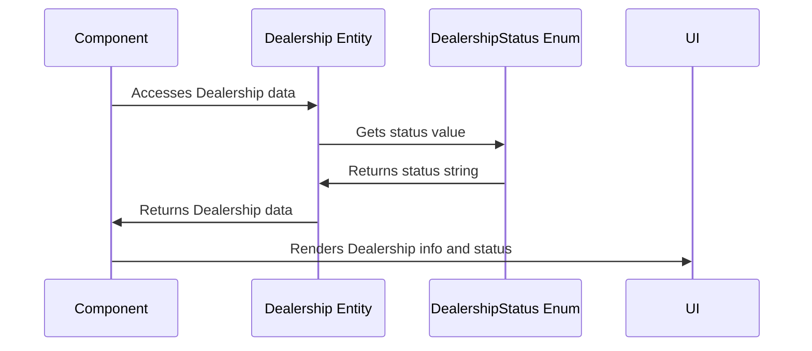

# Chapter 5: Wholesale Finance Abstractions (Entities and Statuses)

In the previous chapter, [Application State (App.tsx)](04_application_state__app_tsx_.md), we learned how to manage the data that drives our application using `useState` in `App.tsx`. Now, let's focus on organizing and structuring the data itself, especially in the wholesale finance part of our application. We'll be discussing **Wholesale Finance Abstractions (Entities and Statuses)**.

Imagine you're building a model car collection. You need to know what cars you have (make, model, year), who owns them, and what condition they're in. In our wholesale finance application, we need to keep track of similar information for dealerships, credit lines, and inventory. These are our "entities." We also need to know their state, like whether a dealership is active or suspended – their "statuses." This chapter will guide you on how to define and use these entities and statuses in `fleetpro-fleetmanagement`.

**Central Use Case:** Displaying a list of dealerships and their current status on the `DealershipsPage`.

Without clear definitions of what a "Dealership" is, what properties it has, and what statuses it can be in, our code would become messy and hard to understand. These abstractions help us solve this problem by providing a clear and consistent way to represent the different parts of our wholesale finance application.

**Key Concepts**

Let's break down the key concepts behind these abstractions:

1.  **Entities:** These represent the core "things" in our wholesale finance world. Examples include `Dealership`, `CreditLine`, and `InventoryUnit`.

2.  **Statuses:** These describe the state of an entity at a particular point in time. Examples include `DealershipStatus` and `InventoryUnitStatus`.

**1. Entities: The Core "Things"**

Entities are like nouns in a sentence – they represent the subjects we're talking about. In our case, they represent the key objects in our wholesale finance application.

*   **`Dealership`**: This entity represents a car dealership. It has properties like name, location, dealer principal, and more.

    ```tsx
    interface Dealership {
      id: string;
      name: string;
      dealerPrincipal: string;
      location: string;
      status: DealershipStatus; // We'll talk about DealershipStatus next!
      agreementDate: string;
      creditLineId: string | null;
    }
    ```

    This code defines what a `Dealership` *is*. It *must* have an `id`, a `name`, a `dealerPrincipal`, a `location`, a `status`, an `agreementDate` and a `creditLineId` that is either a string or null. Think of this as the blueprint for a dealership object. The `DealershipStatus` type is explained below.

*   **`CreditLine`**: This entity represents the credit line extended to a dealership. It includes properties like total limit, available credit, and interest rate.

    ```tsx
    interface CreditLine {
      id: string;
      dealershipId: string;
      totalLimit: number;
      availableCredit: number;
      interestRate: number;
      status: CreditLineStatus;
    }
    ```

    Similar to `Dealership`, this code defines what a `CreditLine` *is*.

*   **`InventoryUnit`**: This represents a single vehicle in a dealership's inventory. It has properties like VIN, make, model, and financed amount.

    ```tsx
    interface InventoryUnit {
      vin: string;
      dealershipId: string;
      make: string;
      model: string;
      year: number;
      financedAmount: number;
      status: InventoryUnitStatus;
      fundingDate: string;
      daysInStock: number;
      oemInvoiceNumber: string;
      hypothecationStatus: HypothecationStatus;
    }
    ```

    Again, this code defines what an `InventoryUnit` *is*.

**2. Statuses: Describing the State**

Statuses are like adjectives – they describe the state of our entities. They tell us whether a dealership is active, whether an inventory unit is in stock, and so on.

*   **`DealershipStatus`**: This describes the status of a dealership. It can be `ONBOARDING`, `ACTIVE`, `SUSPENDED`, or `INACTIVE`.

    ```tsx
    enum DealershipStatus {
      ONBOARDING = 'Onboarding',
      ACTIVE = 'Active',
      SUSPENDED = 'Suspended',
      INACTIVE = 'Inactive',
    }
    ```

    This code defines the possible statuses for a `Dealership`. It can only be one of these four values.

*   **`InventoryUnitStatus`**: This describes the status of a vehicle in inventory. It can be `IN_STOCK`, `SOLD_PENDING_PAYMENT`, `REPAID`, or `AUDIT_MISSING`.

    ```tsx
    enum InventoryUnitStatus {
        IN_STOCK = 'In Stock',
        SOLD_PENDING_PAYMENT = 'Sold (Pending Payment)',
        REPAID = 'Repaid',
        AUDIT_MISSING = 'Audit Missing'
    }
    ```

     This code defines the possible statuses for an `InventoryUnit`.

**Solving the Central Use Case: Displaying Dealerships**

Let's see how we can use these abstractions to display a list of dealerships and their statuses on the `DealershipsPage`.

First, we need to get the list of dealerships from our application state (as explained in [Application State (App.tsx)](04_application_state__app_tsx_.md)). Let's assume we have an array of `Dealership` objects called `dealerships`.

Now, in our `DealershipsPage` component, we can map over this array and display the information for each dealership.

```tsx
import React from 'react';
import { Dealership, DealershipStatus } from '../../types';

interface DealershipsPageProps {
  dealerships: Dealership[];
}

const DealershipsPage: React.FC<DealershipsPageProps> = ({ dealerships }) => {
  return (
    <div>
      <h1>Dealerships</h1>
      {dealerships.map(dealership => (
        <div key={dealership.id}>
          <h2>{dealership.name}</h2>
          <p>Status: {dealership.status}</p>
        </div>
      ))}
    </div>
  );
};

export default DealershipsPage;
```

This code iterates over the `dealerships` array and, for each dealership, displays its name and status. Notice that we're using the `dealership.status` property, which is of type `DealershipStatus`. This ensures that the status is always one of the allowed values (ONBOARDING, ACTIVE, SUSPENDED, or INACTIVE).

**Example Inputs and Outputs:**

Let's say we have the following `dealerships` array:

```tsx
const dealerships = [
  { id: '1', name: 'Acme Motors', dealerPrincipal: 'John Doe', location: 'New York', status: DealershipStatus.ACTIVE, agreementDate: '2023-01-01', creditLineId: null },
  { id: '2', name: 'Beta Cars', dealerPrincipal: 'Jane Smith', location: 'Los Angeles', status: DealershipStatus.ONBOARDING, agreementDate: '2023-02-01', creditLineId: null },
];
```

The `DealershipsPage` component will render the following HTML:

```html
<div>
  <h1>Dealerships</h1>
  <div>
    <h2>Acme Motors</h2>
    <p>Status: Active</p>
  </div>
  <div>
    <h2>Beta Cars</h2>
    <p>Status: Onboarding</p>
  </div>
</div>
```

The `AuditsPage.tsx`, `CreditLinesPage.tsx`, `DealershipsPage.tsx` and `InventoryPage.tsx` all use these data types in the pages.

**Internal Implementation**

When we use these entities and statuses, here's what happens behind the scenes:



1.  **Component Access:** Our React component (e.g., `DealershipsPage`) needs to display information about a dealership.
2.  **Entity Access:** The component accesses the `Dealership` entity, which is just a JavaScript object with properties.
3.  **Status Resolution:**  To display the dealership's status, the component reads the `status` property, which is of type `DealershipStatus`. This enum ensures the status is a valid value.
4.  **UI Rendering:**  The component then renders the dealership information and its status in the user interface.

The code for defining the entities and statuses is located in `src/types.ts` (covered in [Data Types (Interfaces and Enums)](06_data_types__interfaces_and_enums_.md)).

**In Summary:**

In this chapter, we learned about Wholesale Finance Abstractions, specifically entities and statuses. Entities are like nouns representing the "things" in our application (Dealership, CreditLine, InventoryUnit), while statuses are like adjectives describing the state of those entities (DealershipStatus, InventoryUnitStatus). We saw how to use these abstractions to display a list of dealerships and their statuses on the `DealershipsPage`.  We also explored how these abstractions are used in the internal implementation.

Now that we understand how to define and use these abstractions, let's move on to the next chapter: [Data Types (Interfaces and Enums)](06_data_types__interfaces_and_enums_.md), where we'll dive deeper into how these data types are defined and used in our application.


---

Generated by [AI Codebase Knowledge Builder](https://github.com/The-Pocket/Tutorial-Codebase-Knowledge)