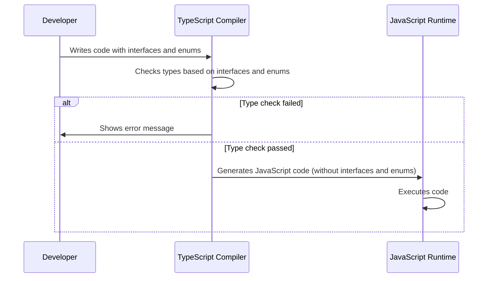

# Chapter 6: Data Types (Interfaces and Enums)

In the previous chapter, [Wholesale Finance Abstractions (Entities and Statuses)](05_wholesale_finance_abstractions__entities_and_statuses_.md), we learned about entities and statuses in the wholesale finance part of our application. Now, let's zoom in on how we define these entities and statuses, along with other data structures, using **Data Types (Interfaces and Enums)**.

Imagine you're baking a cake. You need a recipe that specifies what ingredients to use (flour, sugar, eggs) and how much of each. In our application, data types are like that recipe. They tell us what kind of data we're working with, like what a `Vehicle` looks like or what the possible statuses for a `MaintenanceTask` are. This chapter will show you how to define and use data types to ensure our application uses data consistently and correctly.

**Central Use Case:** Defining the structure of a `Vehicle` object, including its properties (make, model, year) and their data types (string, number).

Without clearly defined data types, our code could become chaotic. We might accidentally assign a number to the `make` property or use an invalid status for a `MaintenanceTask`. Data types help us solve this problem by providing a blueprint for our data and ensuring that we use it in the right way.

**Key Concepts**

Let's break down the key concepts behind data types in TypeScript:

1.  **Interfaces:** These define the "shape" of an object. They specify what properties an object has and what data types those properties should be.
2.  **Enums:** These define a set of named constants. They are useful for representing a fixed set of values, like the possible statuses for a vehicle.

**1. Interfaces: Defining Object Shapes**

Interfaces are like blueprints for objects. They tell us what properties an object has and what data types those properties should be.

*   **`Vehicle` Interface**:

    Let's look at a simplified version of the `Vehicle` interface:

    ```tsx
    interface Vehicle {
      id: string;
      make: string;
      model: string;
      year: number;
    }
    ```

    This code defines what a `Vehicle` object *should* look like. It *must* have an `id` (which is a string), a `make` (which is a string), a `model` (which is a string), and a `year` (which is a number).

    Think of it like this: If you're building a house, the blueprint specifies that it *must* have walls, a roof, and a door. Similarly, the `Vehicle` interface specifies that a `Vehicle` object *must* have these four properties.

*   **Using the `Vehicle` Interface**:

    Now, let's see how we can use this interface to create a `Vehicle` object:

    ```tsx
    const myVehicle: Vehicle = {
      id: '123',
      make: 'Toyota',
      model: 'Camry',
      year: 2020,
    };
    ```

    This code creates a `Vehicle` object called `myVehicle` and assigns values to its properties. Because we've specified that `myVehicle` *must* follow the `Vehicle` interface, TypeScript will check to make sure that we've included all the required properties and that they have the correct data types.

    If we try to create a `Vehicle` object without all the required properties, TypeScript will give us an error:

    ```tsx
    // This will cause an error!
    const myVehicle: Vehicle = {
      id: '123',
      make: 'Toyota',
      model: 'Camry',
    };
    ```

*   **Optional Properties**:
    You can specify if a property on an interface is optional by adding a `?` after the property name:

        ```tsx
        interface Vehicle {
          id: string;
          make: string;
          model: string;
          year: number;
          imageUrl?: string; // The image url is optional
        }
        ```

**2. Enums: Defining Named Constants**

Enums are like lists of allowed values. They help us represent a fixed set of options, like the possible statuses for a vehicle or the different types of maintenance tasks.

*   **`VehicleStatus` Enum**:

    Let's look at the `VehicleStatus` enum:

    ```tsx
    enum VehicleStatus {
      ACTIVE = 'Active',
      MAINTENANCE = 'Maintenance',
      INACTIVE = 'Inactive',
      RETIRED = 'Retired',
    }
    ```

    This code defines the possible values for the `VehicleStatus`. A vehicle can only be `ACTIVE`, `MAINTENANCE`, `INACTIVE`, or `RETIRED`.

    Think of it like this: If you're ordering a pizza, you might have a list of toppings to choose from (pepperoni, mushrooms, onions). The `VehicleStatus` enum is like that list of toppings – it specifies the only allowed values for the vehicle's status.

*   **Using the `VehicleStatus` Enum**:

    Now, let's see how we can use this enum in our `Vehicle` interface:

    ```tsx
    interface Vehicle {
      id: string;
      make: string;
      model: string;
      year: number;
      status: VehicleStatus;
    }
    ```

    This code says that the `status` property of a `Vehicle` object *must* be one of the values defined in the `VehicleStatus` enum.

    When we create a `Vehicle` object, we can now use the enum to assign a value to the `status` property:

    ```tsx
    const myVehicle: Vehicle = {
      id: '123',
      make: 'Toyota',
      model: 'Camry',
      year: 2020,
      status: VehicleStatus.ACTIVE,
    };
    ```

    If we try to assign an invalid value to the `status` property, TypeScript will give us an error:

    ```tsx
    // This will cause an error!
    const myVehicle: Vehicle = {
      id: '123',
      make: 'Toyota',
      model: 'Camry',
      year: 2020,
      status: 'Broken',
    };
    ```

**Solving the Central Use Case: Defining a `Vehicle` Object**

Let's put it all together and see how we can use interfaces and enums to define a `Vehicle` object:

```tsx
enum VehicleStatus {
  ACTIVE = 'Active',
  MAINTENANCE = 'Maintenance',
  INACTIVE = 'Inactive',
  RETIRED = 'Retired',
}

interface Vehicle {
  id: string;
  make: string;
  model: string;
  year: number;
  status: VehicleStatus;
}

const myVehicle: Vehicle = {
  id: '123',
  make: 'Toyota',
  model: 'Camry',
  year: 2020,
  status: VehicleStatus.ACTIVE,
};
```

This code defines the `VehicleStatus` enum and the `Vehicle` interface. It then creates a `Vehicle` object called `myVehicle` and assigns values to its properties, making sure to use the `VehicleStatus` enum for the `status` property.

**Example Inputs and Outputs:**

If we try to log the `myVehicle` object to the console, we'll see the following output:

```json
{
  "id": "123",
  "make": "Toyota",
  "model": "Camry",
  "year": 2020,
  "status": "Active"
}
```

**Internal Implementation**

When we use interfaces and enums, here's what happens behind the scenes:



1.  **Developer Writes Code:** We write our code using interfaces and enums to define the structure of our data.
2.  **TypeScript Compiler Checks Types:** The TypeScript compiler checks our code to make sure that we're using the interfaces and enums correctly. If we violate the rules defined by the interfaces and enums, the compiler will give us an error.
3.  **JavaScript Runtime Executes Code:** Once our code passes the type-checking phase, the TypeScript compiler generates JavaScript code. **Important:** Interfaces and enums are *removed* during this process. They only exist to help us catch errors during development. The JavaScript runtime then executes the generated code.

The code for defining the entities and statuses is located in `src/types.ts`.

**In Summary:**

In this chapter, we learned about data types, specifically interfaces and enums. Interfaces help us define the "shape" of our objects, while enums help us define a set of named constants. We saw how to use these data types to define a `Vehicle` object and how TypeScript helps us catch errors during development.

Now that we understand how to define and use data types, let's move on to the next chapter: [Constants](07_constants.md), where we'll explore how to define and use constant values in our application.


---

Generated by [AI Codebase Knowledge Builder](https://github.com/The-Pocket/Tutorial-Codebase-Knowledge)