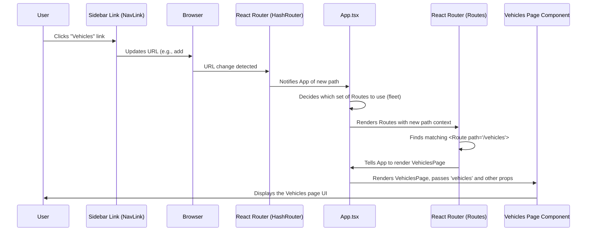

# Chapter 7: Application Structure & Routing

Welcome back to the FleetPro tutorial! In the [previous chapter](06_reusable_ui_components_.md), we explored **Reusable UI Components**, the building blocks like buttons and modals that we use to create our user interface. We also learned about **Pages** ([Chapter 5: Pages](05_pages_.md)), which are the full screens users interact with, like the Vehicles page or the Inventory page.

Now that we know *what* pages and components are, we need to understand *how* the application puts them all together and decides which page to show at any given time. Think about a complex machine with many parts. You need a central system to control which parts are active and how they work together.

In FleetPro, this central control system, especially for deciding what the user sees, involves the main **App component** and **Routing**.

## What is the Application Structure & Routing?

Imagine FleetPro is like a website with different sections. You have the Fleet Management section and the Wholesale Finance section. Within each section, you have different pages (like Vehicles, Trips, Dealerships, Inventory).

The **main App component (`App.tsx`)** is the core of our application. It's the first component that gets rendered (besides some setup code). Its main jobs are:

1.  **Holds Central Data:** It keeps track of the important lists of data we discussed in earlier chapters (the list of all vehicles, all dealerships, all trips, etc.) using React's `useState`. This data is shared by many different parts of the application.
2.  **Decides the Main Layout:** It renders the basic structure of the page – the sidebar menu on the left (either the Fleet one or the Wholesale one) and the main content area on the right.
3.  **Handles Routing:** It uses a special library called **React Router** (`react-router-dom`) to look at the web address (the URL in your browser's address bar) and figure out which Page component (like `VehiclesPage` or `InventoryPage`) should be displayed in that main content area.
4.  **Manages App Switching:** It controls which of the two main applications (Fleet Management or Wholesale Finance) the user is currently viewing, affecting which sidebar and which set of pages are available.

It's like the main entrance hall of our building (the `App` component). It shows you the navigation signs (the sidebar) and directs you to the correct room (the page) based on where you want to go (the URL). It also manages the overall state of the building (like whether you're in the Fleet wing or the Wholesale wing).

## Core Use Case: Navigating Between Different Application Sections

The main use case this concept solves is simply allowing users to move around the application. When a user clicks a link in the sidebar, the application needs to:

1.  Change the URL in the browser.
2.  Show the correct page corresponding to the new URL.
3.  Ensure the data displayed on the new page is correct and up-to-date.

The `App` component and React Router work together to make this happen smoothly.

## How it Works: App, State, and Routes

Let's break down the key pieces:

### 1. The Entry Point (`index.tsx` and `index.html`)

When you open the application in your browser, the first files loaded are `index.html` and `index.tsx`.

`index.html` is the basic HTML page skeleton. It has a `<div id="root"></div>` where our React application will be placed.

```html
<!-- index.html (simplified) -->
<!DOCTYPE html>
<html lang="en">
  <head>
    <meta charset="UTF-8" />
    <meta name="viewport" content="width=device-width, initial-scale=1.0" />
    <title>FleetPro</title>
    <!-- ... other setup like Tailwind CSS, importmap ... -->
  </head>
  <body class="bg-gray-900 ...">
    <div id="root"></div> <!-- This is where React renders the app -->
    <script type="module" src="/index.tsx"></script> <!-- Starts the React app -->
  </body>
</html>
```

`index.tsx` is the very first piece of React code that runs. It finds the `<div id="root">` and tells React to render the main `App` component inside it. It also wraps the `App` component with `HashRouter` from `react-router-dom`.

```typescript
// index.tsx
import React from 'react';
import ReactDOM from 'react-dom/client';
import App from './App'; // Import the main App component
import { HashRouter } from 'react-router-dom'; // Import the router

const rootElement = document.getElementById('root');
if (!rootElement) {
  throw new Error("Could not find root element to mount to");
}

const root = ReactDOM.createRoot(rootElement);
root.render(
  <React.StrictMode>
    {/* Wrap the App with the router */}
    <HashRouter>
      <App /> 
    </HashRouter>
  </React.StrictMode>
);
```
**Explanation:**
*   `ReactDOM.createRoot(rootElement).render(...)` is the standard way to start a React application. It tells React to take the components inside `render()` and put them into the `rootElement` on the page.
*   `<HashRouter>` is part of React Router. It enables navigation by using the hash (`#`) symbol in the URL (e.g., `http://localhost:5173/#/vehicles`). This is useful for simple deployments. `HashRouter` listens for changes after the `#` and tells the `App` component (and the router inside it) what the current path is.

### 2. The Main App Component (`App.tsx`)

This is where the magic happens. `App.tsx` is a large component that:

*   Initializes and holds all the main application data (vehicles, trips, dealerships, etc.) in its state using `useState`.
*   Defines all the functions to add, update, or delete this data (like `addVehicle`, `fundNewInventory`).
*   Uses the `currentApp` state (`'fleet'` or `'wholesale'`) to decide which main layout parts to render.
*   Uses React Router's `<Routes>` and `<Route>` components to decide which page component to render based on the URL.

Here's a simplified look at the structure of `App.tsx`:

```typescript
// App.tsx (simplified structure)
import React, { useState, useCallback, useEffect } from 'react';
import { Routes, Route, Navigate } from 'react-router-dom'; // React Router parts
import Sidebar from './components/Sidebar'; // Fleet sidebar
import WholesaleSidebar from './components/WholesaleSidebar'; // Wholesale sidebar

// Import all the page components
import DashboardPage from './pages/DashboardPage';
import VehiclesPage from './pages/VehiclesPage';
// ... import other fleet pages ...
import WholesaleDashboardPage from './pages/wholesale/WholesaleDashboardPage';
import DealershipsPage from './pages/wholesale/DealershipsPage';
// ... import other wholesale pages ...

// Import types and mock data logic
import { Vehicle, Dealership, Trip, /* ... other types ... */ } from './types';
import { generateMockId, /* ... other mock data functions ... */ } from './constants';

const App: React.FC = () => {
  // 1. Central Data State
  const [vehicles, setVehicles] = useState<Vehicle[]>([]);
  const [drivers, setDrivers] = useState<Driver[]>([]);
  // ... state for all other data lists (trips, dealerships, inventory, etc.) ...

  // State to control which app is active
  const [currentApp, setCurrentApp] = useState<'fleet' | 'wholesale'>('fleet'); // Default to fleet

  // useEffect to generate initial mock data on startup (covered in later chapter)
  useEffect(() => {
    // ... mock data generation logic ...
    setVehicles(/* ... */);
    setDrivers(/* ... */);
    // ... set other data states ...
    setIsLoading(false); // Hide loading spinner once data is ready
  }, []); // Empty dependency array means run once on mount

  // Callback functions to modify state (passed down to pages)
  const addVehicle = useCallback((vehicleData: Omit<Vehicle, 'id'>) => {
     // ... logic to create vehicle ...
     setVehicles(prev => [...prev, newVehicle]);
  }, []);
  // ... other add, update, delete functions for all data types ...
   const addDealership = useCallback((dealershipData: Omit<Dealership, 'id'>) => {
     // ... logic ...
     setDealerships(prev => [...prev, newDealership]);
  }, []);
  // ... fundNewInventory, markInventoryAsRepaid, etc. ...


  if (isLoading) {
    return (
      // Show loading spinner while data is generated
      <div className="...">Loading Application Data...</div>
    );
  }

  return (
    <div className="flex h-screen bg-gray-900 text-gray-200">
      {/* 2. Decide and Render the Sidebar */}
      {currentApp === 'fleet' ? (
        <Sidebar currentApp={currentApp} setCurrentApp={setCurrentApp} />
      ) : (
        <WholesaleSidebar currentApp={currentApp} setCurrentApp={setCurrentApp} />
      )}

      {/* The Main Content Area */}
      <main className="flex-1 ml-72 p-8 overflow-y-auto bg-gray-850">
        {/* 3. Handle Routing based on currentApp */}
        {currentApp === 'fleet' ? (
          <Routes>
            {/* Fleet Routes */}
            <Route path="/" element={<DashboardPage vehicles={vehicles} drivers={drivers} /* ... other data ... */ />} />
            <Route path="/vehicles" element={<VehiclesPage vehicles={vehicles} drivers={drivers} addVehicle={addVehicle} updateVehicle={updateVehicle} deleteVehicle={deleteVehicle}/>} />
            <Route path="/trips" element={<TripsPage trips={trips} vehicles={vehicles} drivers={drivers} addTrip={addTrip} updateTrip={updateTrip} cancelTrip={cancelTrip}/>} />
            {/* ... other fleet routes ... */}
            {/* Fallback route for fleet */}
            <Route path="/fleet/*" element={<Navigate to="/" />} /> 
          </Routes>
        ) : (
          <Routes>
             {/* Wholesale Finance Routes */}
              {/* Redirect / to wholesale dashboard when in wholesale mode */}
              <Route path="/" element={<Navigate to="/wholesale/dashboard" />} /> 
              <Route path="/wholesale/dashboard" element={<WholesaleDashboardPage dealerships={dealerships} creditLines={creditLines} inventory={inventory} /* ... other data ... */ />} />
              <Route path="/wholesale/dealerships" element={<DealershipsPage dealerships={dealerships} creditLines={creditLines} inventory={inventory} addDealership={addDealership} />} />
              <Route path="/wholesale/inventory" element={<InventoryPage inventory={inventory} dealerships={dealerships} fundNewInventory={fundNewInventory} markInventoryAsRepaid={markInventoryAsRepaid} />} />
            {/* ... other wholesale routes ... */}
            {/* Fallback route for wholesale */}
            <Route path="/wholesale/*" element={<Navigate to="/wholesale/dashboard" />} />
          </Routes>
        )}
      </main>
    </div>
  );
};

export default App;
```
**Explanation:**
*   The `App` component uses `useState` to hold the main lists of data (`vehicles`, `trips`, `dealerships`, `inventory`, etc.). This is our simple in-memory mock data management system for now.
*   It uses the `currentApp` state (controlled by the `AppSwitcher` component within the sidebars) to conditionally render either the `<Sidebar>` or `<WholesaleSidebar>` component.
*   The `<main>` HTML tag represents the main content area next to the sidebar.
*   Inside `<main>`, it uses `currentApp` again to conditionally render *one of two sets* of `<Routes>`.
*   `<Routes>` is a React Router component that looks at the current URL path (provided by the `HashRouter` from `index.tsx`).
*   `<Route path="/vehicles" element={<VehiclesPage ... />}>` is a single route definition. It says: "If the URL path is `/vehicles` (after the `#`), then render the `VehiclesPage` component."
*   Crucially, when rendering a page component like `VehiclesPage`, `App.tsx` passes the relevant data from its state (`vehicles`, `drivers`, `maintenanceTasks`) *down* as props. It also passes the functions that modify this data (`addVehicle`, `updateVehicle`, `deleteVehicle`) as props. This is how the `VehiclesPage` gets the information it needs to display and the ability to ask `App.tsx` to make changes.
*   `<Navigate>` is another React Router component used for redirection. For example, when in wholesale mode, accessing the base path `/` automatically redirects the user to `/wholesale/dashboard`.

### 3. Routing and Navigation (React Router in Action)

React Router manages the relationship between the URL in the browser and the components that are displayed.

*   The `HashRouter` in `index.tsx` sets up the system to use URLs like `/`, `#/vehicles`, `#/wholesale/inventory`.
*   The `<Routes>` component in `App.tsx` acts as a container for all possible routes.
*   Each `<Route>` component maps a specific `path` (a part of the URL) to a specific `element` (a React component, which is one of our pages).

When you click a `<NavLink>` component (used in our sidebars, as seen in Chapter 6), like the one for Vehicles:

```typescript
// Inside components/Sidebar.tsx (simplified)
import { NavLink } from 'react-router-dom';

// ... inside SidebarNavLink component ...
<NavLink to={item.path} className={/* ... */}>
  {/* ... link content ... */}
</NavLink>
```
**Explanation:**
*   The `to={item.path}` prop on the `NavLink` component (where `item.path` might be something like `/vehicles`) tells React Router where to navigate.
*   Instead of doing a full page reload like a standard HTML `<a href="...">` tag, `NavLink` (and the underlying React Router) intercepts the click.
*   It updates the URL in the browser's address bar (e.g., adds or changes `#/vehicles`).
*   The `HashRouter` detects this URL change.
*   The `App` component, which contains the `<Routes>`, re-renders because the URL (which React Router makes available) has changed.
*   The `<Routes>` component looks at the new URL, finds the matching `<Route path="/vehicles">`, and renders the `VehiclesPage` component in the main area, replacing whatever page was there before.

Here's a simplified flow of a navigation click:


**Explanation:**
*   The user's click on a `NavLink` triggers a URL change.
*   React Router's `HashRouter` detects this and signals the `App` component.
*   The `App` component (along with its conditional `<Routes>`) re-renders.
*   The `<Routes>` component matches the URL to the correct `<Route>` definition (`path="/vehicles"`).
*   The `App` component then renders the `VehiclesPage` component that was specified in that `<Route>`, providing it with the necessary data and functions as props from the `App` component's state.

### 4. App Switching (`currentApp` state)

The `App` component also manages the `currentApp` state (`'fleet'` or `'wholesale'`). The `AppSwitcher` component (placed in both sidebars) simply updates this state when clicked:

```typescript
// Inside components/AppSwitcher.tsx (simplified)
interface AppSwitcherProps {
  currentApp: 'fleet' | 'wholesale';
  setCurrentApp: (app: 'fleet' | 'wholesale') => void; // Function to update state
}

const AppSwitcher: React.FC<AppSwitcherProps> = ({ currentApp, setCurrentApp }) => {
  return (
    <div>
      <button onClick={() => setCurrentApp('fleet')}> {/* Calls the function prop */}
        Fleet Manager
      </button>
      <button onClick={() => setCurrentApp('wholesale')}> {/* Calls the function prop */}
        Wholesale Finance
      </button>
    </div>
  );
};
```
**Explanation:**
*   The `AppSwitcher` component receives the `currentApp` state and the `setCurrentApp` function as props from `App.tsx`.
*   When a button is clicked, it calls `setCurrentApp` with the appropriate value (`'fleet'` or `'wholesale'`).
*   This updates the `currentApp` state in `App.tsx`.
*   When `currentApp` changes, `App.tsx` re-renders. Because the sidebar and the `<Routes>` components are conditionally rendered based on `currentApp`, changing the state switches the displayed sidebar and makes the corresponding set of routes active.

If the user is on `/vehicles` (a fleet path) and switches to Wholesale Finance, the `currentApp` state changes. The `App` component re-renders, now showing the `WholesaleSidebar` and activating the wholesale `<Routes>`. Since `/vehicles` is not a valid wholesale path, the wholesale `<Routes>` will trigger the fallback `<Route path="/wholesale/*" element={<Navigate to="/wholesale/dashboard" />}>`, redirecting the user to the wholesale dashboard (`/wholesale/dashboard`).

## Summary of Roles

Here's a simple table summarizing the roles of the key parts in application structure and routing:

| Part               | Role                                                    | Key Concepts                                  | Where to find it (in code) |
| :----------------- | :------------------------------------------------------ | :-------------------------------------------- | :------------------------- |
| `index.html`       | The starting HTML page structure                        | Root element (`<div id="root">`)              | `index.html`               |
| `index.tsx`        | Renders the main `App` into the HTML, sets up routing   | `ReactDOM.createRoot`, `HashRouter`           | `index.tsx`                |
| `App.tsx`          | The application's main component / orchestrator           | Holds central state, decides main layout, manages app switch, contains all routes | `App.tsx`                  |
| `react-router-dom` | Library for mapping URLs to components (Routing)        | `HashRouter`, `Routes`, `Route`, `NavLink`, `Navigate` | Imported and used in `index.tsx` and `App.tsx`, and components like `SidebarNavLink` |
| `Sidebar`, `WholesaleSidebar` | Navigation menus                             | Receive `currentApp`, `setCurrentApp` props, use `NavLink` | `components/Sidebar.tsx`, `components/WholesaleSidebar.tsx` |
| Page Components    | Full-screen views (Vehicles, Trips, etc.)              | Receive data and action functions as props, use reusable UI components | Files in `pages/` and `pages/wholesale/` |
| `AppSwitcher`      | Component to toggle between Fleet and Wholesale apps    | Receives `currentApp`, `setCurrentApp` props  | `components/AppSwitcher.tsx` |

Understanding this structure is fundamental. The `App` component is the state manager and router orchestrator, passing everything down to the components that need it. Routing provides the user-friendly way to navigate between the different sections (pages) managed by the `App`.

## Conclusion

In this chapter, we pulled back the curtain to see how the FleetPro application is structured at a high level. We learned that the main `App.tsx` component acts as the central hub, holding important data, deciding between the Fleet and Wholesale views, and using **React Router** to map URLs to the correct Page components. We saw how `index.tsx` starts the app and sets up the router, and how clicking links updates the URL, triggering the `App` component to render the right page.

This structure is crucial because it defines how data flows from the central `App` down to the pages and how user navigation works. Next, we'll dive deeper into another foundational concept: how we formally define the shape of our data using Interfaces and Enums.

[Next Chapter: Data Types (Interfaces & Enums)](08_data_types__interfaces___enums__.md)

---

<sub><sup>Generated by [AI Codebase Knowledge Builder](https://github.com/The-Pocket/Tutorial-Codebase-Knowledge).</sup></sub> <sub><sup>**References**: [[1]](https://github.com/rakeshkrrajak/fleetpro-fleetmanagement/blob/7b84d99e0dc11a8c8350b388be15b56727655e66/App.tsx), [[2]](https://github.com/rakeshkrrajak/fleetpro-fleetmanagement/blob/7b84d99e0dc11a8c8350b388be15b56727655e66/components/AppSwitcher.tsx), [[3]](https://github.com/rakeshkrrajak/fleetpro-fleetmanagement/blob/7b84d99e0dc11a8c8350b388be15b56727655e66/components/Sidebar.tsx), [[4]](https://github.com/rakeshkrrajak/fleetpro-fleetmanagement/blob/7b84d99e0dc11a8c8350b388be15b56727655e66/components/WholesaleSidebar.tsx), [[5]](https://github.com/rakeshkrrajak/fleetpro-fleetmanagement/blob/7b84d99e0dc11a8c8350b388be15b56727655e66/index.html), [[6]](https://github.com/rakeshkrrajak/fleetpro-fleetmanagement/blob/7b84d99e0dc11a8c8350b388be15b56727655e66/index.tsx)</sup></sub>