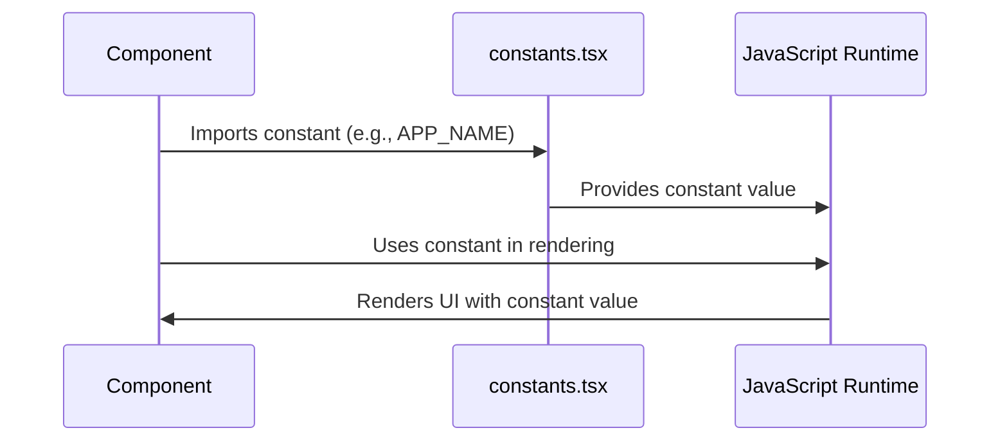

# Chapter 7: Constants

In the previous chapter, [Data Types (Interfaces and Enums)](06_data_types__interfaces_and_enums_.md), we explored how to define the structure of our data using interfaces and enums. Now, let's talk about **Constants**.

Imagine you're building a model airplane. You need glue, screws, and maybe some paint. These are essential items you'll use throughout the building process. In our application, **constants** are like those essential items. They're commonly used values and settings that different parts of our project need.

**Central Use Case:** Using the application's name "FleetPro" throughout the application.

Without a central place to store the application's name, we'd have to type "FleetPro" in every file where we need it. If we ever wanted to change the name to "FleetManager," we'd have to find and replace it *everywhere*. Constants help us solve this problem by defining the application's name in one place.

**What are Constants?**

Constants are values that don't change during the execution of our application. They can be anything from:

*   Static data (like the application's name).
*   Icon components.
*   Navigation items.
*   Mock data counts (how many fake vehicles to create for testing).
*   API keys (for connecting to external services).
*   Default image URLs.
*   Simulation parameters (for testing how the application behaves under different conditions).

**Why Use Constants?**

*   **Maintainability:** If a value needs to be changed, you only have to change it in one place.
*   **Readability:** Using a named constant (e.g., `APP_NAME`) makes code easier to understand than using a "magic" value (e.g., `"FleetPro"`).
*   **Consistency:** Ensures that the same value is used consistently throughout the application.

**Key Concepts**

1.  **Declaring Constants:** In TypeScript, we declare constants using `const`. This tells the compiler that the value of the variable cannot be changed after it's initialized.

2.  **Grouping Constants:** We typically group related constants in a single file (e.g., `constants.tsx`) to keep our code organized.

**How to Use Constants**

Let's see how we can use constants in our `fleetpro-fleetmanagement` project.

**Step 1: Declare a Constant**

In `constants.tsx`, we can declare a constant for the application's name:

```tsx
export const APP_NAME = "FleetPro";
```

This code declares a constant called `APP_NAME` and assigns it the value `"FleetPro"`. The `export` keyword makes this constant available to other files in our project.

**Step 2: Use the Constant**

Now, we can use the `APP_NAME` constant in any component where we need to display the application's name:

```tsx
import React from 'react';
import { APP_NAME } from './constants';

function Header() {
  return <h1>Welcome to {APP_NAME}!</h1>;
}
```

This code imports the `APP_NAME` constant from `constants.tsx` and uses it in the `Header` component to display the application's name.

**Example: Navigation Items**

Another common use case for constants is defining navigation items. Instead of hardcoding the navigation items in our `Sidebar` component (mentioned in [Routing (React Router)](02_routing__react_router_.md) and [React Components](03_react_components.md)), we can define them as constants:

```tsx
import { HomeIcon, TruckIcon, UserGroupIcon, RouteIcon, WrenchIcon, ChartBarIcon, LightBulbIcon, ShieldCheckIcon, CogIcon, MapPinIcon, BuildingStorefrontIcon, BanknotesIcon, RectangleStackIcon, ClipboardDocumentCheckIcon, BellAlertIcon, CurrencyDollarIcon, TagIcon, FireIcon, ChartPieIcon, DocumentChartBarIcon, DocumentTextIcon, EnvelopeIcon, ArrowDownTrayIcon, DevicePhoneMobileIcon} from './constants';
import { NavigationItem } from './types';

export const NAVIGATION_ITEMS: NavigationItem[] = [
  { name: "Dashboard", path: "/", icon: HomeIcon },
  { name: "Fleet Overview", path: "/fleet-overview", icon: ChartBarIcon },
  { name: "Advanced Insights", path: "/advanced-insights", icon: LightBulbIcon },
  { name: "Vehicles", path: "/vehicles", icon: TruckIcon },
  { name: "Drivers", path: "/drivers", icon: UserGroupIcon },
  { name: "Trips", path: "/trips", icon: RouteIcon },
  { 
    name: "Maintenance", 
    path: "/maintenance", 
    icon: WrenchIcon,
    children: [
        { name: "Maintenance Dashboard", path: "/maintenance/dashboard", icon: ChartPieIcon },
        { name: "Maintenance Tasks", path: "/maintenance/tasks", icon: ClipboardListIcon },
        { name: "Mechanics Directory", path: "/maintenance/mechanics", icon: UserGroupIcon },
    ]
  },
  { 
    name: "Cost Management", 
    path: "/costs", 
    icon: CurrencyDollarIcon,
    children: [
        { name: "Cost Dashboard", path: "/costs/dashboard", icon: DocumentChartBarIcon },
        { name: "Fuel Dashboard", path: "/costs/fuel-dashboard", icon: ChartPieIcon },
        { name: "Cost Categories", path: "/costs/categories", icon: TagIcon },
        { name: "Vehicle Costs", path: "/costs/vehicle-entry", icon: CreditCardIcon },
        { name: "Fuel Log", path: "/costs/fuel-log", icon: FireIcon },
    ]
  },
  { 
    name: "Telematics", 
    path: "/telematics", 
    icon: BellAlertIcon,
    children: [
        { name: "Alerts Dashboard", path: "/telematics/dashboard", icon: ChartPieIcon },
        { name: "Alerts Log", path: "/telematics/log", icon: ClipboardListIcon },
        { name: "Email Log", path: "/telematics/email-log", icon: EnvelopeIcon },
    ]
  },
  { 
    name: "Safety & Compliance", 
    path: "/safety", 
    icon: ShieldCheckIcon,
    children: [
        { name: "Safety Dashboard", path: "/safety/dashboard", icon: ChartPieIcon },
        { name: "Document Compliance", path: "/safety/documents", icon: DocumentTextIcon },
    ]
  },
  { name: "User Management", path: "/user-management", icon: UserGroupIcon }, 
  { name: "Map Overview", path: "/map", icon: MapPinIcon },
  { name: "Settings", path: "/settings", icon: CogIcon },
];
```

This code defines an array of `NavigationItem` objects. Each object represents a link in the navigation menu. It includes the name of the link, the path to navigate to, and an icon to display. The icons themselves are imported as constants as well! (Explained more in-depth below.)

Now, in our `Sidebar` component, we can import this constant and use it to render the navigation menu:

```tsx
import React from 'react';
import { NAVIGATION_ITEMS } from './constants';
import { NavLink } from 'react-router-dom';

function Sidebar() {
  return (
    <ul>
      {NAVIGATION_ITEMS.map(item => (
        <li key={item.name}>
          <NavLink to={item.path}>
            {item.icon && <item.icon />} {item.name}
          </NavLink>
        </li>
      ))}
    </ul>
  );
}
```

This code iterates over the `NAVIGATION_ITEMS` array and renders a `NavLink` for each item. The `NavLink` component (from `react-router-dom`, as discussed in [Routing (React Router)](02_routing__react_router_.md)) creates a link to the specified path.

**Example: Icon Components**

The `constants.tsx` file also exports React components as constants for icons. For example:

```tsx
import React from 'react';

export const HomeIcon = (props: React.SVGProps<SVGSVGElement>) => (
  <svg xmlns="http://www.w3.org/2000/svg" fill="none" viewBox="0 0 24 24" strokeWidth={1.5} stroke="currentColor" {...props}>
    <path strokeLinecap="round" strokeLinejoin="round" d="M2.25 12l8.954-8.955a1.5 1.5 0 012.122 0l8.954 8.955M2.25 12v10.5a.75.75 0 00.75.75h4.5a.75.75 0 00.75-.75v-6a.75.75 0 01.75-.75h3a.75.75 0 01.75.75v6a.75.75 0 00.75.75h4.5a.75.75 0 00.75-.75V12m-16.5 0a1.5 1.5 0 01-1.06-2.56l8.954-8.955a1.5 1.5 0 012.122 0l8.954 8.955a1.5 1.5 0 01-1.06 2.56H2.25z" />
  </svg>
);
```

This code defines a functional React component called `HomeIcon` that renders an SVG icon. The `export` keyword makes this component available to other files in our project. You can similarly create Icon constants to be used and referenced throughout the app.

**Internal Implementation**

When we use constants, here's what happens behind the scenes:



1.  **Component Imports Constant:** Our React component (e.g., `Header`) needs to use a constant value (e.g., `APP_NAME`).
2.  **Value Provided:** The component imports the constant from `constants.tsx`. The JavaScript runtime retrieves the value of the constant from memory.
3.  **Component Uses Constant:** The component uses the constant value in its rendering logic.
4.  **UI Rendering:** The component renders the UI with the constant value.

When the application is compiled, the constants are essentially "inlined" into the code. This means that the value of the constant is directly inserted into the code where it's used. This can improve performance because the JavaScript runtime doesn't have to look up the value of the constant at runtime.

**In Summary:**

In this chapter, we learned about constants. Constants are values that don't change during the execution of our application. They help us improve maintainability, readability, and consistency in our code. We saw how to declare constants, group them in a single file, and use them in our components.

Now that we understand how to use constants, let's move on to the next chapter: [Mock Data Generation](08_mock_data_generation.md), where we'll explore how to generate fake data for testing our application.


---

Generated by [AI Codebase Knowledge Builder](https://github.com/The-Pocket/Tutorial-Codebase-Knowledge)