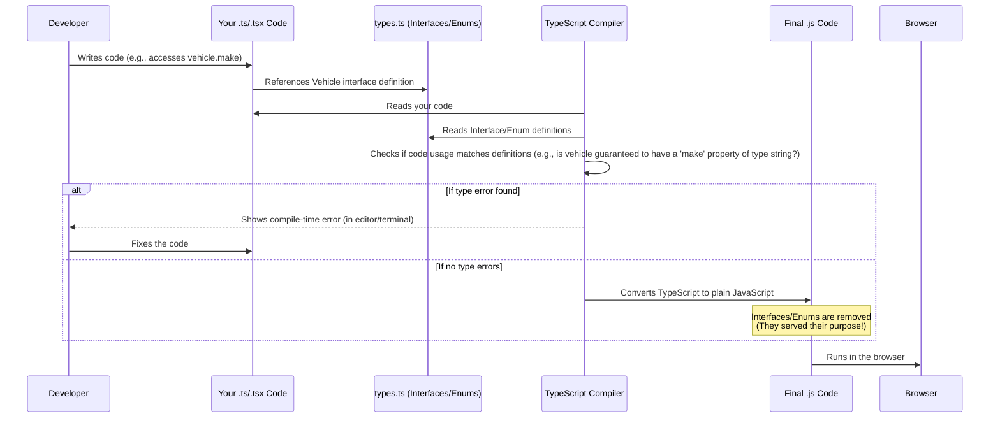

# Chapter 8: Data Types (Interfaces & Enums)

Welcome back to the FleetPro tutorial! In the [previous chapter](07_application_structure___routing__.md), we explored how the main `App.tsx` component works with **Routing** to organize our application into different **Pages** and navigate between them. We saw that `App.tsx` holds the central lists of data (like vehicles, trips, and dealerships) and passes this data down to the pages that need to display and interact with it.

But what *is* this data, exactly? How does the application (and you, as you look at the code) know what pieces of information are stored for a vehicle, or what are the possible states a trip can be in? This is where we need clear definitions for our data.

Imagine you're building something with LEGOs. The instructions need to tell you exactly what kind of bricks you have (e.g., "a red 2x4 brick," "a blue 1x1 circular plate") and sometimes provide a limited set of options (e.g., "use either a yellow door or a brown door"). Without this clarity, building would be chaotic!

In software, we need a similar way to define the "shape" and "allowed values" for the information our application handles. This is the role of **Data Types**, specifically **Interfaces** and **Enums** in our TypeScript project.

## What are Interfaces? (The Blueprint)

Think of an **Interface** as a **blueprint or a contract** for what an object should look like. It defines the names of the properties an object *must* have, and the *type* of data each property will hold (like text, numbers, true/false, or even lists of other things).

Interfaces are a feature of TypeScript (the language we're using, which adds type checking to JavaScript). They help you catch mistakes *before* you even run your code. If you write code that expects an object to have a certain property (like a vehicle's `vin`) but the object doesn't have it, or if you try to put the wrong *type* of data into a property (like putting text into a property that should be a number), TypeScript will alert you with an error right in your code editor.

### Example: The Vehicle Interface

Let's revisit the `Vehicle` we saw in [Chapter 1: Vehicles (Fleet Entity)](01_vehicles__fleet_entity__.md). Its interface is defined in the `types.ts` file:

```typescript
// From types.ts
export interface Vehicle {
  id: string;         // A unique ID, expects text
  vin: string;        // VIN, expects text
  make: string;       // Make (e.g., 'Tata'), expects text
  model: string;      // Model (e.g., 'Ace'), expects text
  year: number;       // Year (e.g., 2023), expects a whole number
  licensePlate: string; // License plate, expects text
  status: VehicleStatus; // Status, expects one of the specific VehicleStatus options (we'll see this next!)
  mileage: number;    // Mileage, expects a number
  imageUrl?: string;  // Image URL, expects text, '?' means it's optional
  // ... many more properties defined here ...
}
```
**Explanation:**
*   `export interface Vehicle { ... }` declares an interface named `Vehicle`. The `export` keyword means it can be used in other files.
*   Inside the curly braces `{}`, we list the required properties and their types, separated by semicolons `;`.
*   `id: string;` means any object claiming to be a `Vehicle` *must* have a property named `id`, and its value must be a `string` (text).
*   `year: number;` means the `year` property must be a `number`.
*   `imageUrl?: string;` means the `imageUrl` property is *optional* (because of the `?`) and, if it exists, must be a `string`.
*   `status: VehicleStatus;` means the `status` property must be one of the values defined by the `VehicleStatus` enum (more on that below).

### How Interfaces Help the Vehicles Page

The [Vehicles Page](05_pages_.md) component uses this `Vehicle` interface definition. When it receives the list of vehicles as a prop (remember `vehicles: Vehicle[]` from Chapter 5?), it knows exactly what to expect for each item in that list.

```typescript
// Inside VehiclesPage.tsx (simplified)
interface VehiclesPageProps {
  vehicles: Vehicle[]; // We know 'vehicles' is an array of objects matching the Vehicle interface
  // ...
}

const VehiclesPage: React.FC<VehiclesPageProps> = ({ vehicles, ... }) => {
  return (
    <div>
      {/* ... */}
      {/* Mapping over the list */}
      {vehicles.map(vehicle => (
        <div key={vehicle.id}> {/* We know 'vehicle' will have an 'id' property */}
          {/* We know 'vehicle' will have 'make', 'model', 'year', 'licensePlate', 'status', 'mileage' */}
          <h3>{vehicle.make} {vehicle.model} ({vehicle.year})</h3>
          <p>Plate: {vehicle.licensePlate}</p>
          <p>Status: {vehicle.status}</p>
          <p>Mileage: {vehicle.mileage.toLocaleString()} km</p>
          {/* If we tried to access 'vehicle. Maker', TypeScript would give an error! */}
        </div>
      ))}
      {/* ... */}
    </div>
  );
};
```
**Explanation:**
*   The `vehicles: Vehicle[]` prop tells TypeScript that the `vehicles` variable inside this component is an array (`[]`) where each item is an object that conforms to the `Vehicle` interface.
*   When we loop through the `vehicles` array using `.map()` and get a single `vehicle` object, TypeScript understands that this `vehicle` object follows the `Vehicle` interface blueprint.
*   This means we can confidently access `vehicle.id`, `vehicle.make`, `vehicle.status`, etc., and TypeScript will verify that we are using the correct property names and that the data we expect to find there (like `vehicle.mileage` being a number for `toLocaleString()`) matches the interface definition.

Interfaces provide a clear contract that helps developers avoid mistakes and understand the structure of complex data throughout the application.

## What are Enums? (The Restricted List)

An **Enum** (short for "enumeration") is a special data type that allows you to define a set of named constants. It's useful for representing a fixed collection of related values, like the different states something can be in.

Think of it as defining a set of multiple-choice answers. You can only pick one from the predefined list.

### Example: The VehicleStatus Enum

We saw the `VehicleStatus` enum used within the `Vehicle` interface. It is also defined in the `types.ts` file:

```typescript
// From types.ts
export enum VehicleStatus {
  ACTIVE = 'Active',      // Represents the state 'Active'
  MAINTENANCE = 'Maintenance', // Represents the state 'Maintenance'
  INACTIVE = 'Inactive',    // Represents the state 'Inactive'
  RETIRED = 'Retired',      // Represents the state 'Retired'
}
```
**Explanation:**
*   `export enum VehicleStatus { ... }` declares an enum named `VehicleStatus`.
*   Inside the curly braces `{}`, we list the possible names (like `ACTIVE`, `MAINTENANCE`) and assign them specific string values (like `'Active'`, `'Maintenance'`).
*   Now, instead of using the raw string `'Active'` directly in our code, we can use `VehicleStatus.ACTIVE`.

### How Enums Help with Status

Using an enum like `VehicleStatus` offers several advantages:

1.  **Readability:** `vehicle.status === VehicleStatus.ACTIVE` is much clearer than `vehicle.status === 'Active'`.
2.  **Preventing Typos:** If you accidentally type `vehicle.status === 'Actve'`, TypeScript will catch this error because `'Actve'` is not a valid value from the `VehicleStatus` enum. You *must* use one of the predefined enum members.
3.  **Limited Options:** It makes it explicit that a vehicle's status can *only* be one of these specific values, preventing unexpected data.

This is useful in many parts of the application, like filtering the list of vehicles on the [Vehicles Page](05_pages_.md):

```typescript
// Inside VehiclesPage.tsx (simplified)
const [filterStatus, setFilterStatus] = useState<VehicleStatus | 'ALL'>('ALL');

const filteredVehicles = useMemo(() => {
  if (filterStatus === 'ALL') {
    return vehicles; // Show all vehicles
  }
  // Filter vehicles where status matches the selected enum value
  return vehicles.filter(vehicle => vehicle.status === filterStatus);
}, [vehicles, filterStatus]); // Recalculate if vehicles or filterStatus changes

// ... later in JSX ...
<select value={filterStatus} onChange={(e) => setFilterStatus(e.target.value as VehicleStatus | 'ALL')}>
  <option value="ALL">All Statuses</option>
  <option value={VehicleStatus.ACTIVE}>Active</option> {/* Using the enum members */}
  <option value={VehicleStatus.MAINTENANCE}>Maintenance</option>
  {/* ... other status options ... */}
</select>

{/* ... map over filteredVehicles ... */}
```
**Explanation:**
*   The `filterStatus` state variable is defined to hold either a `VehicleStatus` enum value or the string `'ALL'`.
*   The filtering logic directly compares `vehicle.status` to the selected `filterStatus`. Because `vehicle.status` is defined as type `VehicleStatus` in the interface, and we are comparing it to a variable that holds either `'ALL'` or a value *from* `VehicleStatus`, TypeScript understands and validates this comparison.
*   In the `<select>` dropdown, we use the actual enum values (`VehicleStatus.ACTIVE`, etc.) as the `value` for each option.

Enums are used throughout the project for various states, such as:

*   `DealershipStatus` ([Chapter 2: Dealerships (Wholesale Entity)](02_dealerships__wholesale_entity__.md))
*   `TripStatus` ([Chapter 3: Trips (Fleet Feature)](03_trips__fleet_feature__.md))
*   `InventoryUnitStatus`, `HypothecationStatus` ([Chapter 4: Inventory (Wholesale Feature)](04_inventory__wholesale_feature__.md))
*   `MaintenanceTaskStatus`, `MaintenanceType` (defined in `types.ts`)
*   `AlertType` (defined in `types.ts`)
*   `UserRole`, `UserStatus` (defined in `types.ts`)
*   `AuditStatus` (defined in `types.ts`)
*   `FuelType` (defined in `types.ts`)

Each of these provides a clear, type-safe, and readable way to represent a specific, limited set of options.

## Putting it Together: Interfaces Use Enums

As you saw with the `Vehicle` interface, interfaces can use enums as the type for a property. This is a common pattern: the interface defines the overall structure of an object, and enums define the allowed values for specific properties within that structure.

```typescript
// From types.ts
export interface Trip {
  id: string;
  tripName: string;
  // ... other properties ...
  status: TripStatus; // The 'status' property must be one of the values from the TripStatus enum
  // ... more properties ...
}

export enum TripStatus {
  PLANNED = "Planned",
  ONGOING = "Ongoing",
  COMPLETED = "Completed",
  CANCELLED = "Cancelled",
  DELAYED = "Delayed",
}
```
This clearly states that any `Trip` object will have a `status` property, and that property can *only* hold one of the values defined in the `TripStatus` enum.

## Under the Hood: How TypeScript Uses Data Types

It's important to understand that interfaces and enums, as used here, are primarily features of **TypeScript**, not the final JavaScript code that runs in the browser.

When you write your code, the TypeScript compiler uses these definitions to perform **static analysis**. This means it checks your code for type errors *before* it's converted into JavaScript.


**Explanation:**
*   You write code using interfaces and enums.
*   The TypeScript compiler reads your code (`.ts`, `.tsx` files) and the definitions in `types.ts`.
*   It checks if your code follows the rules defined by the types. If your code tries to do something that violates the interface or enum definition (like using a property that doesn't exist or assigning the wrong type), the compiler tells you. This usually happens right in your code editor as you type!
*   If there are no type errors, the compiler removes the TypeScript-specific parts (like the `interface` and `enum` keywords, and the type annotations like `: string` or `: VehicleStatus`) and produces standard JavaScript code that the browser can run.

Interfaces and enums don't add any size or performance overhead to your final application's code because they are removed during the compilation step. Their value is entirely in making development safer, clearer, and easier.

All the core data types and enums used in the FleetPro project are centralized in the `types.ts` file for easy reference and management.

## Why Use Data Types? (Summary)

Using Interfaces and Enums gives us significant advantages:

*   **Clarity:** They clearly document the structure of our data and the valid options for certain properties.
*   **Type Safety:** TypeScript catches potential errors related to data structure and types *before* the code runs, reducing bugs.
*   **Maintainability:** When the data structure needs to change (e.g., adding a new field to `Vehicle`), updating the interface in `types.ts` will cause TypeScript errors in all places that need to be updated to handle the change.
*   **Collaboration:** Multiple developers working on the project can rely on these definitions to understand what data is available and how to use it correctly.

These data types are fundamental to building a robust and understandable application, even with our current in-memory mock data.

## Conclusion

In this chapter, we explored the crucial concept of **Data Types** in FleetPro, focusing on **Interfaces** and **Enums**. We learned that Interfaces act like blueprints, defining the structure and types of properties for our data objects (`Vehicle`, `Trip`, `Dealership`, etc.), while Enums provide a limited, type-safe set of named values for properties that have fixed options (`VehicleStatus`, `TripStatus`, etc.). We saw how these are used in the code and how TypeScript leverages them to provide type safety and clarity during development.

Understanding the definition and purpose of these data types is essential because they dictate the form of all the information our application processes. Now that we know *what* our data looks like, we're ready to dive into how that data is actually managed in our current mock setup.

[Next Chapter: Data Management (Mock)](09_data_management__mock__.md)

---

<sub><sup>**References**: [[1]](https://github.com/rakeshkrrajak/fleetpro-fleetmanagement/blob/7b84d99e0dc11a8c8350b388be15b56727655e66/constants.tsx), [[2]](https://github.com/rakeshkrrajak/fleetpro-fleetmanagement/blob/7b84d99e0dc11a8c8350b388be15b56727655e66/types.ts)</sup></sub>