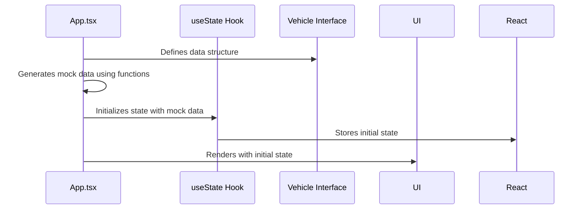

# Chapter 8: Mock Data Generation

In the previous chapter, [Constants](07_constants.md), we learned about using constants to keep our code organized and maintainable. Now, let's talk about **Mock Data Generation**.

Imagine you're building a house, but you don't have any furniture yet. You still want to show people what it *could* look like, so you put in cardboard boxes labeled "Sofa," "Bed," and "Dining Table." In our application, mock data is like those cardboard boxes. It's fake data that lets us develop and test our application *before* we have a real database.

**Central Use Case:** Developing the `VehiclesPage` even before we have a real API to fetch vehicle data from.

Without mock data, we'd have to wait until the *entire* backend is built to even start working on the user interface! Mock data lets us work independently and iterate quickly. This chapter shows you how the `fleetpro-fleetmanagement` project generates this mock data.

**What is Mock Data Generation?**

Mock data generation is the process of creating fake data that looks and behaves like real data. This lets us:

*   Develop our UI components.
*   Test our application logic.
*   Demonstrate our application's features.

**Key Concepts**

In `fleetpro-fleetmanagement`, the mock data generation happens primarily within the `App.tsx` file (where we discussed [Application State (App.tsx)](04_application_state__app_tsx_.md)). Let's break down how it works:

1.  **Data Structures:** We first define the *structure* of our data using TypeScript interfaces (as we discussed in [Data Types (Interfaces and Enums)](06_data_types__interfaces_and_enums_.md)). These interfaces tell us what properties each piece of data should have (e.g., a `Vehicle` has a `make`, `model`, and `year`).

2.  **Generation Functions:** Then, we write functions to *create* the mock data. These functions use random values and predefined lists to simulate real-world data.

3.  **Initialization:** Finally, we use the `useState` hook (also from [Application State (App.tsx)](04_application_state__app_tsx_.md)) to store the mock data in our application's state.

**How to Use Mock Data Generation**

Let's see how we can use mock data generation to create a list of vehicles.

**Step 1: Define the `Vehicle` Interface**

First, we need to define the `Vehicle` interface. As we discussed in [Data Types (Interfaces and Enums)](06_data_types__interfaces_and_enums_.md) this tells us what properties each vehicle should have:

```tsx
interface Vehicle {
  id: string;
  make: string;
  model: string;
  year: number;
}
```

This code says that each `Vehicle` object *must* have an `id`, a `make`, a `model`, and a `year`.

**Step 2: Create the Mock Data**

Next, we create an array of `Vehicle` objects with some fake data:

```tsx
const initialVehicles: Vehicle[] = [
  { id: '1', make: 'Toyota', model: 'Camry', year: 2020 },
  { id: '2', make: 'Honda', model: 'Civic', year: 2022 },
];
```

This code creates two `Vehicle` objects with some example values.

**Step 3: Store the Data in State**

Finally, we use the `useState` hook to store the `initialVehicles` array in our application's state:

```tsx
import React, { useState } from 'react';

function App() {
  const [vehicles, setVehicles] = useState<Vehicle[]>(initialVehicles);

  // ... rest of the component
}
```

Now, the `vehicles` variable holds our mock data, and we can use it in our components.

**A More Realistic Example**

The `fleetpro-fleetmanagement` project uses a more complex approach to generate mock data. It uses predefined lists of vehicle makes and models, and it generates random values for other properties. Let's look at a simplified example:

```tsx
const vehicleMakesAndModels = [
    { make: "Tata", models: ["Ace", "Intra"] },
    { make: "Ashok Leyland", models: ["Dost", "Bada Dost"] },
];
```

This code defines an array of vehicle makes and models.

```tsx
const initialVehicles = Array.from({ length: 5 }, (_, i) => {
    const makeModelInfo = vehicleMakesAndModels[i % vehicleMakesAndModels.length];
    return {
        id: i.toString(),
        make: makeModelInfo.make,
        model: makeModelInfo.models[i % makeModelInfo.models.length],
        year: 2018 + (i % 6),
    };
});
```

This code generates 5 mock vehicles, cycling through the available makes and models. This is more realistic than just hardcoding a few vehicles. We are creating mock data using random values.

**Solving the Central Use Case: Displaying Vehicles on `VehiclesPage`**

As we learned in [React Components](03_react_components.md), we can now pass this mock data to the `VehiclesPage` component as a prop, as explained in [Application State (App.tsx)](04_application_state__app_tsx_.md). The `VehiclesPage` can then display the list of vehicles in the UI. Even without a real backend, we can develop and test our UI!

**Example Inputs and Outputs:**

If we were to log the `initialVehicles` array to the console, we might see something like this:

```json
[
  { "id": "0", "make": "Tata", "model": "Ace", "year": 2018 },
  { "id": "1", "make": "Ashok Leyland", "model": "Dost", "year": 2019 },
  { "id": "2", "make": "Tata", "model": "Intra", "year": 2020 },
  { "id": "3", "make": "Ashok Leyland", "model": "Bada Dost", "year": 2021 },
  { "id": "4", "make": "Tata", "model": "Ace", "year": 2022 }
]
```

The `VehiclesPage` would then render this data into a list of vehicles in the UI.

**Internal Implementation**

Let's see what happens behind the scenes when we generate mock data.



1.  **Interface Definition:** We start by defining the structure of our data using a TypeScript interface (e.g., `Vehicle`).

2.  **Data Generation:** We write functions to generate the mock data. These functions use random values and predefined lists to simulate real-world data.

3.  **State Initialization:** We use the `useState` hook to store the mock data in our application's state.

4.  **UI Rendering:** Our components access the mock data from the application state and render it in the UI.

The code for generating mock data is located in `App.tsx`, right at the beginning of the `App` component, inside the `useEffect` hook.

**In Summary:**

In this chapter, we learned about mock data generation. Mock data lets us develop and test our application *before* we have a real backend. We saw how to define data structures, create generation functions, and initialize our application's state with mock data.

Now that we understand how to generate mock data, let's move on to the next chapter: [AI Service Integration (Gemini)](09_ai_service_integration__gemini_.md), where we'll explore how to integrate an AI service (Gemini) into our application.


---

Generated by [AI Codebase Knowledge Builder](https://github.com/The-Pocket/Tutorial-Codebase-Knowledge)