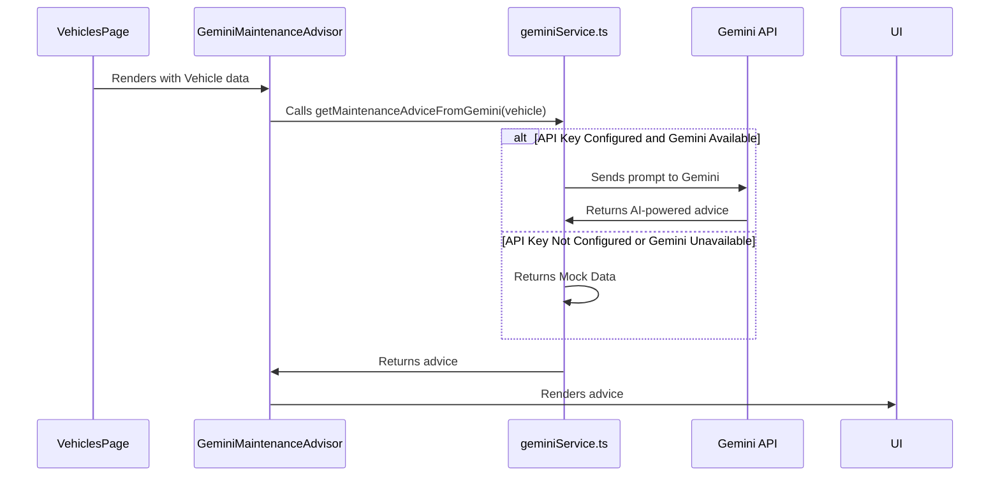

# Chapter 9: AI Service Integration (Gemini)

In the previous chapter, [Mock Data Generation](08_mock_data_generation.md), we learned how to create fake data to test our application. Now, let's make our application *smart* by integrating an AI service! This chapter is about **AI Service Integration (Gemini)**.

Imagine you're a fleet manager and you want to know the best maintenance schedule for your vehicles. Instead of manually looking up this information, wouldn't it be great if our application could *automatically* provide this advice using AI? That's what we'll achieve by integrating with Google's Gemini AI model!

**Central Use Case:** Getting AI-powered maintenance advice for a specific vehicle.

Without AI integration, our application would be limited to displaying static data. We couldn't provide intelligent suggestions or personalized recommendations. By integrating with Gemini, we can add a whole new layer of functionality and provide valuable insights to our users.

**Key Concepts**

Let's break down the key concepts behind our AI service integration:

1.  **`geminiService.ts`**: This file is the heart of our AI integration. It handles all the communication with the Gemini API.
2.  **API Key**: To access the Gemini API, we need a special key. This is like a password that allows our application to use the Gemini service.
3.  **Prompts**: We need to tell Gemini what we want it to do. We do this by sending it "prompts," which are instructions in plain English.
4.  **Mock Data Fallback**: If the Gemini API is unavailable (e.g., due to network issues or an invalid API key), we want our application to still work. So, we provide mock data as a fallback.

**1. `geminiService.ts`: Talking to Gemini**

The `geminiService.ts` file is like a translator. It takes our requests and translates them into a language that Gemini understands. It then takes Gemini's responses and translates them back into a format that our application can use.

Here's a simplified example of how `geminiService.ts` might look:

```tsx
// Inside services/geminiService.ts
export async function getMaintenanceAdvice(make: string, model: string, year: number) {
  //  Skipping the actual API call to Gemini for brevity
  return ["Change oil every 10,000 km", "Check tire pressure regularly"];
}
```

This code defines a function called `getMaintenanceAdvice` that takes the vehicle's `make`, `model`, and `year` as input. It then (in a real application) would use these inputs to communicate with the Gemini API and retrieve maintenance advice. For simplicity, we are skipping the actual API call and returning some hardcoded advice.

**2. API Key: Our Gemini Password**

To use the Gemini API, we need an API key. This is like a password that tells Gemini that we are authorized to use its services.

**Important:** You need to get your own API key from Google and store it in an environment variable called `API_KEY`. Environment variables are a way to securely store sensitive information like API keys.

```bash
# Example of how to set an environment variable (this depends on your system)
export API_KEY="YOUR_GEMINI_API_KEY"
```

**3. Prompts: Telling Gemini What to Do**

Prompts are how we tell Gemini what we want it to do. We send Gemini a prompt, and it generates a response based on that prompt.

For example, to get maintenance advice for a Toyota Camry, we might send Gemini the following prompt:

```
Provide common maintenance advice for a 2020 Toyota Camry.
```

Gemini would then analyze this prompt and generate a response containing maintenance advice for a 2020 Toyota Camry.

The `getMaintenanceAdviceFromGemini` function in `geminiService.ts` constructs the prompt using the vehicle's information:

```tsx
const prompt = `Provide common maintenance advice for a ${year} ${make} ${model} with ${mileage} miles. 
Focus on typical checks, fluid changes, and part replacements for a vehicle of this age and mileage. 
Use Google Search for up-to-date information if relevant.
Respond with a valid JSON object in the following format only. Do not include any introductory or concluding paragraphs or markdown formatting like \`\`\`json.
{
  "advice": ["string (first advice point in a full sentence)", "string (second advice point in a full sentence)", "string (third advice point, etc.)"]
}`;
```

**4. Mock Data Fallback: Keeping Things Running**

What happens if the Gemini API is unavailable? We don't want our application to crash! That's why we provide mock data as a fallback.

In `geminiService.ts`, if the API key is not configured correctly or if there's an error communicating with the Gemini API, we return mock data:

```tsx
if (!ai) {
    console.warn("Gemini service not available. Returning mock maintenance advice.");
    const mockAdvice = [
      `For a ${year} ${make} ${model}, it is recommended to change the oil and filter every 7,500 to 10,000 km to ensure engine longevity.`,
      `Given the vehicle has ${mileage.toLocaleString()} km, a thorough inspection of the tire tread and pressure is advised. Consider rotation if not done recently.`,
      `At this mileage, it is crucial to have the brake pads, rotors, and brake fluid checked for wear and effectiveness.`,
      `Regularly check and top up all essential fluids, including coolant, brake fluid, power steering fluid, and windshield washer fluid.`,
      `Test the battery's health, especially if it's over 3 years old, to prevent unexpected starting issues.`,
      `*(This is mock data. Configure API_KEY in your environment for live advice.)*`
    ];
    return { advice: mockAdvice, sources: null, error: undefined };
  }
```

This code checks if the `ai` variable (which represents the Gemini API client) is available. If it's not, we return a predefined set of maintenance advice.

**Solving the Central Use Case: Displaying AI-Powered Maintenance Advice**

Let's see how we can use these concepts to display AI-powered maintenance advice for a specific vehicle.

First, we need a component to display the advice. Let's call it `GeminiMaintenanceAdvisor`. This component will take a `vehicle` object as a prop and use the `geminiService.ts` file to get maintenance advice for that vehicle.

Here's a simplified version of the `GeminiMaintenanceAdvisor` component:

```tsx
import React, { useState, useEffect } from 'react';
import { Vehicle } from '../types';
import { getMaintenanceAdviceFromGemini } from '../services/geminiService';

interface GeminiMaintenanceAdvisorProps {
  vehicle: Vehicle;
}

const GeminiMaintenanceAdvisor: React.FC<GeminiMaintenanceAdvisorProps> = ({ vehicle }) => {
  const [advice, setAdvice] = useState<string[] | null>(null);

  useEffect(() => {
    async function fetchAdvice() {
      const result = await getMaintenanceAdviceFromGemini(vehicle.make, vehicle.model, vehicle.year, vehicle.mileage);
      setAdvice(result.advice);
    }

    fetchAdvice();
  }, [vehicle]);

  return (
    <div>
      {advice ? (
        <ul>
          {advice.map((line, index) => (
            <li key={index}>{line}</li>
          ))}
        </ul>
      ) : (
        <p>Loading advice...</p>
      )}
    </div>
  );
};

export default GeminiMaintenanceAdvisor;
```

Let's break down this code:

1.  We import the `getMaintenanceAdviceFromGemini` function from `geminiService.ts`.
2.  We use the `useState` hook to store the maintenance advice.
3.  We use the `useEffect` hook to fetch the maintenance advice when the component mounts.
4.  We call the `getMaintenanceAdviceFromGemini` function with the vehicle's information.
5.  We update the `advice` state with the result from `getMaintenanceAdviceFromGemini`.
6.  We render the maintenance advice in a list.

You can see the full code for this component in `components/GeminiMaintenanceAdvisor.tsx`.

**Using the `GeminiMaintenanceAdvisor` Component**

To use the `GeminiMaintenanceAdvisor` component, we simply include it in our `VehiclesPage` (or any other component where we want to display maintenance advice).

```tsx
import React from 'react';
import { Vehicle } from '../types';
import GeminiMaintenanceAdvisor from '../components/GeminiMaintenanceAdvisor';

interface VehiclesPageProps {
  vehicles: Vehicle[];
}

const VehiclesPage: React.FC<VehiclesPageProps> = ({ vehicles }) => {
  return (
    <div>
      <h1>Vehicles</h1>
      {vehicles.map(vehicle => (
        <div key={vehicle.id}>
          <h2>{vehicle.make} {vehicle.model}</h2>
          <GeminiMaintenanceAdvisor vehicle={vehicle} />
        </div>
      ))}
    </div>
  );
};

export default VehiclesPage;
```

This code iterates over the list of vehicles and renders a `GeminiMaintenanceAdvisor` component for each vehicle. The `GeminiMaintenanceAdvisor` component will then fetch and display the AI-powered maintenance advice for that vehicle.

**Example Inputs and Outputs:**

Let's say we have a `Vehicle` object with the following information:

```json
{
  "id": "1",
  "make": "Toyota",
  "model": "Camry",
  "year": 2020,
  "mileage": 50000
}
```

The `GeminiMaintenanceAdvisor` component would then call the `getMaintenanceAdviceFromGemini` function with this information. If the Gemini API is available and the API key is configured correctly, the component would display AI-powered maintenance advice for a 2020 Toyota Camry with 50,000 km. If the Gemini API is unavailable, the component would display the mock maintenance advice.

**Internal Implementation**

Let's see what happens behind the scenes when we use the AI service integration.



1.  **Rendering:** The `VehiclesPage` renders the `GeminiMaintenanceAdvisor` component, passing it a `Vehicle` object.
2.  **API Call:** The `GeminiMaintenanceAdvisor` component calls the `getMaintenanceAdviceFromGemini` function in `geminiService.ts`.
3.  **Gemini Interaction (If Available):**
    *   `geminiService.ts` sends a prompt to the Gemini API with the vehicle's information.
    *   The Gemini API generates AI-powered maintenance advice and returns it to `geminiService.ts`.
4.  **Mock Data (If Gemini Unavailable):**
    *   If the API key is not configured correctly or if there's an error communicating with the Gemini API, `geminiService.ts` returns mock data.
5.  **Rendering:** The `GeminiMaintenanceAdvisor` component receives the maintenance advice (either from Gemini or from the mock data) and renders it in the UI.

**Code Location**

*   The `GeminiMaintenanceAdvisor` component is located in `components/GeminiMaintenanceAdvisor.tsx`.
*   The `getMaintenanceAdviceFromGemini` function is located in `services/geminiService.ts`.

**In Summary:**

In this chapter, we learned how to integrate an AI service (Gemini) into our application. We saw how to use the `geminiService.ts` file to communicate with the Gemini API, how to use API keys to authenticate our requests, how to use prompts to tell Gemini what we want it to do, and how to provide mock data as a fallback.

Congratulations! You have reached the end of this tutorial, and can now use all of these components to create a functional Fleet Management application. Good Luck!


---

Generated by [AI Codebase Knowledge Builder](https://github.com/The-Pocket/Tutorial-Codebase-Knowledge)