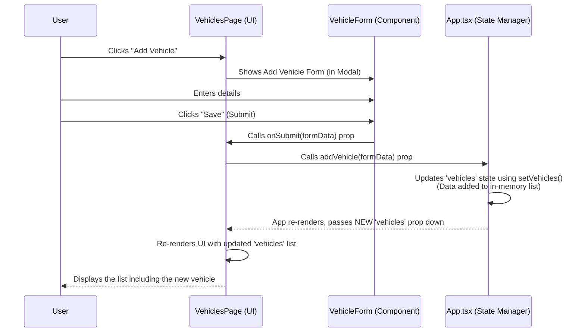

# Chapter 9: Data Management (Mock)

Welcome back to the FleetPro tutorial! In the [previous chapter](08_data_types__interfaces___enums__.md), we learned about **Data Types**, specifically how **Interfaces** and **Enums** give our data objects clear structures and define limited sets of options. This helps us understand the shape of the data for things like Vehicles, Trips, and Dealerships.

We also know from [Chapter 7: Application Structure & Routing](07_application_structure___routing__.md) that the main `App.tsx` component is responsible for holding the central lists of all this data (vehicles, trips, etc.). But how is this data actually handled? How does the application remember the vehicles you added, or update a trip's status?

In a real-world application, this data would be stored permanently in a database (like SQL, MongoDB, etc.). The application would talk to a server, which would then talk to the database to save, load, or change the data.

However, for this beginner tutorial project, connecting to a real database adds a lot of complexity. Our goal here is to understand the *front-end* (the part the user sees and interacts with) and how data flows *within* the application in the browser.

This is where **Data Management (Mock)** comes in.

## What is Data Management (Mock)?

In this FleetPro project, "Mock Data Management" means we are **simulating** how data would be handled, but without a real database.

Instead of saving data to a database on a server, we simply store all the main lists of data directly within the main **`App.tsx` component's memory** using React's state management features (`useState`).

Think of it like keeping all your important notes on a temporary whiteboard instead of filing them away permanently. As long as the whiteboard is visible (the application is open in your browser), the notes are there. If you erase the whiteboard (close the browser tab), the notes are gone forever.

The `App.tsx` component holds these lists:
*   `vehicles`: An array of `Vehicle` objects
*   `dealerships`: An array of `Dealership` objects
*   `trips`: An array of `Trip` objects
*   `inventory`: An array of `InventoryUnit` objects
*   ... and lists for drivers, users, alerts, costs, maintenance, etc.

It also contains the functions needed to perform the basic data operations (often called CRUD operations):

*   **C**reate: Add a new item to a list (e.g., add a new vehicle).
*   **R**ead: Access the data in the lists (done by passing the lists as props to pages).
*   **U**pdate: Modify an existing item in a list (e.g., change a vehicle's status).
*   **D**elete: Remove an item from a list (e.g., delete a vehicle).

## Core Use Case: Displaying and Modifying Data on Pages

The central use case this mock data management system handles is powering the pages we discussed in [Chapter 5: Pages](05_pages_.md). When you go to the Vehicles page, you need to see the current list of vehicles. When you add a new vehicle on that page, the list needs to update, and that change needs to be reflected not just on the Vehicles page, but potentially elsewhere in the app.

The mock data management system in `App.tsx` ensures that:
1.  Pages like `VehiclesPage`, `TripsPage`, `DealershipsPage`, `InventoryPage` get the *current* state of the data lists.
2.  When a user action on a page (like saving a form) requires data to change, the page can trigger the corresponding update function in `App.tsx`.
3.  When the data in `App.tsx` changes, React automatically updates the pages that are displaying that data.

## How it Works: State, Callbacks, and Props

Let's look at the core mechanism, using the example of the Vehicles page and adding a vehicle.

1.  **Data Stored in `App.tsx` State:**
    The `App.tsx` component uses React's `useState` hook to keep track of the main data lists.

    ```typescript
    // Inside App.tsx (simplified)
    import React, { useState, useCallback } from 'react';
    // ... other imports ...
    import { Vehicle } from './types'; // Import the Vehicle interface

    const App: React.FC = () => {
      // Declare state variables to hold the lists of data
      const [vehicles, setVehicles] = useState<Vehicle[]>([]);
      const [drivers, setDrivers] = useState<Driver[]>([]);
      // ... state for other data lists (trips, dealerships, etc.) ...

      // ... useEffect for initial data generation ...
      // ... other state and logic ...

      // Callback functions to modify state
      // ... addVehicle, updateVehicle, deleteVehicle functions are defined here ...
      
      // ... return JSX with routing and pages ...
    };
    ```
    *   `useState<Vehicle[]>([])` declares a state variable `vehicles` that is expected to hold an array of `Vehicle` objects. It's initialized as an empty array `[]`.
    *   `setVehicles` is the function provided by `useState` that *must* be used to update the `vehicles` state. React needs you to use this function so it knows when the state has changed and which parts of the UI need to re-render.
    *   Similar state variables (`drivers`, `trips`, etc.) and their corresponding setter functions (`setDrivers`, `setTrips`) are declared for all the main data lists.

2.  **Update Functions (`Callbacks`) in `App.tsx`:**
    `App.tsx` defines functions (often wrapped in `useCallback` for performance, although for beginners, you can just think of them as regular functions here) that know how to modify these state variables using the `set...` functions.

    ```typescript
    // Inside App.tsx (simplified showing only addVehicle)
    // ... useState declarations ...
    import { Vehicle } from './types';
    const generateMockId = () => Math.random().toString(36).substring(2, 10); // Helper

    // Function to add a new vehicle
    const addVehicle = useCallback((vehicleData: Omit<Vehicle, 'id'>) => {
      // Create a new vehicle object, adding a unique ID
      const newVehicle: Vehicle = {
        id: generateMockId(), 
        ...vehicleData, // Spread existing data from the form
        // Add any default values for fields not in the form initially
        imageUrl: '', 
        documents: [],
        mileage: vehicleData.mileage || 0, // Ensure mileage is a number, default to 0
        status: vehicleData.status || VehicleStatus.ACTIVE, // Default status
        // ... add other default properties if needed ...
      };
      
      // Update the vehicles state by adding the new vehicle to the array
      setVehicles(prevVehicles => [...prevVehicles, newVehicle]); 
      
      console.log("Added new vehicle:", newVehicle); // Log for demo
    }, []); // Dependencies: If this function used any variables from App's scope, list them here
    ```
    *   The `addVehicle` function takes the new vehicle data (usually collected from a form on a page). `Omit<Vehicle, 'id'>` is a TypeScript helper saying the input data looks like a `Vehicle` but *without* the `id`, because the `App` component will generate the ID.
    *   Inside the function, it constructs a complete `Vehicle` object, including generating a mock `id`.
    *   `setVehicles(prevVehicles => [...prevVehicles, newVehicle])` is the standard way to update a state array in React. It takes the previous array (`prevVehicles`), creates a *new* array (`[...prevVehicles, newVehicle]`) by spreading the old items and adding the `newVehicle`, and tells React to update the state to this new array. **You must create a new array/object when updating state; don't modify the old one directly!**

3.  **Data and Functions Passed Down as Props:**
    When `App.tsx` renders a page component (like `VehiclesPage` via routing), it passes the relevant data lists and the update functions as `props`.

    ```typescript
    // Inside App.tsx (simplified rendering logic)
    import VehiclesPage from './pages/VehiclesPage';
    // ... other page imports ...

    // ... state declarations and update functions ...

    return (
      // ... main layout ...
      <main className="...">
        <Routes>
          {/* Route for the Vehicles Page */}
          <Route 
            path="/vehicles" 
            element={<VehiclesPage 
                         vehicles={vehicles} // Pass the vehicles list as a prop
                         drivers={drivers}   // Pass other needed data
                         addVehicle={addVehicle} // Pass the addVehicle function as a prop
                         updateVehicle={updateVehicle} // Pass update function
                         deleteVehicle={deleteVehicle} // Pass delete function
                      />} 
          />
          {/* ... other routes ... */}
        </Routes>
      </main>
      // ...
    );
    ```
    *   When rendering `<VehiclesPage>`, the `vehicles` state variable is passed using `vehicles={vehicles}`. Now the `VehiclesPage` component receives this list as a prop named `vehicles`.
    *   The `addVehicle` function defined in `App.tsx` is passed using `addVehicle={addVehicle}`. The `VehiclesPage` receives this function as a prop named `addVehicle`. Similar steps are done for `updateVehicle` and `deleteVehicle`.

4.  **Pages Call the Update Functions:**
    When a user interacts with a page (e.g., submits the "Add Vehicle" form), the page component calls the function prop that was passed down from `App.tsx`, providing the necessary data.

    ```typescript
    // Inside VehiclesPage.tsx (simplified)
    interface VehiclesPageProps {
      vehicles: Vehicle[]; // Receives the data
      addVehicle: (vehicleData: Omit<Vehicle, 'id'>) => void; // Receives the function
      // ... other props ...
    }

    const VehiclesPage: React.FC<VehiclesPageProps> = ({ vehicles, addVehicle, ... }) => {
      // ... state for modal, selected vehicle etc. ...

      // This function handles the data from the VehicleForm submission
      const handleFormSubmit = (formData: Omit<Vehicle, 'id'>) => {
        console.log("Form submitted, data:", formData);
        // Call the addVehicle function prop passed from App.tsx
        addVehicle(formData); 
        closeModal(); // Close the form modal
      };

      return (
        <div>
           {/* ... Vehicles list display (using the 'vehicles' prop) ... */}

           {/* Modal containing the VehicleForm */}
           <Modal /* ... modal props ... */>
              <VehicleForm 
                onSubmit={handleFormSubmit} // Pass handleFormSubmit to the form
                // ... other form props ...
              />
           </Modal>
        </div>
      );
    };
    ```
    *   The `VehiclesPage` component receives the `addVehicle` function as a prop.
    *   When the `VehicleForm` inside the modal is submitted, it calls the `handleFormSubmit` function defined in `VehiclesPage`.
    *   `handleFormSubmit` then calls the `addVehicle(formData)` function. This call goes *up* to the `addVehicle` function defined in `App.tsx`.
    *   The `addVehicle` function in `App.tsx` updates the `vehicles` state using `setVehicles`.
    *   React detects the state change in `App.tsx`, re-renders `App.tsx`, which re-renders `VehiclesPage`, passing the *new* list of vehicles down as props. The Vehicles page then displays the updated list.

## Under the Hood: The Data Flow Loop

Here's how the process of adding a vehicle works with this mock data management approach:


**Explanation:**
1.  The user triggers an action (click "Save") on a form component (`VehicleForm`).
2.  The form component calls a function passed to it via props (`onSubmit`).
3.  This function is defined in the `VehiclesPage`, which in turn calls a function passed to *it* via props (`addVehicle`).
4.  This call reaches the `addVehicle` function defined in `App.tsx`.
5.  The `addVehicle` function in `App.tsx` uses `setVehicles` to update the main list of vehicles held in `App.tsx`'s state.
6.  React detects that the state in `App.tsx` has changed, triggering a re-render cycle starting from `App.tsx`.
7.  `App.tsx` re-renders the `VehiclesPage`, passing the *new* list of vehicles (the one with the added item) down as the `vehicles` prop.
8.  The `VehiclesPage` re-renders its display using the fresh data from its `vehicles` prop, showing the user the result of their action.

This "state-down, actions-up" pattern is very common in React applications.

## Other Data Operations (Update, Delete)

Update and Delete operations work similarly:

*   **Update:** A page component calls an `update...` function prop from `App.tsx`, passing the entire updated object. The `update...` function in `App.tsx` uses the item's ID to find it in the list and replace the old object with the new, updated one using `set...` and array `map`.

    ```typescript
    // Inside App.tsx (simplified updateVehicle)
    const updateVehicle = useCallback((updatedVehicle: Vehicle) => {
      setVehicles(prevVehicles =>
        // Map over the array, find the item by ID, and return the updated one
        prevVehicles.map(v => (v.id === updatedVehicle.id ? updatedVehicle : v)) 
      );
      console.log("Updated vehicle:", updatedVehicle);
    }, []);
    ```

*   **Delete:** A page component calls a `delete...` function prop from `App.tsx`, passing the ID of the item to delete. The `delete...` function in `App.tsx` uses the ID to filter the item out of the list using `set...` and array `filter`.

    ```typescript
    // Inside App.tsx (simplified deleteVehicle)
    const deleteVehicle = useCallback((vehicleId: string) => {
      setVehicles(prevVehicles =>
        // Filter the array to keep only items whose ID does NOT match the deleted one
        prevVehicles.filter(v => v.id !== vehicleId)
      );
      console.log("Deleted vehicle with ID:", vehicleId);
    }, []);
    ```

All major data lists (vehicles, drivers, trips, dealerships, inventory, etc.) in this project have corresponding `add`, `update`, and `delete` (or `cancel`, `markAsRepaid`, etc.) functions defined and managed within the `App.tsx` state.

## The Purpose of Mock Data Management

Using this mock data management system serves several purposes for this tutorial project:

*   **Focus on Front-end:** It allows us to build and demonstrate the user interface, components, pages, and data flow within the browser without needing a backend server or database setup.
*   **Simplification:** It drastically simplifies the project setup, making it easier for beginners to clone and run the code immediately.
*   **State Management Concept:** It teaches a fundamental pattern in front-end frameworks like React: managing application state in a central location and passing it down.
*   **Simulation:** It simulates the *experience* of interacting with data (adding, editing, deleting) from the user's perspective, even if the data isn't persistent.

While not suitable for a real production application (since data is lost when the app closes), this mock approach is perfect for learning the front-end structure and data flow.

## Conclusion

In this chapter, we explored **Data Management (Mock)**. We learned that in this beginner FleetPro project, data is not stored in a database but managed directly within the main `App.tsx` component's state (in memory). We saw how `App.tsx` holds all the central data lists and defines the functions (like `addVehicle`, `updateVehicle`, `deleteVehicle`, `fundNewInventory`, `markInventoryAsRepaid`) that modify these lists. We understood the data flow loop where pages receive data and functions as props from `App.tsx`, and then call these functions to request data changes, which in turn trigger UI updates.

Understanding this mock data flow is crucial for seeing how all the pieces (entities, pages, components) connect and interact in this project. It provides the foundation for how data is presented and modified, even before we introduce any external services.

Next, we'll look at how the application interacts with the outside world, specifically focusing on our simulated "External Services" like AI route suggestions and telemetry.

[Next Chapter: External Services](10_external_services_.md)

---

<sub><sup>Generated by [AI Codebase Knowledge Builder](https://github.com/The-Pocket/Tutorial-Codebase-Knowledge).</sup></sub> <sub><sup>**References**: [[1]](https://github.com/rakeshkrrajak/fleetpro-fleetmanagement/blob/7b84d99e0dc11a8c8350b388be15b56727655e66/App.tsx), [[2]](https://github.com/rakeshkrrajak/fleetpro-fleetmanagement/blob/7b84d99e0dc11a8c8350b388be15b56727655e66/constants.tsx), [[3]](https://github.com/rakeshkrrajak/fleetpro-fleetmanagement/blob/7b84d99e0dc11a8c8350b388be15b56727655e66/types.ts)</sup></sub>