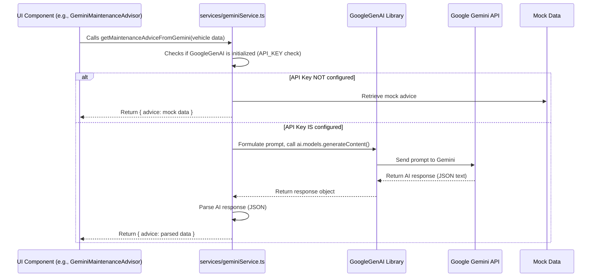
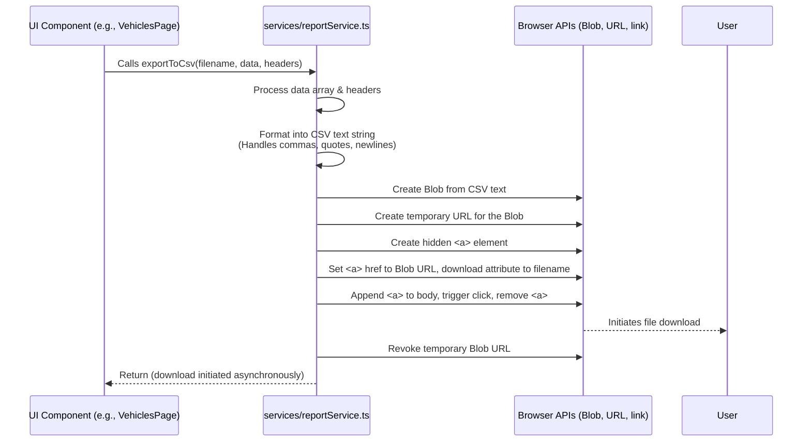

# Chapter 10: External Services

Welcome back to the FleetPro tutorial! In the [previous chapter](09_data_management__mock__.md), we looked at **Data Management (Mock)**, understanding how our application currently keeps track of all its data (vehicles, trips, etc.) right in its memory using React's state. This mock setup is great for learning the basics of data flow within the front-end, but it doesn't interact with anything outside the browser.

Sometimes, a real application needs to go beyond its own internal data and logic. It might need to:

*   Get smart suggestions or insights from an Artificial Intelligence (AI) service.
*   Generate a file (like a spreadsheet) for the user to download based on the data.
*   Communicate with other systems (though we won't cover complex external integrations in this project).

These interactions with resources or capabilities that live *outside* the main application code are handled by **External Services**.

## What are External Services?

Imagine your FleetPro application needs a bit of help from specialists outside its normal operations.

*   For generating reports, it calls upon a "Report Specialist" who knows exactly how to take the list of vehicles and format it into a standard CSV file that can be opened in spreadsheet software.
*   For getting smart advice (like maintenance tips or trip route ideas), it consults an "AI Advisor" who can process information and provide relevant suggestions.

In our FleetPro project, these "specialists" are implemented as separate modules or files, often grouped in a `services` folder. They contain functions specifically designed to communicate with these outside capabilities.

In this project, we'll focus on two examples:

1.  **Gemini Service:** Designed to interact with a large language model (Google's Gemini AI) to get AI-powered suggestions.
2.  **Report Service:** Designed to take application data and format it into a downloadable CSV file.

These services abstract away the technical details of interacting with the external world, so the rest of the application (like your Page components) can just call a simple function like `getMaintenanceAdviceFromGemini()` or `exportToCsv()`.

## Core Use Case: Getting AI Help and Downloading Data

The main use case for External Services in this project is:

1.  **Enriching data/features with AI:** Getting smart suggestions related to fleet management (like maintenance advice for a vehicle or route/stop suggestions for a trip).
2.  **Exporting data:** Allowing users to download lists of data (like their vehicle list) in a common format like CSV for external use or analysis.

Let's look at how these services help achieve this.

## The Gemini Service (AI Advisor)

The `Gemini Service` in our project (found in `services/geminiService.ts`) contains functions that attempt to communicate with the Google Gemini AI model using an API (Application Programming Interface). An API is like a defined way for two different software systems to talk to each other.

**What it does:**
*   It takes specific information (like a vehicle's make, model, year, mileage or a trip's origin and destination) as input.
*   It sends this information to the Gemini AI model via the Google API.
*   The AI processes the request and sends back a response, which the service then formats and provides to the application.

**Important Note:** To use the *real* Gemini API, you need to set up an API key from Google and configure it in your project's environment variables (specifically `API_KEY`). If the API key is not found or is invalid, the `geminiService` is designed to fall back to providing **mock AI responses** so the application still works and you can see the feature, even without a live API connection.

### How to Use the Gemini Service (Example: Maintenance Advice)

Let's look at how a component on a page might use the `Gemini Service` to get maintenance advice for a specific vehicle. This is used in the `GeminiMaintenanceAdvisor` component (found in `components/GeminiMaintenanceAdvisor.tsx`), which is displayed on the Vehicle Details page (not explicitly covered in a chapter, but part of the Vehicles Page structure).

```typescript
// Inside components/GeminiMaintenanceAdvisor.tsx (simplified)
import React, { useState, useCallback } from 'react';
import { Vehicle } from '../types';
// Import the specific function from the Gemini Service
import { getMaintenanceAdviceFromGemini } from '../services/geminiService';

interface GeminiMaintenanceAdvisorProps {
  vehicle: Vehicle; // Component receives the vehicle data
}

const GeminiMaintenanceAdvisor: React.FC<GeminiMaintenanceAdvisorProps> = ({ vehicle }) => {
  const [advice, setAdvice] = useState<string[] | null>(null);
  const [isLoading, setIsLoading] = useState(false);
  const [error, setError] = useState<string | null>(null);

  // This function calls the external service
  const fetchAdvice = useCallback(async () => {
    setIsLoading(true); // Show loading indicator
    setError(null);      // Clear previous errors
    setAdvice(null);     // Clear previous advice

    // Call the service function, passing relevant vehicle data
    const result = await getMaintenanceAdviceFromGemini(
      vehicle.make,
      vehicle.model,
      vehicle.year,
      vehicle.mileage
    );

    // Handle the result from the service
    if (result.error) {
      setError(result.error);
    } else {
      setAdvice(result.advice);
      // setSources(result.sources); // Handle sources too if needed
    }
    setIsLoading(false); // Hide loading indicator
  }, [vehicle]); // Recreate function if 'vehicle' prop changes

  return (
    <div>
      {/* Button to trigger fetching advice */}
      <button onClick={fetchAdvice} disabled={isLoading}>
        {isLoading ? 'Getting Advice...' : 'Get Maintenance Advice'}
      </button>

      {/* Display error if any */}
      {error && <div className="error-message">Error: {error}</div>}

      {/* Display advice if received */}
      {advice && (
        <div>
          <h4>AI's Maintenance Advice:</h4>
          <ul>
            {advice.map((item, index) => <li key={index}>{item}</li>)}
          </ul>
        </div>
      )}
    </div>
  );
};

export default GeminiMaintenanceAdvisor;
```
**Explanation:**
*   The `GeminiMaintenanceAdvisor` component imports the `getMaintenanceAdviceFromGemini` function from `../services/geminiService`.
*   It has state variables (`advice`, `isLoading`, `error`) to manage the display based on the service call.
*   The `fetchAdvice` function is asynchronous (`async`/`await`) because calling an external service (especially over a network like the internet) takes time.
*   Inside `fetchAdvice`, it calls `getMaintenanceAdviceFromGemini()`, passing the required information extracted from the `vehicle` prop.
*   The `await` keyword pauses the execution until the service function returns a `result`.
*   Based on the `result` (which includes `advice`, `sources`, or `error`), the component updates its state to display the AI's advice or an error message.

This shows that from the component's perspective, using the service is simple: import the function, call it with the right inputs, and handle the outcome (success with data or an error). The component doesn't need to know *how* the service talks to Gemini, just *that* it does and what kind of result to expect.

### Under the Hood: Gemini Service Implementation

The `geminiService.ts` file contains the actual logic to interact with Google's AI library or return mock data.

Here's a simplified look at what happens inside the service function when you call `getMaintenanceAdviceFromGemini()`:


**Explanation:**
1.  The UI Component calls the function in `GeminiService`.
2.  The `GeminiService` first checks if the Google AI client (`ai`) was successfully initialized, which only happens if `API_KEY` is set.
3.  *If* `ai` is not initialized (no API key), it skips the AI call and returns predefined mock data.
4.  *If* `ai` is initialized, it constructs a text prompt for the Gemini model based on the input data.
5.  It uses the `GoogleGenAI` library (`ai.models.generateContent()`) to send the prompt to the Google Gemini API over the internet.
6.  The Google API processes the prompt and sends back a response, typically a block of text (which the service expects to be in JSON format).
7.  The `GeminiService` receives the response, attempts to parse the JSON, and extracts the `advice` (and potentially `sources`).
8.  Finally, it returns the parsed data (or an error if something went wrong) back to the UI Component that called it.

Here's a simplified snippet from the `geminiService.ts` showing parts of this implementation:

```typescript
// Inside services/geminiService.ts (simplified)
import { GoogleGenAI } from "@google/genai";
// ... other imports ...

// Initialize AI client ONLY if API_KEY is present
const API_KEY = process.env.API_KEY;
let ai: GoogleGenAI | null = null;
if (API_KEY) {
  ai = new GoogleGenAI({ apiKey: API_KEY });
} else {
  console.warn("API_KEY environment variable not found. Gemini API calls will be mocked.");
}

export const getMaintenanceAdviceFromGemini = async (
  make: string,
  model: string,
  year: number,
  mileage: number
): Promise<{ advice: string[]; sources: any; error?: string }> => {
  // Check if AI is available (API key was set)
  if (!ai) {
    // Return mock data if not configured
    const mockAdvice = ["Mock advice 1", "Mock advice 2"];
    return { advice: mockAdvice, sources: null };
  }

  // --- Logic to call the real API ---
  const prompt = `Provide maintenance advice for ${year} ${make} ${model} with ${mileage} km... Return JSON {"advice": ["...", "..."]}`; // Simplified prompt
  try {
    const response = await ai.models.generateContent({
      model: "your-gemini-model-name", // Needs actual model name
      contents: prompt,
      config: { tools: [{ googleSearch: {} }] },
    });
    
    const textResponse = response.text;
    if (!textResponse) return { advice: [], sources: null, error: "No text response" };

    // Attempt to parse the JSON response
    const parsedData = JSON.parse(textResponse);
    return { advice: parsedData.advice, sources: response.candidates?.[0]?.groundingMetadata?.groundingChunks || null };

  } catch (error) {
    console.error("Gemini API error:", error);
    return { advice: [], sources: null, error: "Failed to fetch advice" };
  }
};

// ... other Gemini service functions like getTripSuggestionsFromGemini ...
```
**Explanation:**
*   The code checks `if (!ai)` to determine if the real API client is available.
*   If not, it directly returns the mock data defined within the function.
*   If `ai` is available, it constructs the prompt and calls `ai.models.generateContent()` using `await`.
*   It then processes the `response` received from the API, specifically trying to `JSON.parse` the `response.text`.
*   The parsed data or an error is returned.

This pattern of checking for API availability and falling back to mock data is a good practice for demo projects that might not always have live service connections configured.

## The Report Service (CSV Exporter)

The `Report Service` (found in `services/reportService.ts`) is responsible for taking an array of data objects (like the list of vehicles) and converting it into a Comma Separated Values (CSV) text format, which is commonly used for spreadsheets, and then triggering a file download in the user's browser.

**What it does:**
*   It takes an array of data objects and a definition of the headers (which properties from the objects should be included and what their column titles should be).
*   It formats this data into a string where each object is a row and the property values are columns, separated by commas, with special handling for commas or quotes within the data itself.
*   It creates a temporary file-like object (`Blob`) containing this CSV text.
*   It uses browser features to automatically prompt the user to download this `Blob` as a file with a specified name.

### How to Use the Report Service (Example: Exporting Vehicle List)

Let's imagine a button on the [Vehicles Page](05_pages_.md) that lets the user download their vehicle list.

```typescript
// Inside VehiclesPage.tsx (simplified)
import React from 'react';
import { Vehicle } from '../types';
// Import the export function from the Report Service
import { exportToCsv } from '../services/reportService';

interface VehiclesPageProps {
  vehicles: Vehicle[]; // Component receives the list of vehicles
  // ... other props ...
}

const VehiclesPage: React.FC<VehiclesPageProps> = ({ vehicles, ... }) => {

  // Define the headers for the CSV file
  const vehicleCsvHeaders = [
    { key: 'licensePlate', label: 'License Plate' },
    { key: 'make', label: 'Make' },
    { key: 'model', label: 'Model' },
    { key: 'year', label: 'Year' },
    { key: 'status', label: 'Status' },
    { key: 'mileage', label: 'Mileage (km)' },
    // ... add other relevant vehicle properties ...
  ];

  // Function to trigger the export
  const handleExportVehicles = () => {
    console.log("Exporting vehicles to CSV...");
    // Call the service function, passing filename, data, and headers
    exportToCsv('vehicles_report.csv', vehicles, vehicleCsvHeaders);
  };

  return (
    <div>
      {/* ... Vehicle list display ... */}

      {/* Button to trigger the export */}
      <button onClick={handleExportVehicles} className="...">
        Download Vehicle Report (CSV)
      </button>

      {/* ... other page content ... */}
    </div>
  );
};

export default VehiclesPage;
```
**Explanation:**
*   The `VehiclesPage` imports the `exportToCsv` function from `../services/reportService`.
*   It defines an array `vehicleCsvHeaders` specifying which properties from each `Vehicle` object (`key`) should become columns and what their header titles (`label`) should be.
*   The `handleExportVehicles` function simply calls `exportToCsv()`, providing the desired filename (`'vehicles_report.csv'`), the list of data to export (`vehicles` prop), and the header definitions (`vehicleCsvHeaders`).
*   When the button is clicked, this function executes, triggering the download via the service.

Using the `Report Service` makes the export functionality reusable. If we needed to export a list of `Dealership` objects on the Dealerships page, we would just import `exportToCsv` there and call it with the `dealerships` list and a different set of headers defining dealership properties.

### Under the Hood: Report Service Implementation

The `reportService.ts` file contains the `exportToCsv` function that performs the data formatting and download magic using browser APIs.

Here's a simplified look at what happens inside the `exportToCsv()` function:


**Explanation:**
1.  The UI Component calls the function in `ReportService`.
2.  The `ReportService` loops through the provided `data` array.
3.  For each data object, it creates a row of text. It looks up the values for the `key` specified in each `header` object.
4.  It formats these values, joining them with commas, using a helper function `escapeCsvCell` to make sure values containing commas, quotes, or newlines are correctly handled (usually by wrapping them in quotes and doubling any internal quotes).
5.  It joins all the rows (including a header row created from `header.label`) into one large CSV text string.
6.  It uses the browser's built-in `Blob` object to create a temporary binary representation of this text data, specifying the content type as CSV.
7.  It creates a temporary URL that points to this `Blob` in memory using `URL.createObjectURL`.
8.  It then *simulates* a file download click. It creates a hidden `<a>` (anchor) HTML element in memory, sets its `href` to the temporary Blob URL, and sets the `download` attribute to the desired `filename`. Setting the `download` attribute tells the browser to download the target instead of navigating to it.
9.  It temporarily adds this hidden link to the document's body, programmatically triggers a `.click()` event on it (which starts the download), and then immediately removes the link.
10. Finally, it cleans up the temporary Blob URL using `URL.revokeObjectURL`.

Here's a simplified snippet from the `reportService.ts` showing the core formatting and download logic:

```typescript
// Inside services/reportService.ts (simplified)

// Helper to format individual cells for CSV
const escapeCsvCell = (cell: any): string => {
  // ... logic to escape commas, quotes, newlines ...
  if (cell === null || cell === undefined) return '';
  const cellStr = String(cell);
  if (/[",\n]/.test(cellStr)) {
    return `"${cellStr.replace(/"/g, '""')}"`;
  }
  return cellStr;
};

// The main export function
export const exportToCsv = (
  filename: string,
  data: any[],
  headers: { key: string; label: string }[]
): void => {
  // Create header row by escaping header labels
  const headerRow = headers.map(h => escapeCsvCell(h.label)).join(',');

  // Create data rows by mapping data objects to rows, extracting and escaping values
  const dataRows = data.map(row => {
    return headers.map(header => escapeCsvCell(row[header.key])).join(',');
  });

  // Combine header and data rows into one CSV string
  const csvContent = [headerRow, ...dataRows].join('\n');

  // --- Browser Download Logic ---
  // Create a Blob from the content
  const blob = new Blob([csvContent], { type: 'text/csv;charset=utf-8;' });
  // Create a temporary URL for the blob
  const url = URL.createObjectURL(blob);
  // Create a hidden link element
  const link = document.createElement('a');
  // Set link attributes to trigger download
  link.setAttribute('href', url);
  link.setAttribute('download', filename);
  // Append, click, and remove the link
  document.body.appendChild(link);
  link.click();
  document.body.removeChild(link);
  // Clean up the temporary URL
  URL.revokeObjectURL(url);
};
```
**Explanation:**
*   The `escapeCsvCell` function ensures that special characters in your data don't break the CSV format.
*   `headerRow` is built by joining the `label` from each header object, escaped.
*   `dataRows` is built by mapping over the `data` array. For each `row` (data object), it maps over the `headers` again to get the value for the corresponding `key` (`row[header.key]`), escapes it, and joins the cell values with commas.
*   `csvContent` joins the header and all data rows with newline characters.
*   The rest of the code uses standard browser APIs (`Blob`, `URL.createObjectURL`, `<a>`, `click`, `URL.revokeObjectURL`) to initiate the download.

This service effectively separates the concern of generating a file from the concern of displaying the data on a page, making the code cleaner and more maintainable.

## Conclusion

In this chapter, we explored the concept of **External Services**. We learned that these are dedicated modules designed to interact with capabilities outside the main application logic. We looked at two specific examples in this project: the **Gemini Service** for fetching AI-powered suggestions (with a fallback to mock data if the API key isn't configured) and the **Report Service** for generating and downloading data reports as CSV files. We saw how components use simple functions from these services to request external operations without needing to know the complex details of the implementation or external APIs.

Understanding external services is important because most real-world applications need to interact with the outside world for various purposes, from getting data from APIs to integrating with third-party tools or generating outputs. These services act as the bridge between your application's internal logic and external capabilities.

This chapter concludes our guided tour through the key concepts of the FleetPro Fleet Management project as outlined in the tutorial structure. We've covered entities, features, UI components, application structure, data types, mock data management, and external services. You now have a foundational understanding of the main building blocks and patterns used in this project.

---
*(This is the final chapter in the planned tutorial structure.)*

---

<sub><sup>Generated by [AI Codebase Knowledge Builder](https://github.com/The-Pocket/Tutorial-Codebase-Knowledge).</sup></sub> <sub><sup>**References**: [[1]](https://github.com/rakeshkrrajak/fleetpro-fleetmanagement/blob/7b84d99e0dc11a8c8350b388be15b56727655e66/components/GeminiMaintenanceAdvisor.tsx), [[2]](https://github.com/rakeshkrrajak/fleetpro-fleetmanagement/blob/7b84d99e0dc11a8c8350b388be15b56727655e66/services/geminiService.ts), [[3]](https://github.com/rakeshkrrajak/fleetpro-fleetmanagement/blob/7b84d99e0dc11a8c8350b388be15b56727655e66/services/reportService.ts)</sup></sub>