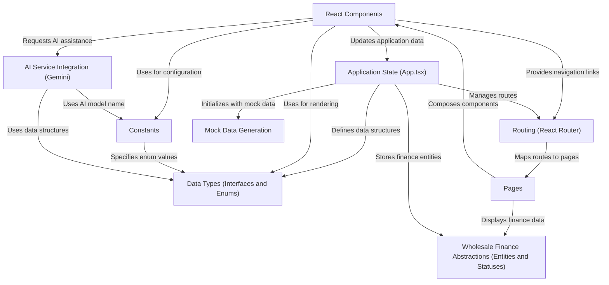

# Tutorial: fleetpro-fleetmanagement

This project, `fleetpro-fleetmanagement`, provides a comprehensive solution for managing both **fleet operations** and **wholesale finance**.  It allows users to track vehicles, drivers, and related costs within a fleet. Additionally, it manages dealership credit lines, inventory, and audits for wholesale finance operations. The application utilizes reusable *React components* for the user interface and integrates with external services like *Gemini AI* to provide intelligent insights.

**Source Repository:** [https://github.com/rakeshkrrajak/fleetpro-fleetmanagement](https://github.com/rakeshkrrajak/fleetpro-fleetmanagement)

## Chapters

1. [Pages](01_pages.md)
2. [Routing (React Router)](02_routing__react_router_.md)
3. [React Components](03_react_components.md)
4. [Application State (App.tsx)](04_application_state__app_tsx_.md)
5. [Wholesale Finance Abstractions (Entities and Statuses)](05_wholesale_finance_abstractions__entities_and_statuses_.md)
6. [Data Types (Interfaces and Enums)](06_data_types__interfaces_and_enums_.md)
7. [Constants](07_constants.md)
8. [Mock Data Generation](08_mock_data_generation.md)
9. [AI Service Integration (Gemini)](09_ai_service_integration__gemini_.md)

---

Generated by [AI Codebase Knowledge Builder](https://github.com/The-Pocket/Tutorial-Codebase-Knowledge)